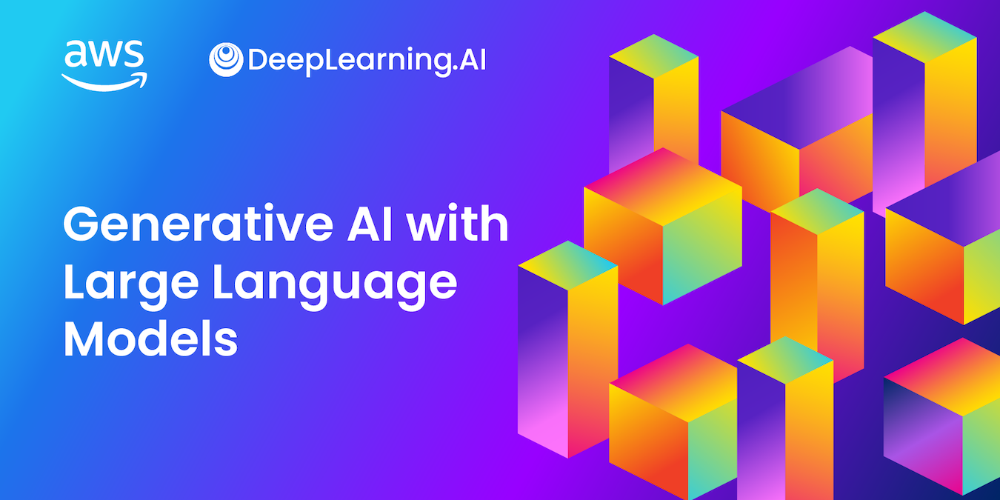

# Gen AI LLM

This repo inclueds courses, code snippets from various sources to better learn and build an intuition about Large Language Models
I first enrolled in a course from Deeplearning.ai called [Generative AI with Large Language Models](https://www.coursera.org/learn/generative-ai-with-llms) Course from AWS and Deeplearning.ai.
The main reason is my prior experience with Deeplearnin.ai as I gained a lot of knowledge from 2 prior courses from Andrew Ng and his team, namely [Machine Learning specialization](https://www.deeplearning.ai/courses/machine-learning-specialization/) and [Deep Learning specialization](https://www.deeplearning.ai/courses/deep-learning-specialization/)

### Courses - Generative AI with Large Language Model
 - Course 1 - Intro to LLMs and the generative AI project lifecycle
   - [1 - Transformer intro and arch](genai-with-llm-course/course1/1_transformer_intro_arch.md)
   - [2 - Generating Text with Transformers](genai-with-llm-course/course1/2_text_generation_transformer.md)
   - [3 - Attention is All you need (paper)](genai-with-llm-course/course1/3_attention_is_all_you_need.md)
   - [4 - Prompt Engineering](genai-with-llm-course/course1/4_prompt_engineering.md)
   - [5 - Generative Configuration and GenAI Project Lifecycle](genai-with-llm-course/course1/5_generative_configuration.md)
   - [Lab - Document Summarization with LLM Hugging Face FLAN T5](genai-with-llm-course/course1/lab_dialog_summarization.md)
 - Course 2 - LLM pre-training and scaling laws
   - [1 - Pre-Training large language models](genai-with-llm-course/course2/1_pre-training_llm.md)
   - [2 - Computational Challenges of training LLMs](genai-with-llm-course/course2/2_computational_challenges_training_llm.md)
   - [3 - Efficient multi-GPU compute strategies](genai-with-llm-course/course2/3_multi_gpu_strategies.md)
   - [4 - Scaling laws and compute-optimal models](genai-with-llm-course/course2/4_scaling_laws_compute.md)
   - [5 - Pre-training for domain adaptation](genai-with-llm-course/course2/5_pre-training_model_adaptation.md)
 - Quiz 1 [personal responses](genai-with-llm-course/quiz1/quiz1.md)

### Notebooks and code snippet

### Credits and Resources
#### Courses
 - [Generative AI with Large Language Models](https://www.coursera.org/learn/generative-ai-with-llms) Course from AWS and Deeplearning.ai
 - [Machine Learning specialization](https://www.deeplearning.ai/courses/machine-learning-specialization/)
 - [Deep Learning specialization](https://www.deeplearning.ai/courses/deep-learning-specialization/)

#### Papers
 - [Attention is All You Need](https://arxiv.org/abs/1706.03762) Google and Toronto University papaer introducing the Transformer architecture
 - [Transfomer: A Novel Neural Network Architecture for Language understanding](https://blog.research.google/2017/08/transformer-novel-neural-network.html) Google Blog
 - [BloombergGPT paper](https://arxiv.org/abs/2303.17564)
