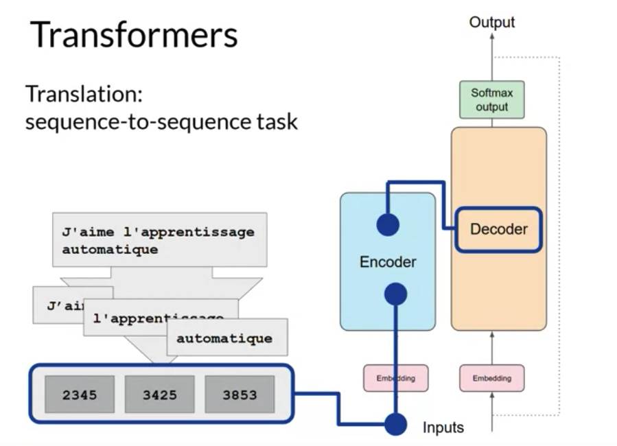
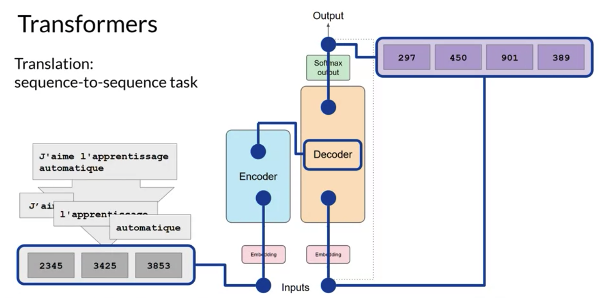
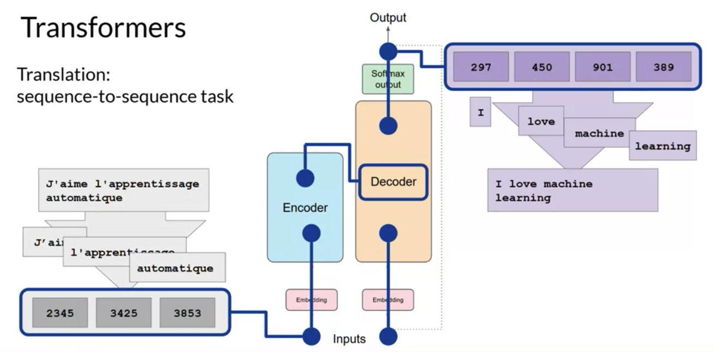
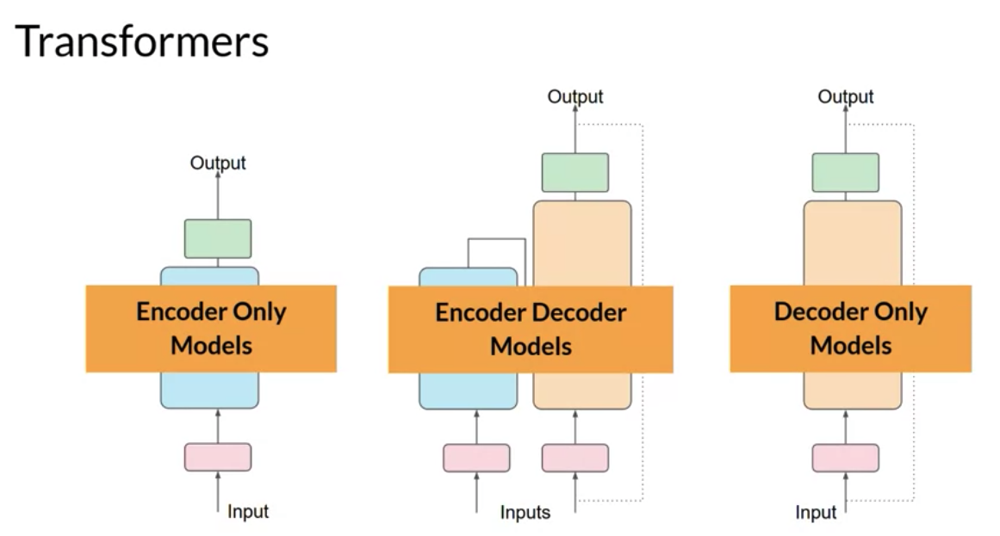

# Gen AI LLM - Course 1
## Part 2 - Generating Text with Transformers

Below are some key notes from [Generative AI with Large Language Models](https://www.coursera.org/learn/generative-ai-with-llms)

### Encoder and Decoder
Let's walk through an example: Translation
Translation is a sequence-to-sequence task

Translate "J'aime l'apprentissage automatique" in English

First, you'll tokenize the input words using this same tokenizer that was used to train the network. These tokens are then added into the input on the encoder side of the network, passed through the embedding layer, and then fed into the multi-headed attention layers. The outputs of the multi-headed attention layers are fed through a feed-forward network to the output of the encoder. At this point, the data that leaves the encoder is a deep representation of the structure and meaning of the input sequence. This representation is inserted into the middle of the decoder to influence the decoder's self-attention mechanisms.

Next, a start of sequence token is added to the input of the decoder. This triggers the decoder to predict the next token, which it does based on the contextual understanding that it's being provided from the encoder. The output of the decoder's self-attention layers gets passed through the decoder feed-forward network and through a final softmax output layer. At this point, we have our first token
!translation_transformer_decoder.png](../../images/translation_transformer_decoder.png)

You'll continue this loop, passing the output token back to the input to trigger the generation of the next token, until the model predicts an end-of-sequence token.

At this point, the final sequence of tokens can be detokenized into words, and you have your output. In this case, I love machine learning. There are multiple ways in which you can use the output from the softmax layer to predict the next token. These can influence how creative you are generated text is

#### Summary
The encoder encodes input sequences into a deep representation of the structure and meaning of the input. The decoder, working from input token triggers, uses the encoder's contextual understanding to generate new tokens. It does this in a loop until some stop condition has been reached.
!translation_transformer_encoder_decoder](../../images/translation_transformer_encoder_decoder.png)

### Encoder Model only, Encoder Decoder model, Decoder only model
Encoder-only models also work as sequence-to-sequence models, but without further modification, the input sequence and the output sequence or the same length. Their use is less common these days, but by adding additional layers to the architecture, you can train encoder-only models to perform classification tasks such as sentiment analysis, BERT is an example of an encoder-only model. Encoder-decoder models, as you've seen, perform well on sequence-to-sequence tasks such as translation, where the input sequence and the output sequence can be different lengths. You can also scale and train this type of model to perform general text generation tasks. Examples of encoder-decoder models include BART as opposed to BERT and T5, the model that you'll use in the labs in this course. Finally, decoder-only models are some of the most commonly used today. Again, as they have scaled, their capabilities have grown. These models can now generalize to most tasks. Popular decoder-only models include the GPT family of models, BLOOM, Jurassic, LLaMA, and many more

