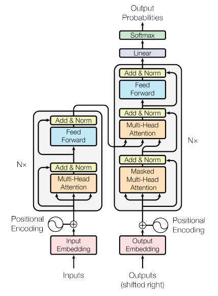

# Gen AI LLM - Course 1
## Part 3 - Paper - "Attention is All You Need"

###### Below are some key notes from [Generative AI with Large Language Models](https://www.coursera.org/learn/generative-ai-with-llms)

"Attention is All You Need" is a research paper published in 2017 by Google researchers, which introduced the Transformer model, a novel architecture that revolutionized the field of natural language processing (NLP) and became the basis for the LLMs we  now know - such as GPT, PaLM and others. The paper proposes a neural network architecture that replaces traditional recurrent neural networks (RNNs) and convolutional neural networks (CNNs) with an entirely attention-based mechanism. 

The Transformer model uses self-attention to compute representations of input sequences, which allows it to capture long-term dependencies and parallelize computation effectively. The authors demonstrate that their model achieves state-of-the-art performance on several machine translation tasks and outperforms previous models that rely on RNNs or CNNs.

The Transformer architecture consists of an encoder and a decoder, each of which is composed of several layers. Each layer consists of two sub-layers: a multi-head self-attention mechanism and a feed-forward neural network. The multi-head self-attention mechanism allows the model to attend to different parts of the input sequence, while the feed-forward network applies a point-wise fully connected layer to each position separately and identically. 

The Transformer model also uses residual connections and layer normalization to facilitate training and prevent overfitting. In addition, the authors introduce a positional encoding scheme that encodes the position of each token in the input sequence, enabling the model to capture the order of the sequence without the need for recurrent or convolutional operations.

You can read the Transformers paper [here](https://arxiv.org/abs/1706.03762)

