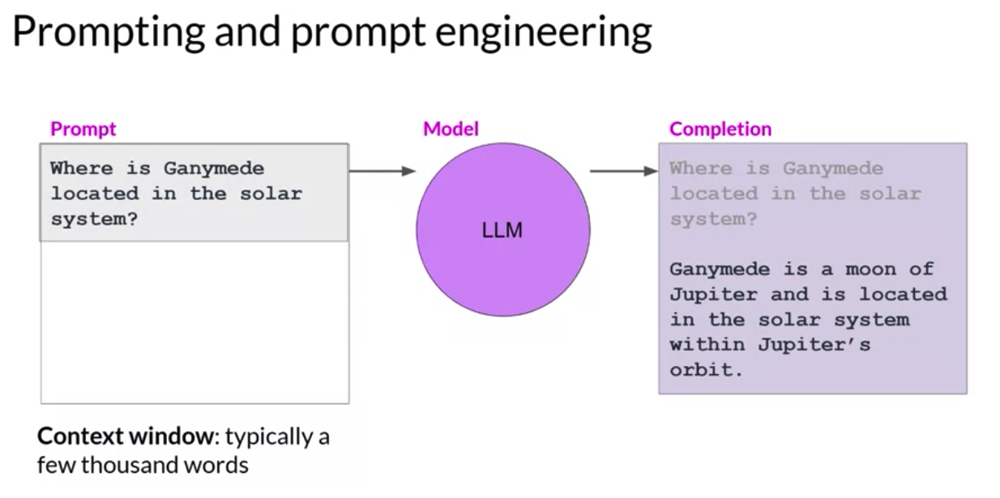
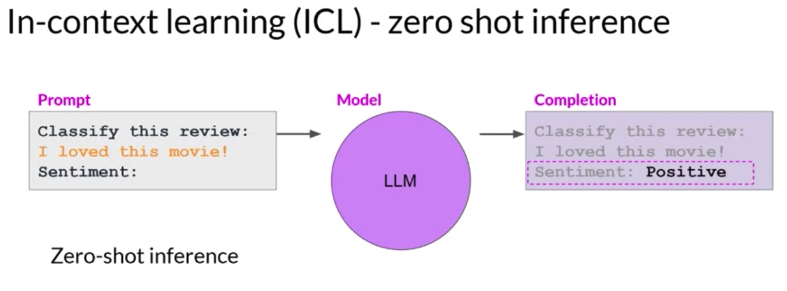
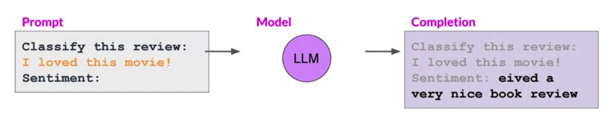
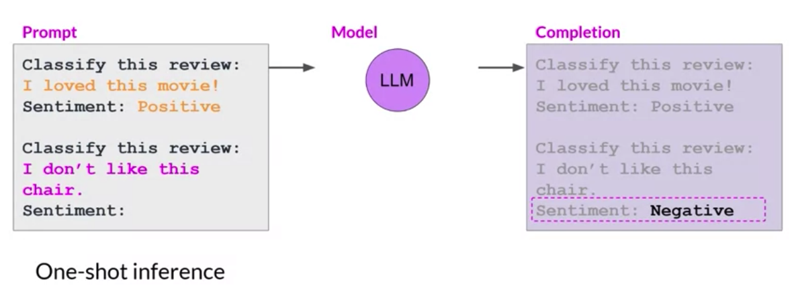
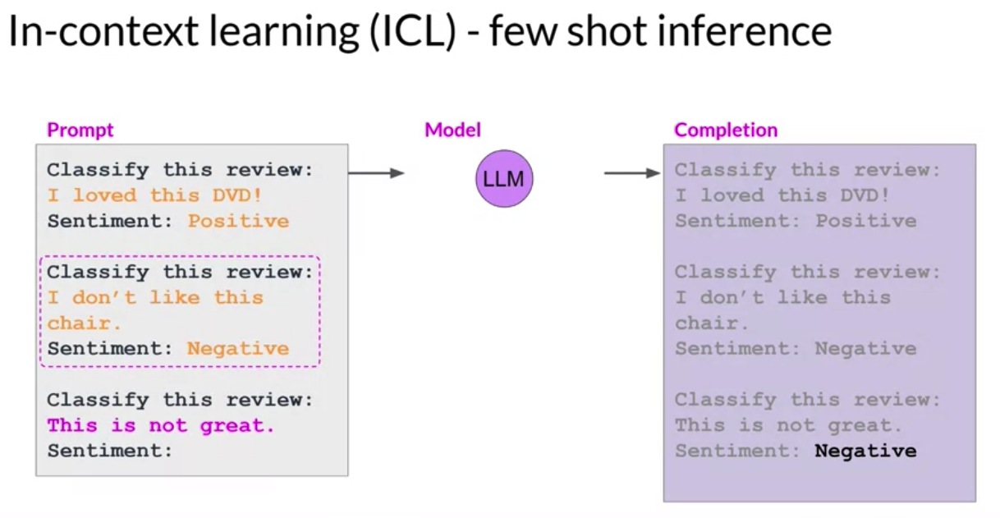
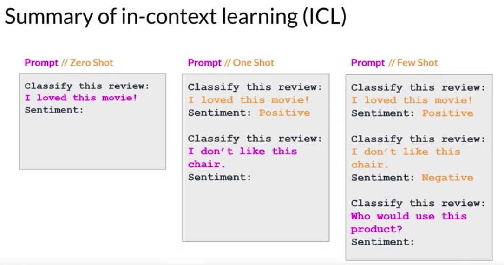
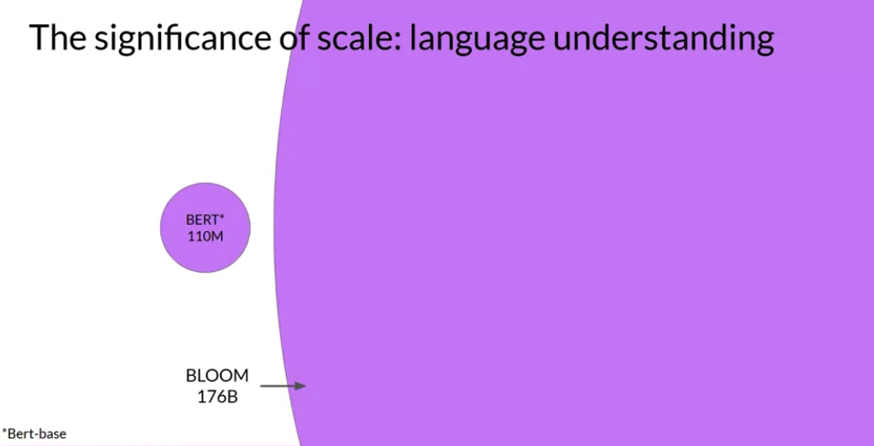

# Gen AI LLM - Course 1
## Part 4 - Prompt Engineering and In-Context Learning

###### Below are some key notes from [Generative AI with Large Language Models](https://www.coursera.org/learn/generative-ai-with-llms)

### Terminology
 - The text that you feed into the model is called the *prompt*
 - The act of generating text is known as *inference*
 - The output text is known as the *completion* 
 - The full amount of text or the memory that is available to use for the prompt is called the *context window* 

Although the example here shows the model performing well, you'll frequently encounter situations where the model doesn't produce the outcome that you want on the first try. You may have to revise the language in your prompt or the way that it's written several times to get the model to behave in the way that you want. 

This work to develop and improve the prompt is known as *prompt engineering*. 

This is a big topic. But one powerful strategy to get the model to produce better outcomes is to include examples of the task that you want the model to carry out inside the prompt

### In-Context Learning
Providing examples inside the context window is called *in-context learning*. 
With in-context learning, you can help LLMs learn more about the task being asked by including examples or additional data in the prompt. 

#### Zero-shot inference
Here is a concrete example. Within the prompt shown here, you ask the model to classify the sentiment of a review. So whether the review of this movie is positive or negative, the prompt consists of the *instruction*, "Classify this review," followed by some *context*, which in this case is the review text itself, and an *instruction* to produce the sentiment at the end. 

This method, including your input data within the prompt, is called *zero-shot inference*. The largest of the LLMs are surprisingly good at this, grasping the task to be completed and returning a good answer. In this example, the model correctly identifies the sentiment as positive. 

Smaller models, on the other hand, can struggle with this. Here's an example of a completion generated by GPT-2, an earlier smaller version of the model that powers ChatGPT. As you can see, the model doesn't follow the instruction. While it does generate text with some relation to the prompt, the model can't figure out the details of the task and does not identify the sentiment.

This is where providing an example within the prompt can improve performance.

#### One-shot inference
Here you can see that the prompt text is longer and now starts with a completed example that demonstrates the tasks to be carried out to the model. After specifying that the model should classify the review, the prompt text includes a sample review. "I loved this movie", followed by a completed sentiment analysis. In this case, the review is "positive". 
Next, the prompt states the instruction again and includes the actual input review that we want the model to analyze. You pass this new longer prompt to the smaller model, which now has a better chance of understanding the task you're specifying and the format of the response that you want. 

The inclusion of a single example is known as *one-shot inference*, in contrast to the zero-shot prompt you supplied earlier. 

#### Few-shot inference
Sometimes a single example won't be enough for the model to learn what you want it to do. So you can extend the idea of giving a single example to include multiple examples. This is known as *few-shot inference*. 

Here, you're working with an even smaller model that failed to carry out good sentiment analysis with one-shot inference. Instead, you're going to try few-shot inference by including a second example. This time, a negative review, including a mix of examples with different output classes can help the model to understand what it needs to do. You pass the new prompts to the model. And this time it understands the instruction and generates a completion that correctly identifies the sentiment of the review as negative. 

#### Summary
So to recap, you can engineer your prompts to encourage the model to learn by examples. While the largest models are good at zero-shot inference with no examples, smaller models can benefit from one-shot or few-shot inference that include examples of the desired behavior. 

But remember the context window because you have a limit on the amount of in-context learning that you can pass into the model. Generally, if you find that your model isn't performing well when, say, including five or six examples, you should try fine-tuning your model instead. *Fine-tuning* performs additional training on the model using new data to make it more capable of the task you want it to perform.

#### Languag model size
As larger and larger models have been trained, it's become clear that the ability of models to perform multiple tasks and how well they perform those tasks depends strongly on the scale of the model. 

Models with more parameters are able to capture more understanding of language. The largest models are surprisingly good at zero-shot inference and are able to infer and successfully complete many tasks that they were not specifically trained to perform. 

In contrast, smaller models are generally only good at a small number of tasks. Typically, those that are similar to the task that they were trained on. 

You may have to try out a few models to find the right one for your use case. Once you've found the model that is working for you, there are a few settings that you can experiment with to influence the structure and style of the completions that the model generates.

