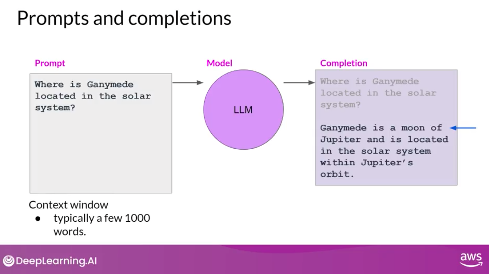
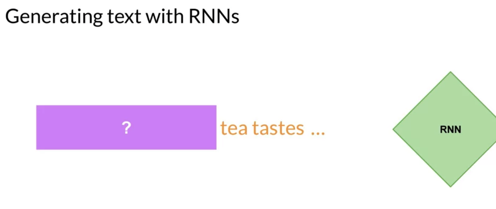
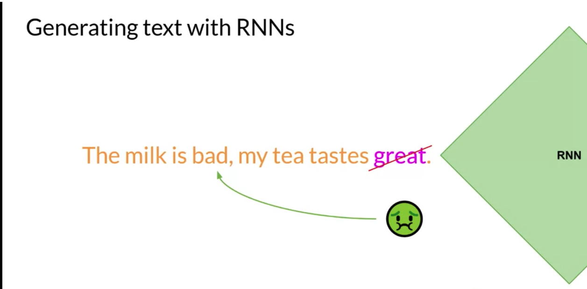
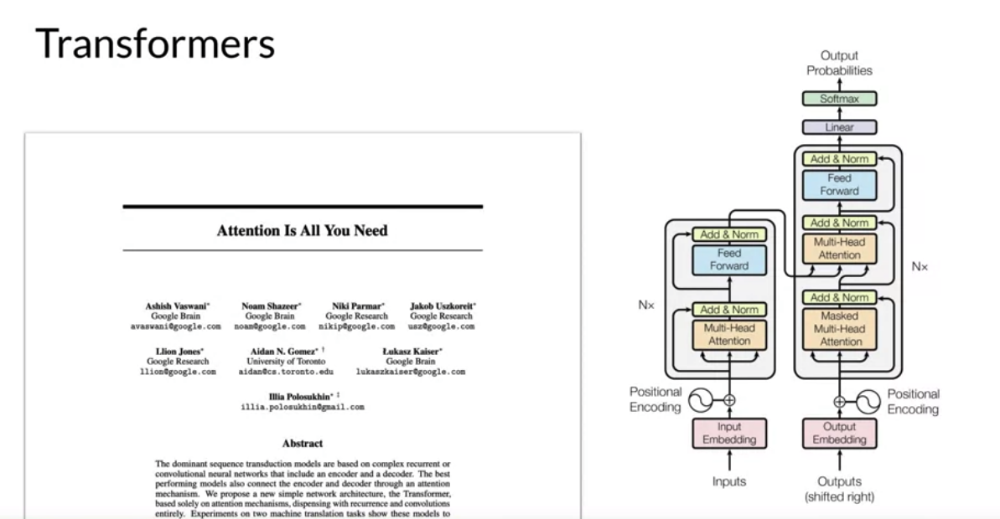

# Gen AI LLM - Course 1

Below are some key notes from [Generative AI with Large Language Models](https://www.coursera.org/learn/generative-ai-with-llms)

### Intro
Generative AI and LLMs specifically are a general purpose technology. That means that similar to other general purpose technologies like deep learning and electricity, is useful not just for a single application, but for a lot of different applications that span many corners of the economy. Similar to the rise of deep learning that started maybe 15 years ago or so, there's a lot of important where it lies ahead of us that needs to be done over many years by many people, to identify use cases and build specific applications.

### Transformer Network
The [Transfomer: A Novel Neural Network Architecture for Language understanding](https://blog.research.google/2017/08/transformer-novel-neural-network.html)  blog and corresponding paper [Attention is All You Need](https://arxiv.org/abs/1706.03762) from Google were released on aug 2017.
This is the foundation of LLM and Foundational Models. And it's amazing how long the transformer architecture has been around and it's still state of the art for many models

From the Blog: "Neural networks, in particular recurrent neural networks (RNNs), are now at the core of the leading approaches to language understanding tasks such as language modeling, machine translation and question answering. In “Attention Is All You Need”, we introduce the Transformer, a novel neural network architecture based on a self-attention mechanism that we believe to be particularly well suited for language understanding.
In our paper, we show that the Transformer outperforms both recurrent and convolutional models on academic English to German and English to French translation benchmarks. On top of higher translation quality, the Transformer requires less computation to train and is a much better fit for modern machine learning hardware, speeding up training by up to an order of magnitude."

We will learn the intuitions behind some of these terms you may have heard before, like multi-headed attention. What is that and why does it make sense? And why did the transformer architecture really take off. To note transformer architecture also helped on other modalities than text/NLP like vision.
To also note we can also use a transformer architecture with smaller foundational models than the large ones that have 100 of billion of parameters for single tasks like summarilizing dialog.

### Generative AI & LLMs
Generative AI is a subset of traditional ML. find statistical pattern in massive data sets.
Large Language Models - Trained on trillions of words over many weeks and months with lots of compute power. 
Base LLM models are: BERT, BLOOM, GPT, LLaMa, PaLM, FLAN-T5...
We can use them as-is or finte-tune them without the ned to train new models from scratch.
To note other modalities are also supported (audio, video, speech,...).
The way we interact with LLM is quite different: as opposed to formalized syntax/code used in models, LLMS use Natural language of human written instructions and perform tasks. Text passed to LLM is known as a "prompt". The space or memory aailable to the prompt is called the "context window". It is usually large wnough for a few 1000 of words but varies form a model to another.
The outcome of the LLM model is called a "completion" and the act of using a model to generate the text is called "inference".

### LLM Use cases
Use cases are various: text summarization, translation (example: english to programming language, french to english,...), entity extraction (identify people and places in a document), connected to external data sources, enable model to power interaction with real world (flight information,...)

From 11M parameters of BERT, the # of parameters exploded. Example: 176 Billion parameters with BLOOM
To note small models can be fine tuned to do really well small focused tasks so we don't always need large odels.

### Text generation before transformers
It's important to note that generative algorithms are not new. Previous generations of language models made use of an architecture called recurrent neural networks or RNNs. 
RNNs while powerful for their time, were limited by the amount of compute and memory needed to perform well at generative tasks. 
Let's look at an example of an RNN carrying out a simple next-word prediction generative task. 
The RNN needs to scale resources to see enough of the input (preceeding words in particular) to make a successfull prediction.
Example with a small RNN

Even after scaling the model, it had not seen enough of the input to make a proper prediction

Models need to have an understanding of the whole sentence, and maybe whole document. And the pb is that language is complex. One word can have multiple meanings.
For example "bank" can mean different things depending on context (river bank)

Understanding language can be challenging too. Example: "The teacher taught the student with the book".
Does it mean that the teacher taught the student with the help of the book?
Or did the teacher taught the student who had a book? Or both?

How can an algorithm make sense of human language if sometimes we can't?
In 2017, after publication of :Attention is All You need" paaper from Google and hte university of Toronto, everything changed. 
The **Transformer** architecture has arrived.

This novel approach unlocked the process in generative AI we see today. It can be scaled efficiently to use multi-core GPUs, it can parallel process input data, making use of much larger training datasets and its able to learn to pay attention to the meanting of the words it's processing. Attention is all you need. It's in the title

