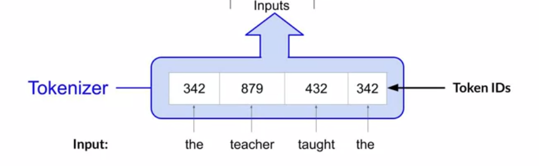

# Gen AI LLM - Course 1

Below are some key notes from [Generative AI with Large Language Models](https://www.coursera.org/learn/generative-ai-with-llms)

### Intro
Generative AI and LLMs specifically are a general purpose technology. That means that similar to other general purpose technologies like deep learning and electricity, is useful not just for a single application, but for a lot of different applications that span many corners of the economy. Similar to the rise of deep learning that started maybe 15 years ago or so, there's a lot of important where it lies ahead of us that needs to be done over many years by many people, to identify use cases and build specific applications.

### Transformer Network
The [Transfomer: A Novel Neural Network Architecture for Language understanding](https://blog.research.google/2017/08/transformer-novel-neural-network.html)  blog and corresponding paper [Attention is All You Need](https://arxiv.org/abs/1706.03762) from Google were released on aug 2017.
This is the foundation of LLM and Foundational Models. And it's amazing how long the transformer architecture has been around and it's still state of the art for many models

From the Blog: "Neural networks, in particular recurrent neural networks (RNNs), are now at the core of the leading approaches to language understanding tasks such as language modeling, machine translation and question answering. In “Attention Is All You Need”, we introduce the Transformer, a novel neural network architecture based on a self-attention mechanism that we believe to be particularly well suited for language understanding.
In our paper, we show that the Transformer outperforms both recurrent and convolutional models on academic English to German and English to French translation benchmarks. On top of higher translation quality, the Transformer requires less computation to train and is a much better fit for modern machine learning hardware, speeding up training by up to an order of magnitude."

We will learn the intuitions behind some of these terms you may have heard before, like multi-headed attention. What is that and why does it make sense? And why did the transformer architecture really take off. To note transformer architecture also helped on other modalities than text/NLP like vision.
To also note we can also use a transformer architecture with smaller foundational models than the large ones that have 100 of billion of parameters for single tasks like summarilizing dialog.

### Generative AI & LLMs
Generative AI is a subset of traditional ML. find statistical pattern in massive data sets.
Large Language Models - Trained on trillions of words over many weeks and months with lots of compute power. 
Base LLM models are: BERT, BLOOM, GPT, LLaMa, PaLM, FLAN-T5...
We can use them as-is or finte-tune them without the ned to train new models from scratch.
To note other modalities are also supported (audio, video, speech,...).
The way we interact with LLM is quite different: as opposed to formalized syntax/code used in models, LLMS use Natural language of human written instructions and perform tasks. Text passed to LLM is known as a "prompt". The space or memory aailable to the prompt is called the "context window". It is usually large wnough for a few 1000 of words but varies form a model to another.
The outcome of the LLM model is called a "completion" and the act of using a model to generate the text is called "inference".

### LLM Use cases
Use cases are various: text summarization, translation (example: english to programming language, french to english,...), entity extraction (identify people and places in a document), connected to external data sources, enable model to power interaction with real world (flight information,...)

From 11M parameters of BERT, the # of parameters exploded. Example: 176 Billion parameters with BLOOM
To note small models can be fine tuned to do really well small focused tasks so we don't always need large odels.

### Text generation before transformers
It's important to note that generative algorithms are not new. Previous generations of language models made use of an architecture called recurrent neural networks or RNNs. 
RNNs while powerful for their time, were limited by the amount of compute and memory needed to perform well at generative tasks. 
Let's look at an example of an RNN carrying out a simple next-word prediction generative task. 
The RNN needs to scale resources to see enough of the input (preceeding words in particular) to make a successfull prediction.
Example with a small RNN

Even after scaling the model, it had not seen enough of the input to make a proper prediction

Models need to have an understanding of the whole sentence, and maybe whole document. And the pb is that language is complex. One word can have multiple meanings.
For example "bank" can mean different things depending on context (river bank)

Understanding language can be challenging too. Example: "The teacher taught the student with the book".
Does it mean that the teacher taught the student with the help of the book?
Or did the teacher taught the student who had a book? Or both?

How can an algorithm make sense of human language if sometimes we can't?
In 2017, after publication of :Attention is All You need" paaper from Google and hte university of Toronto, everything changed. 
The **Transformer** architecture has arrived.

This novel approach unlocked the process in generative AI we see today. It can be scaled efficiently to use multi-core GPUs, it can parallel process input data, making use of much larger training datasets and its able to learn to pay attention to the meanting of the words it's processing. Attention is all you need. It's in the title

 The power of the transformer architecture lies in its ability to learn the relevance and context of **all of the words** in a sentence. Not just as you see here, to each word next to its neighbor, but to every other word in a sentence. To apply attention weights to those relationships so that the model learns the relevance of each word to each other words no matter where they are in the input. This gives the algorithm the ability to learn who has the book, who could have the book, and if it's even relevant to the wider context of the document. These attention weights are learned during LLM training.
 
 
The below diagram is called an **attention map** and can be useful to illustrate the attention weights between each word and every other word. Here in this stylized example, you can see that the word book is strongly connected with or paying attention to the word teacher and the word student. This is called **self-attention** and the ability to learn a tension in this way across the whole input significantly approves the model's ability to encode language. 

Now that you've seen one of the key attributes of the transformer architecture, self-attention, let's cover at a high level how the model works.

Here's a simplified diagram of the **transformer** architecture so that you can focus at a high level on where these processes are taking place. The transformer architecture is split into two distinct parts, the **encoder** and the **decoder**.

Now, machine-learning models are just big statistical calculators and they work with numbers, not words. So before passing texts into the model to process, you must first tokenize the words. Simply put, this converts the words into numbers, with each number representing a position in a dictionary of all the possible words that the model can work with. 

You can choose from multiple tokenization methods. For example, token IDs matching two complete words, or using token IDs to represent parts of words. As you can see here. 

What's important is that once you've selected a tokenizer to train the model, you must use the same tokenizer when you generate text.

Now that your input is represented as numbers, you can pass it to the embedding layer. This layer is a trainable vector embedding space, a high-dimensional space where each token is represented as a vector and occupies a unique location within that space. Each token ID in the vocabulary is matched to a multi-dimensional vector, and the intuition is that these vectors learn to encode the meaning and context of individual tokens in the input sequence. 

Embedding vector spaces have been used in natural language processing for some time, previous generation language algorithms like Word2vec use this concept.
Looking back at the sample sequence, you can see that in this simple case, each word has been matched to a token ID, and each token is mapped into a vector. In the original transformer paper, the vector size was actually 512, so much bigger than we can fit onto this image. 

For simplicity, if you imagine a vector size of just three, you could plot the words into a three-dimensional space and see the relationships between those words. 

You can see now how you can relate words that are located close to each other in the embedding space, and how you can calculate the distance between the words as an angle, which gives the model the ability to mathematically understand language

As you add the token vectors into the base of the encoder or the decoder, you also add positional encoding. The model processes each of the input tokens in parallel. So by adding the positional encoding, you preserve the information about the word order and don't lose the relevance of the position of the word in the sentence.

Once you've summed the input tokens and the positional encodings, you pass the resulting vectors to the **self-attention** layer. Here, the model analyzes the relationships between the tokens in your input sequence. 

This allows the model to attend to different parts of the input sequence to better capture the contextual dependencies between the words. The self-attention weights that are learned during training and stored in these layers reflect the importance of each word in that input sequence to all other words in the sequence. But this does not happen just once, the transformer architecture actually has multi-headed self-attention. This means that multiple sets of self-attention weights or heads are learned in parallel independently of each other. The number of attention heads included in the attention layer varies from model to model, but numbers in the range of 12-100 are common. 

The intuition here is that each self-attention head will learn a different aspect of language. For example, one head may see the relationship between the people entities in our sentence. Whilst another head may focus on the activity of the sentence. Whilst yet another head may focus on some other properties such as if the words rhyme. It's important to note that you don't dictate ahead of time what aspects of language the attention heads will learn. The weights of each head are randomly initialized and given sufficient training data and time, each will learn different aspects of language.

Now that all of the attention weights have been applied to your input data, the output is processed through a fully-connected feed-forward network. The output of this layer is a vector of logits proportional to the probability score for each and every token in the tokenizer dictionary. 

You can then pass these logits to a final softmax layer, where they are normalized into a probability score for each word. This output includes a probability for every single word in the vocabulary, so there's likely to be thousands of scores here. One single token will have a score higher than the rest. This is the most likely predicted token. But as you'll see later in the course, there are a number of methods that you can use to vary the final selection from this vector of probabilities.
The intuition here is that each self-attention head will learn a different aspect of language. For example, one head may see the relationship between the people entities in our sentence. Whilst another head may focus on the activity of the sentence. Whilst yet another head may focus on some other properties such as if the words rhyme. It's important to note that you don't dictate ahead of time what aspects of language the attention heads will learn. The weights of each head are randomly initialized and given sufficient training data and time, each will learn different aspects of language.

