# Gen AI LLM - Course 2
## Part 1 - Pre-training large langugage models

###### Below are some key notes from [Generative AI with Large Language Models](https://www.coursera.org/learn/generative-ai-with-llms)

### Project Lifecycle - Selecting a Model

Once you have scoped out your use case, and determined how you'll need the LLM to work within your application, your next step is to *select a model* to work with. 

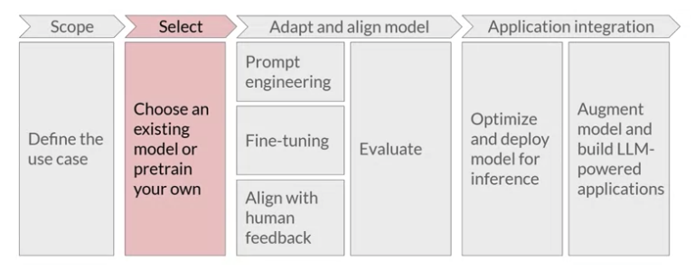

Your first choice will be to either work with an *existing model*, or *train your own from scratch*. 

There are specific circumstances where training your own model from scratch might be advantageous. In general, however, you'll begin the process of developing your application using an existing foundation model. 
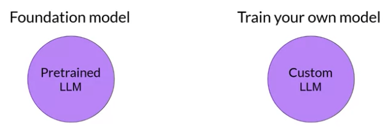

Many open-source models are available for members of the AI community like you to use in your application. The developers of some of the major frameworks for building generative AI applications like Hugging Face and PyTorch, have curated *hubs* where you can browse these models. A really useful feature of these hubs is the inclusion of *model cards*, that describe important details including the best use cases for each model, how it was trained, and known limitations. 
 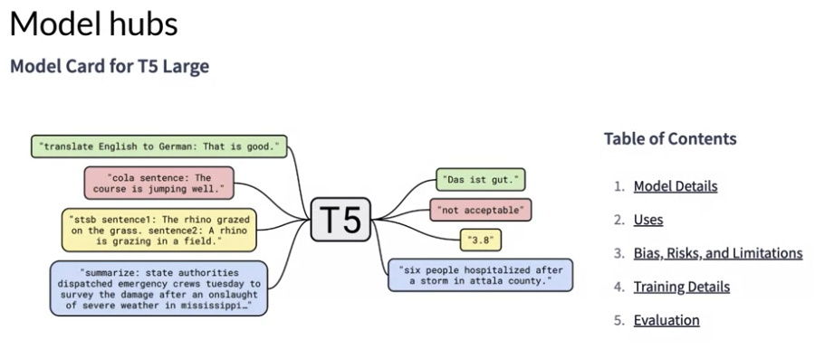
The exact model that you'd choose will depend on the details of the task you need to carry out. Variance of the transformer model architecture are suited to different language tasks, largely because of differences in how the models are trained.

### LLM Pre-Training
To begin, let's take a high-level look at the initial training process for LLMs. This phase is often referred to as *pre-training*. 
This understanding is developed during the models pre-training phase when the model learns from vast amounts of unstructured textual data. This can be gigabytes, terabytes, and even petabytes of text. This data is pulled from many sources, including scrapes off the Internet and corpora of texts that have been assembled specifically for training language models. 
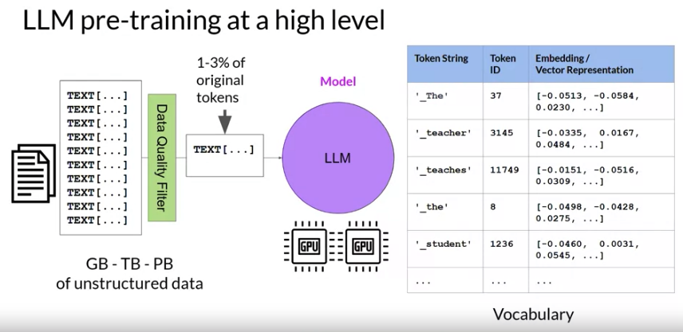

In this self-supervised learning step, the model internalizes the patterns and structures present in the language. These patterns then enable the model to complete its training objective, which depends on the architecture of the model, as you'll see shortly. 

During pre-training, the model weights get updated to minimize the loss of the training objective. The encoder generates an embedding or vector representation for each token. Pre-training also requires a large amount of compute and the use of GPUs. 

Note, when you scrape training data from public sites such as the Internet, you often need to process the data to increase quality, address bias, and remove other harmful content. As a result of this data quality curation, often only 1-3% of tokens are used for pre-training. You should consider this when you estimate how much data you need to collect if you decide to pre-train your own model. 

### Transformers: Encoders, Decoders
There are three variance of the transformer model; encoder-only encoder-decoder models, and decode-only. Each of these is trained on a different objective, and so learns how to carry out different tasks.

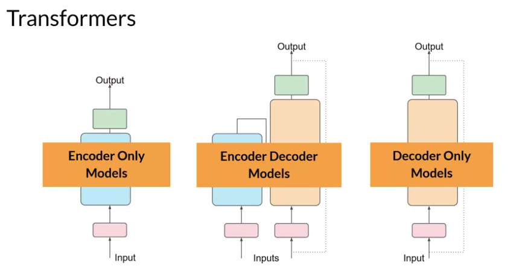

#### Encoder-only models
Encoder-only models are also known as *Autoencoding models*, and they are pre-trained using masked language modeling. Here, tokens in the input sequence are randomly mask, and the training objective is to predict the mask tokens in order to reconstruct the original sentence. This is also called a *denoising objective*. 

Autoencoding models spilled *bi-directional representations* of the input sequence, meaning that the model has an understanding of the full context of a token and not just of the words that come before.

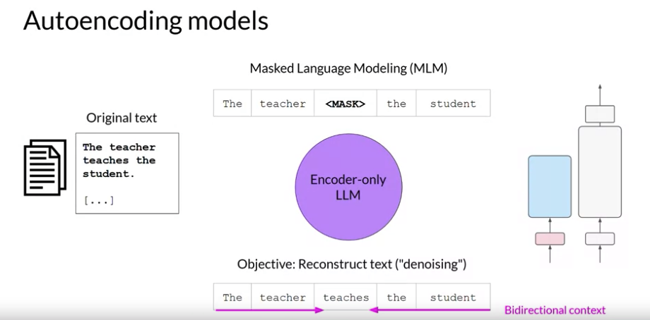

Encoder-only models are ideally suited to task that benefit from this bi-directional contexts. You can use them to carry out:
 - sentence classification tasks, for example, sentiment analysis 
 - or token-level tasks like named entity recognition or word classification.
  Some well-known examples of an autoencoder model are BERT and RoBERTa. 

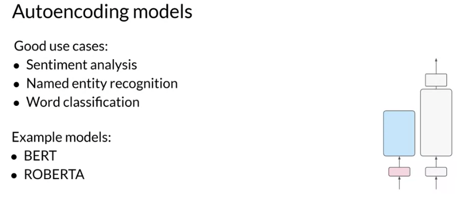

#### Decoder-only models

Decoder-only or *autoregressive models* are pre-trained using causal language modeling. Here, the training objective is to predict the *next token* based on the previous sequence of tokens. Predicting the next token is sometimes called full language modeling by researchers. 

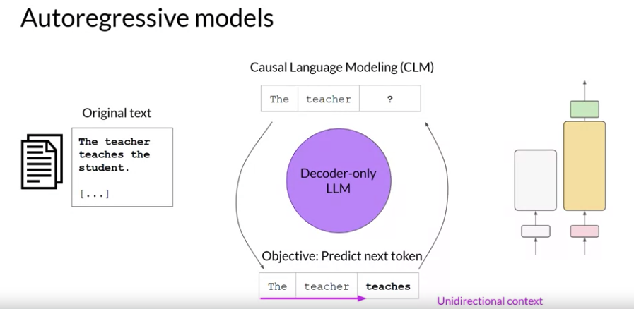

Decoder-based autoregressive models, mask the input sequence and can only see the input tokens leading up to the token in question. The model has no knowledge of the end of the sentence. The model then iterates over the input sequence one by one to predict the following token. In contrast to the encoder architecture, this means that the context is unidirectional. By learning to predict the next token from a vast number of examples, the model builds up a statistical representation of language. 

Decoder-only models are often used for *text generation*, although larger decoder-only models show strong zero-shot inference abilities, and can often perform a range of tasks well. 
  Well known examples of decoder-based autoregressive models are GBT and BLOOM.

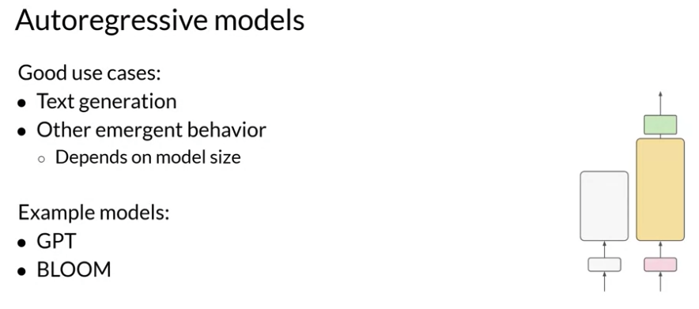

#### Sequence-to-sequence models (use both encoder and decoder arch)
A popular *sequence-to-sequence* model *T5*, pre-trains the encoder using span corruption, which masks random sequences of input tokens. Those mass sequences are then replaced with a unique Sentinel token, shown here as x. Sentinel tokens are special tokens added to the vocabulary, but do not correspond to any actual word from the input text. The decoder is then tasked with reconstructing the mask token sequences auto-regressively. 
 The output is the Sentinel token followed by the predicted tokens.

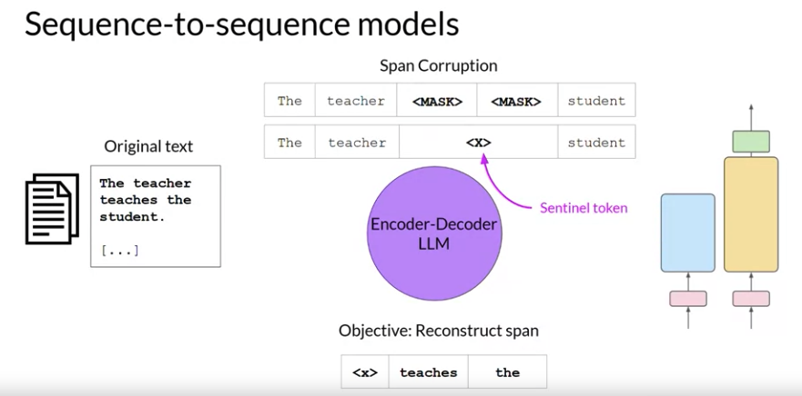

You can use sequence-to-sequence models for:
 - translation 
 - summarization 
 - question-answering. 

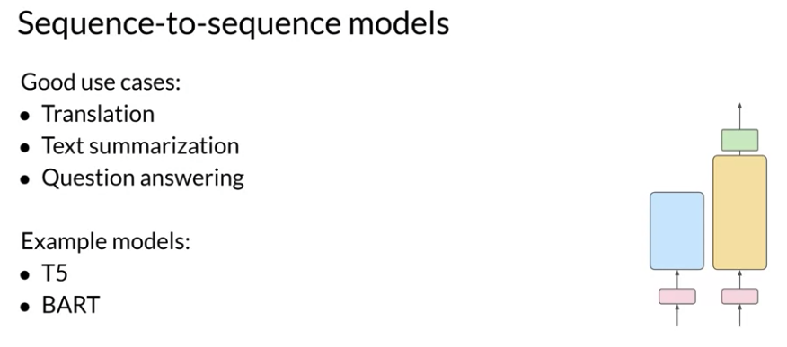

They are generally useful in cases where you have a body of texts as both input and output. Besides T5, another well-known encoder-decoder model is BART. 

### Summary
To summarize, here's a quick comparison of the different model architectures and the targets off the pre-training objectives:
 - *Autoencoding models* are pre-trained using masked language modeling. They correspond to the *encoder* part of the original transformer architecture, and are often used with *sentence classification* or *token classification*. 
 - *Autoregressive models* are pre-trained using causal language modeling. Models of this type make use of the *decoder* component of the original transformer architecture, and often used for *text generation*. 
 - *Sequence-to-sequence models* use both the *encoder and decoder* part off the original transformer architecture. The exact details of the pre-training objective vary from model to model. The T5 model is pre-trained using span corruption. Sequence-to-sequence models are often used for *translation, summarization, and question-answering*. 

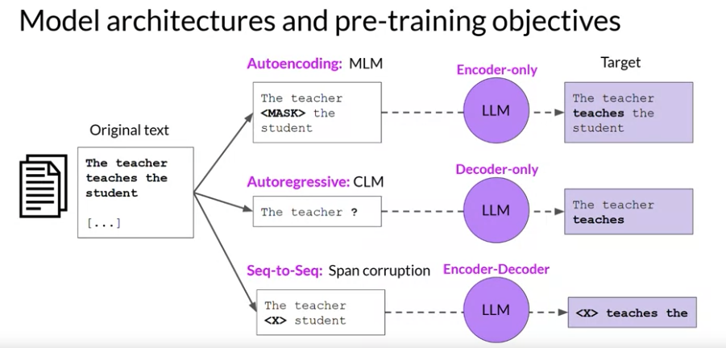

#### Scalability

Researchers have found that the larger a model, the more likely it is to work as you needed to without additional in-context learning or further training. 
!significance_of_scale](../../images/significance_of_scale.png)

This observed trend of *increased model capability with size* has driven the development of larger and larger models in recent years. This growth has been fueled by inflection points and research, such as the introduction of the highly scalable transformer architecture, access to massive amounts of data for training, and the development of more powerful compute resources. 
!model_size_vs_time](../../images/model_size_vs_time.png)

This steady increase in model size actually led some researchers to hypothesize the existence of a new Moore's law for LLMs. Like them, you may be asking, can we just keep adding parameters to increase performance and make models smarter? Where could this model growth lead? While this may sound great, it turns out that training these enormous models is difficult and very expensive, so much so that it may be infeasible to continuously train larger and larger models.

