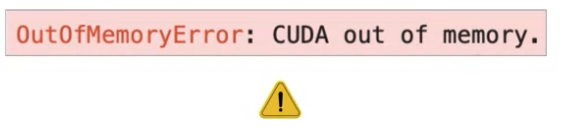
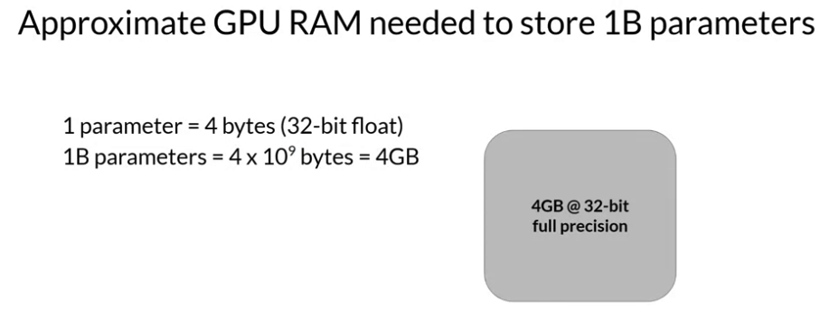
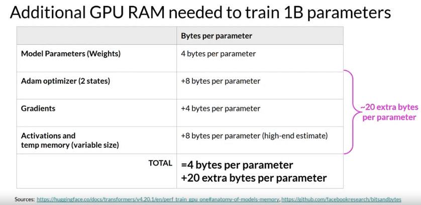
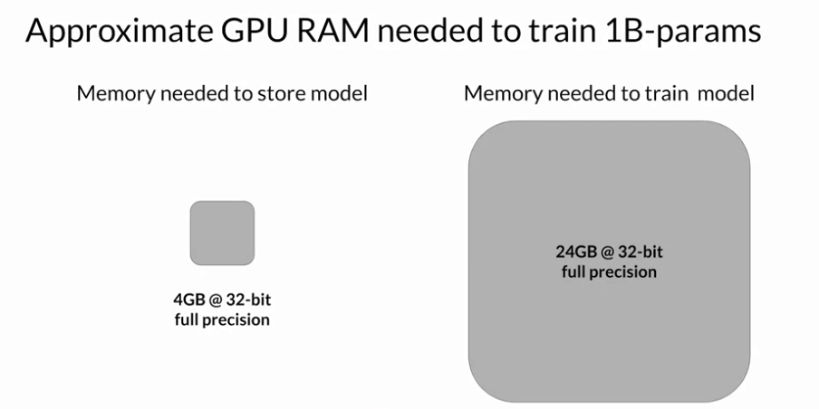
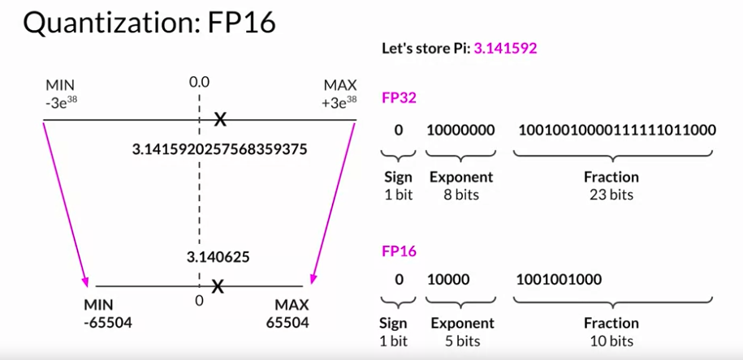
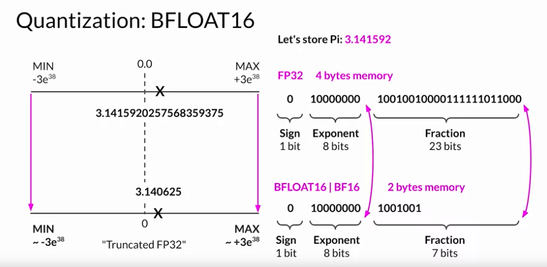
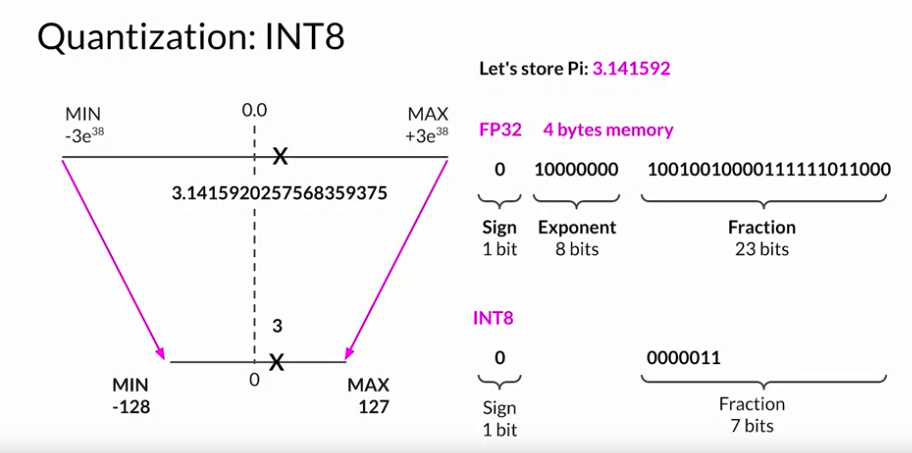
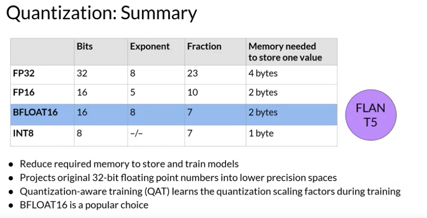
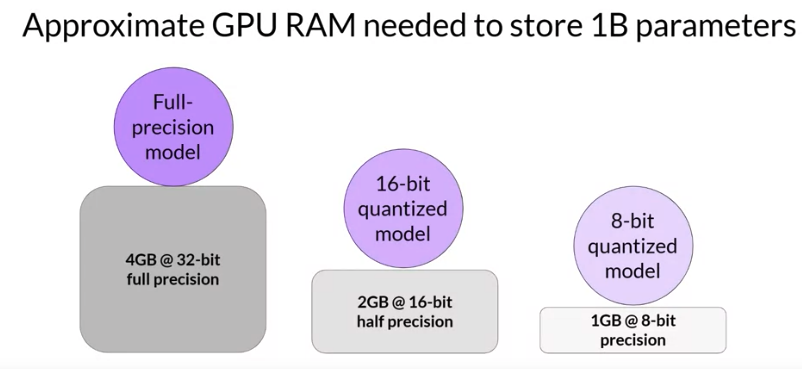
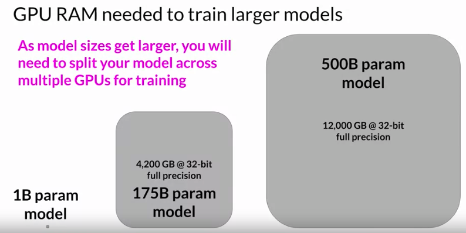

# Gen AI LLM - Course 2
## Part 2 - Computational challenges of training LLMs

###### Below are some key notes from [Generative AI with Large Language Models](https://www.coursera.org/learn/generative-ai-with-llms)

### Intro
One of the most common issues you still counter when you try to train large language models is running out of memory. If you've ever tried training or even just loading your model on Nvidia GPUs, this error message might look familiar. 

*CUDA*, short for Compute Unified Device Architecture, is a collection of libraries and tools developed for Nvidia GPUs. Libraries such as PyTorch and TensorFlow use CUDA to boost performance on metrics multiplication and other operations common to deep learning. You'll encounter these out-of-memory issues because most LLMs are huge, and require a ton of memory to store and train all of their parameters. 

A single parameter is typically represented by a 32-bit float, which is a way computers represent real numbers. You'll see more details about how numbers gets stored in this format shortly. A 32-bit float takes up four bytes of memory. So to store one billion parameters you'll need four bytes times one billion parameters, or four gigabyte of GPU RAM at 32-bit full precision.
And this is just to store model weights

If you want to train the model, you'll have to plan for additional components that use GPU memory during training. These include two Adam optimizer states, gradients, activations, and temporary variables needed by your functions. This can easily lead to 20 extra bytes of memory per model parameter.

In fact, to account for all of these overhead during training, you'll actually require approximately *6 times the amount of GPU RAM that the model weights alone* take up. 

To train a one billion parameter model at 32-bit full precision, you'll need approximately 24 gigabyte of GPU RAM. This is definitely too large for consumer hardware, and even challenging for hardware used in data centers, if you want to train with a single processor.

This is definitely too large for consumer hardware, and even challenging for hardware used in data centers, if you want to train with a single processor. What options do you have to reduce the memory required for training? 

### Quantization
One technique that you can use to reduce the memory is called *quantization*. The main idea here is that you reduce the memory required to store the weights of your model by reducing their precision from 32-bit floating point numbers to 16-bit floating point numbers, or eight-bit integer numbers. The corresponding data types used in deep learning frameworks and libraries are FP32 for 32-bit full position, FP16, or Bfloat16 for 16-bit half precision, and int8 eight-bit integers. 

#### Quantization - FP16
TL;DR with FP16 quantization, we reduce the memory requirement by half

By default, model weights, activations, and other model parameters are stored in FP32. Quantization statistically projects the original 32-bit floating point numbers into a lower precision space, using scaling factors calculated based on the range of the original 32-bit floating point numbers. 

##### FP16 Quantization example of PI

Suppose you want to store a PI to six decimal places in different positions. Floating point numbers are stored as a series of bits zeros and ones. The 32 bits to store numbers in full precision with FP32 consist of one bit for the sign where zero indicates a positive number, and one a negative number. Then eight bits for the exponent of the number, and 23 bits representing the fraction of the number. The fraction is also referred to as the mantissa, or significant. It represents the precision bits off the number. If you convert the 32-bit floating point value back to a decimal value, you notice the slight loss in precision. For reference, here's the real value of Pi to 19 decimal places. Now, let's see what happens if you project this FP32 representation of Pi into the FP16, 16-bit lower precision space. The 16 bits consists of one bit for the sign, as you saw for FP32, but now FP16 only assigns five bits to represent the exponent and 10 bits to represent the fraction. Therefore, the range of numbers you can represent with FP16 is vastly smaller from negative 65,504 to positive 65,504. The original FP32 value gets projected to 3.140625 in the 16-bit space. Notice that you lose some precision with this projection. 

There are only six places after the decimal point now. You'll find that this loss in precision is acceptable in most cases because you're trying to optimize for memory footprint. Storing a value in FP32 requires four bytes of memory. In contrast, storing a value on FP16 requires only two bytes of memory, so with quantization you have reduced the memory requirement by half.

#### Quantization - BFLOAT16
TL;DR: Many LLMs, including FLAN-T5, have been pre-trained with BFLOAT16. BFLOAT16 or BF16 is a hybrid between half precision FP16 and full precision FP32. BF16 significantly helps with training stability and is supported by newer GPU's such as NVIDIA's A100. 

The AI research community has explored ways to optimize16-bit quantization. One datatype in particular BFLOAT16, has recently become a popular alternative to FP16. BFLOAT16, short for *Brain Floating Point* Format developed at Google Brain has become a popular choice in deep learning.

Many LLMs, including FLAN-T5, have been pre-trained with BFLOAT16. BFLOAT16 or BF16 is a hybrid between half precision FP16 and full precision FP32. 

BF16 significantly helps with training stability and is supported by newer GPU's such as NVIDIA's A100. BFLOAT16 is often described as a truncated 32-bit float, as it captures the full dynamic range of the full 32-bit float, that uses only 16-bits. BFLOAT16 uses the full eight bits to represent the exponent, but truncates the fraction to just seven bits. This not only saves memory, but also increases model performance by speeding up calculations. The downside is that BF16 is not well suited for integer calculations, but these are relatively rare in deep learning. 

#### Quantization - INT8 (just for completeness - to not be used)
For completeness let's have a look at what happens if you quantize Pi from the 32-bit into the even lower precision eight bit space. If you use one bit for the sign INT8 values are represented by the remaining seven bits. This gives you a range to represent numbers from negative 128 to positive 127 and unsurprisingly Pi gets projected two or three in the 8-bit lower precision space. This brings new memory requirement down from originally four bytes to just one byte, but obviously results in a pretty dramatic loss of precision.

### Quantization Summary
The goal of *quantization* is to *reduce the memory required to store and train models by reducing the precision off the model weights*. 

Quantization statistically projects the original 32-bit floating point numbers into lower precision spaces using scaling factors calculated based on the range of the original 32-bit floats. Modern deep learning frameworks and libraries support quantization-aware training, which learns the quantization scaling factors during the training process. 

You can use quantization to reduce the memory footprint off the model during training. BFLOAT16 has become a popular choice of precision in deep learning as it maintains the dynamic range of FP32, but reduces the memory footprint by half. Many LLMs, including FLAN-T5, have been pre-trained with BFOLAT16. Lookout for a mention of BFLOAT16 in next week's lab. 

### Fitting models into GPU memory and Distributing Training 
Now let's return to the challenge of fitting models into GPU memory and take a look at the impact quantization can have. By applying quantization, you can reduce your memory consumption required to store the model parameters down to only two gigabyte using 16-bit half precision of 50% saving and you could further reduce the memory footprint by another 50% by representing the model parameters as eight bit integers, which requires only one gigabyte of GPU RAM. Note that in all these cases you still have a model with one billion parameters. 

The circles representing the models are the same size. Quantization will give you the same degree of savings when it comes to training. 

However, many models now have sizes in excess of 50 billion or even 100 billion parameters. Meaning you'd need up to 500 times more memory capacity to train them, tens of thousands of gigabytes. These enormous models dwarf the one billion parameter model we've been considering, shown here to scale on the left. As modal scale beyond a few billion parameters, it becomes impossible to train them on a single GPU. 

Instead, you'll need to turn to *distributed computing* techniques while you train your model across multiple GPUs. This could require access to hundreds of GPUs, which is very expensive. Another reason why you won't pre-train your own model from scratch most of the time

However, an additional training process called fine-tuning, which we will cover in the next chapter, also require storing all training parameters in memory and it's very likely you'll want to fine tune a model at some point

