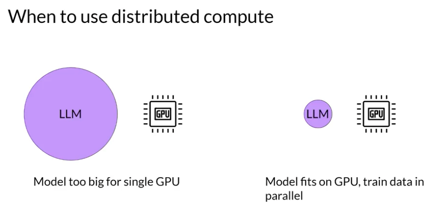
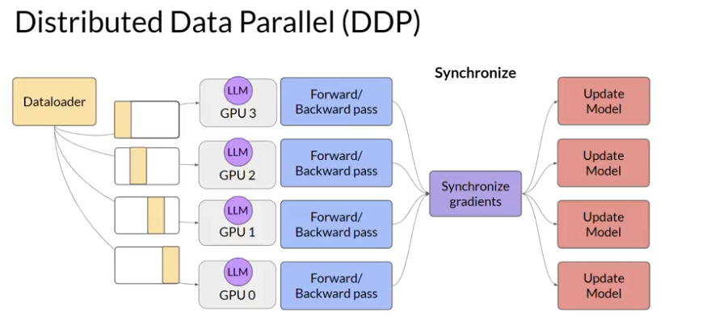
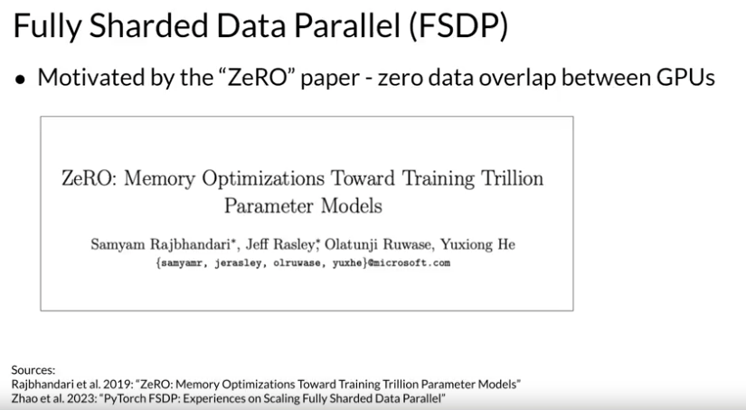
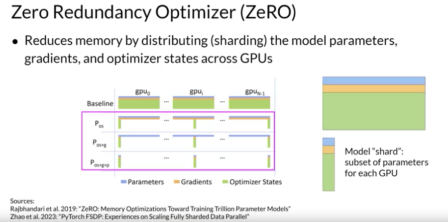
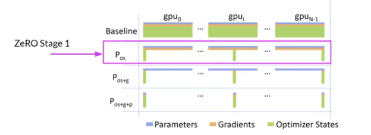
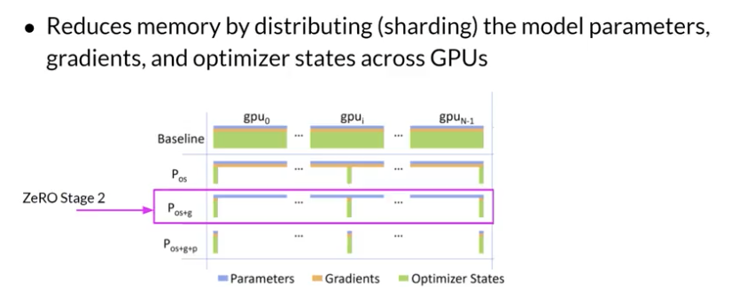
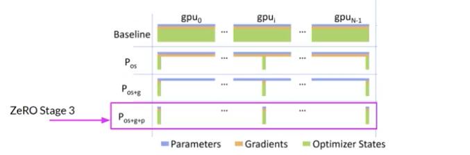
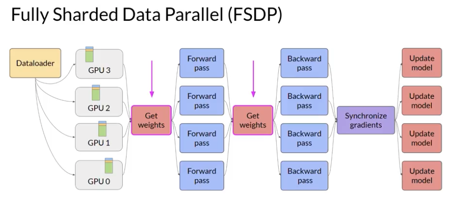
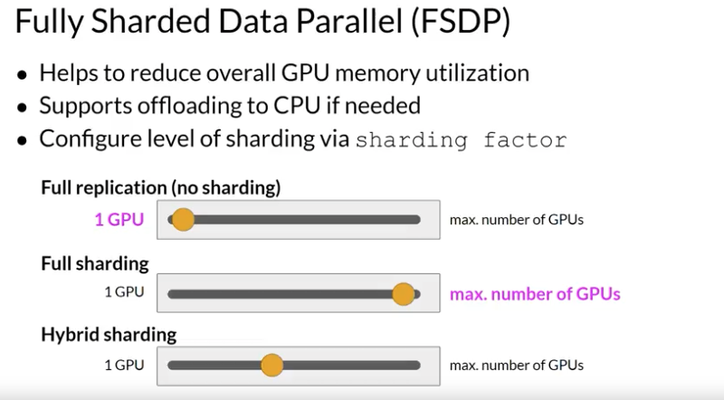
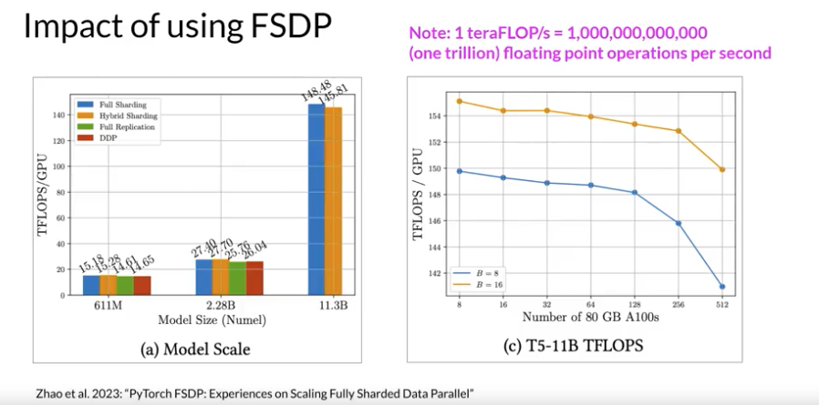

# Gen AI LLM - Course 2
## Part 3 - Efficient multi-GPU compute strategies

###### Below are some key notes from [Generative AI with Large Language Models](https://www.coursera.org/learn/generative-ai-with-llms)

### When to use distributed compute?

It's very likely that at some point you will need to scale your model training efforts beyond a single GPU. You'll need to use multi GPU compute strategies when your model becomes too big to fit in a single GPU. But even if your model does fit onto a single GPU, there are benefits to using multiple GPUs to speed up your training. 

#### DDP - Distributed Data Parallel
The first step in scaling model training is to distribute large data-sets across multiple GPUs and process these batches of data in parallel. 

A popular implementation of this model replication technique is Pytorch distributed data-parallel, or *DDP* for short. DDP copyists your model onto each GPU and sends batches of data to each of the GPUs in parallel. Each data-set is processed in parallel and then a synchronization step combines the results of each GPU, which in turn updates the model on each GPU, which is always identical across chips. This implementation allows parallel computations across all GPUs that results in faster training. Note that DDP requires that your model weights and all of the additional parameters, gradients, and optimizer states that are needed for training, fit onto a single GPU

#### FSPD - Fully Sharded Data Parallel with Zero Redudancy Optimizer (ZeRO)
If your model is too big for this, you should look into another technique called *modal sharding*. A popular implementation of modal sharding is Py Torch fully sharded data parallel, or *FSDP* for short. 

FSDP is motivated by a paper published by researchers at Microsoft in 2019 that proposed a technique called *ZeRO*. ZeRO stands for zero redundancy optimizer and the goal of ZeRO is to optimize memory by distributing or sharding model states across GPUs with ZeRO data overlap. This allows you to scale model training across GPUs when your model doesn't fit in the memory of a single chip

Earlier this week, we looked at all of the memory components required for training LLMs, the largest memory requirement was for the optimizer states, which take up twice as much space as the weights, followed by weights themselves and the gradients. Let's represent the parameters as this blue box, the gradients and yellow and the optimizer states in green. One limitation off the model replication strategy that I showed before is that you need to keep a full model copy on each GPU, which leads to redundant memory consumption. You are storing the same numbers on every GPU. 

ZeRO, on the other hand, eliminates this redundancy by distributing also referred to as sharding the model parameters, gradients, and optimizer states across GPUs instead of replicating them. At the same time, the communication overhead for a sinking model states stays close to that of the previously discussed ADP. ZeRO offers three optimization stages.

ZeRO Stage 1, shots only optimizer states across GPUs, this can reduce your memory footprint by up to a factor of four.

ZeRO Stage 2 also shots the gradients across chips. When applied together with Stage 1, this can reduce your memory footprint by up to eight times. 

Finally, ZeRO Stage 3 shots all components including the model parameters across GPUs. When applied together with Stages 1 and 2, memory reduction is linear with a number of GPUs. For example, sharding across 64 GPUs could reduce your memory by a factor of 64.

When you use FSDP, you distribute the data across multiple GPUs as you saw happening in GDP. But with FSDP, you also distributed or shard the model parameters, gradients, and optimize the states across the GPU nodes using one of the strategies specified in the ZeRO paper. With this strategy, you can now work with models that are too big to fit on a single chip. In contrast to GDP, where each GPU has all of the model states required for processing each batch of data available locally, FSDP requires you to collect this data from all of the GPUs before the forward and backward pass. Each CPU requests data from the other GPUs on-demand to materialize the sharded data into uncharted data for the duration of the operation. After the operation, you release the uncharted non-local data back to the other GPUs as original sharded data You can also choose to keep it for future operations during backward pass for example. Note, this requires more GPU RAM again, this is a typical performance versus memory trade-off decision. In the final step after the backward pass, FSDP is synchronizes the gradients across the GPUs in the same way they were for DDP. Model sharding S described with FSDP allows you to reduce your overall GPU memory utilization.

To manage the trade-off between performance and memory utilization, you can configure the level of sharding using FSDP is charting factor. A sharding factor of one basically removes the sharding and replicates the full model similar to DDP. If you set the sharding factor to the maximum number of available GPUs, you turn on full sharding. This has the most memory savings, but increases the communication volume between GPUs. Any sharding factor in-between enables hyper sharding.

#### Impact of FSPD
Let's take a look at how FSDP performs in comparison to DDP measured in teraflops per GPU. These tests were performed using a maximum of 512 NVIDIA V100 GPUs, each with 80 gigabytes of memory. Note, one teraflop corresponds to one trillion floating-point operations per second. The first figure shows FSDP performance for different size T5 models. You can see the different performance numbers for FSDP, full sharding in blue, hyper shard in orange and full replication in green. For reference, DDP performance is shown in red. For the first 25 models with 611 million parameters and 2.28 billion parameters, the performance of FSDP and DDP is similar. 

Now, if you choose a model size beyond 2.28 billion, such as 25 with 11.3 billion parameters, DDP runs into the out-of-memory error. FSDP on the other hand can easily handle models this size and achieve much higher teraflops when lowering the model's precision to 16-bit. The second figure shows 7% decrease in per GPU teraflops when increasing the number of GPUs from 8-512 for the 11 billion T5 model, plotted here using a batch size of 16 and orange and a batch size of eight in blue. As the model grows in size and is distributed across more and more GPUs, the increase in communication volume between chips starts to impact the performance, slowing down the computation. 

In summary, this shows that you can use FSDP for both small and large models and seamlessly scale your model training across multiple GPUs.

