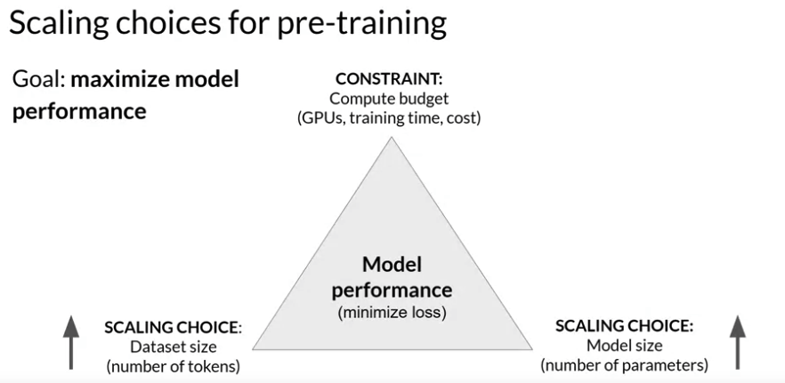
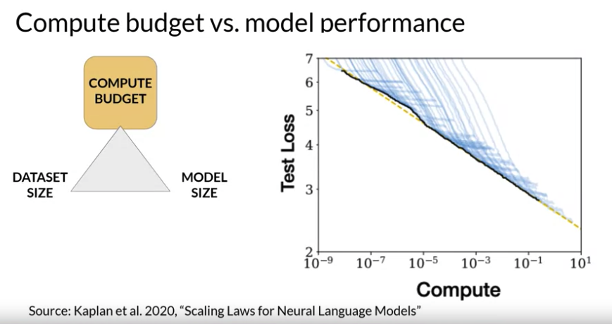

# Gen AI LLM - Course 2
## Part 4 - Scaling laws and compute-optimal models

###### Below are some key notes from [Generative AI with Large Language Models](https://www.coursera.org/learn/generative-ai-with-llms)

In this cahpter, we will learn about the research that has explored the relationship between model size, training, configuration and performance in an effort to determine just how big models need to be.

The goal during pre-training is to maximize the model's performance of its learning objective, which is minimizing the loss when predicting tokens. 

Two options you have to achieve better performance are:
 - increasing the size of the dataset you train your model on 
 - increasing the number of parameters in your model. 

In theory, you could scale either of both of these quantities to improve performance. However, another issue to take into consideration is your compute budget which includes factors like the number of GPUs you have access to and the time you have available for training models.

To help you understand some of the discussion ahead, let's first define a unit of compute that quantifies the required resources. A *petaFLOP* per second day is a measurement of the number of floating point operations performed at a rate of one petaFLOP per second, running for an entire day. Note, one petaFLOP corresponds to one quadrillion floating point operations per second. When specifically thinking about training transformers, one petaFLOP per second day is approximately equivalent to eight NVIDIA V100 GPUs, operating at full efficiency for one full day. 

If you have a more powerful processor that can carry out more operations at once, then a petaFLOP per second day requires fewer chips. For example, two NVIDIA A100 GPUs give equivalent compute to the eight V100 chips. 

To give you an idea off the scale of these compute budgets, this chart shows a comparison off the petaFLOP per second days required to pre-train different variance of Bert and Roberta, which are both encoder only models. T5 and encoder-decoder model and GPT-3, which is a decoder only model. The difference between the models in each family is the number of parameters that were trained, ranging from a few hundred million for Bert base to 175 billion for the largest GPT-3 variant. Note that the y-axis is logarithmic. Each increment vertically is a power of 10. Here we see that T5 XL with three billion parameters required close to 100 petaFLOP per second days. While the larger GPT-3 175 billion parameter model required approximately 3,700 petaFLOP per second days. This chart makes it clear that a huge amount of computers required to train the largest models.

You can see that bigger models take more compute resources to train and generally also require more data to achieve good performance. It turns out that they are actually well-defined relationships between these three scaling choices. 

Researchers have explored the *trade-offs* between *training dataset size, model size and compute budget*. Here's a figure from a paper by researchers at OpenAI that explores the impact of compute budget on model performance. The y-axis is the test loss, which you can consider as a proxy for model performance where smaller values are better. The x-axis is the compute budget in units of petaFLOP per second days. 

As you just saw, larger numbers can be achieved by either using more compute power or training for longer or both. Each thin blue line here shows the model loss over a single training run. Looking at where the loss starts to decline more slowly for each run, reveals a clear relationship between the compute budget and the model's performance. 

This can be approximated by a *power-law* relationship, shown by this pink line. A power law is a mathematical relationship between two variables, where one is proportional to the other raised to some power. When plotted on a graph where both axes are logarithmic, power-law relationships appear as straight lines. The relationship here holds as long as model size and training dataset size don't inhibit the training process. 

Taken at face value, this would suggest that you can just increase your compute budget to achieve better model performance.

In practice however, the compute resources you have available for training will generally be a hard constraint set by factors such as the hardware you have access to, the time available for training and the financial budget of the project.
If you hold your compute budget fixed, the two levers you have to improve your model's performance are the size of the training dataset and the number of parameters in your model. The OpenAI researchers found that these two quantities also show a power-law relationship with a test loss in the case where the other two variables are held fixed.

This is another figure from the paper exploring the impact of training dataset size on model performance.
Here, the compute budget and model size are held fixed and the size of the training dataset is vary. The graph shows that as the volume of training data increases, the performance of the model continues to improve. 

In the second graph, the compute budget and training dataset size are held constant. Models of varying numbers of parameters are trained. As the model increases in size, the test loss decreases indicating better performance. 

### Chinchilla paper
What's the ideal balance between these three quantities? Well, it turns out a lot of people are interested in this question. Both research and industry communities have published a lot of empirical data for pre-training compute optimal models. In a paper published in 2022, a group of researchers led by Jordan Hoffmann, Sebastian Borgeaud and Arthur Mensch carried out a detailed study of the performance of language models of various sizes and quantities of training data. The goal was to find the optimal number of parameters and volume of training data for a given compute budget. The author's name, the resulting compute optimal model, Chinchilla. This paper is often referred to as the Chinchilla paper. 

Let's take a look at some of their findings. The Chinchilla paper hints that many of the 100 billion parameter large language models like GPT-3 may actually be *over parameterized*, meaning they have more parameters than they need to achieve a good understanding of language and *under trained* so that they would benefit from seeing more training data.

The authors hypothesized that smaller models may be able to achieve the same performance as much larger ones if they are trained on larger datasets. In this table, you can see a selection of models along with their size and information about the dataset they were trained on. 

One important takeaway from the Chinchilla paper is that the *optimal training dataset size for a given model is about 20 times larger than the number of parameters in the model*. Chinchilla was determined to be compute optimal. For a 70 billion parameter model, the ideal training dataset contains 1.4 trillion tokens or 20 times the number of parameters. The last three models in the table were trained on datasets that are smaller than the Chinchilla optimal size. These models may actually be under trained. In contrast, LLaMA was trained on a dataset size of 1.4 trillion tokens, which is close to the Chinchilla recommended number.

Another important result from the paper is that the compute optimal Chinchilla model outperforms non compute optimal models such as GPT-3 on a large range of downstream evaluation tasks

With the results of the Chinchilla paper in hand teams have recently started to develop smaller models that achieved similar, if not better results than larger models that were trained in a non-optimal way. Moving forward, you can probably expect to see a deviation from the bigger is always better trends of the last few years as more teams or developers like you start to optimize their model design. The last model shown on this slide, Bloomberg GPT, is a really interesting model. It was trained in a compute optimal way following the Chinchilla loss and so achieves good performance with the size of 50 billion parameters. It's also an interesting example of a situation where pre-training a model from scratch was necessary to achieve good task performance.

