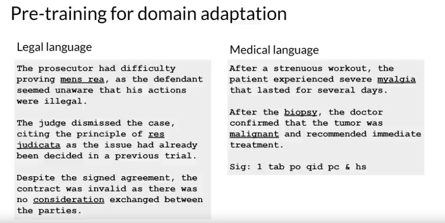
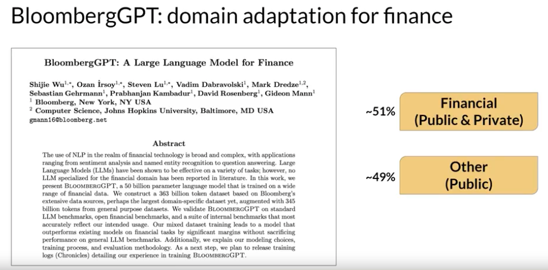
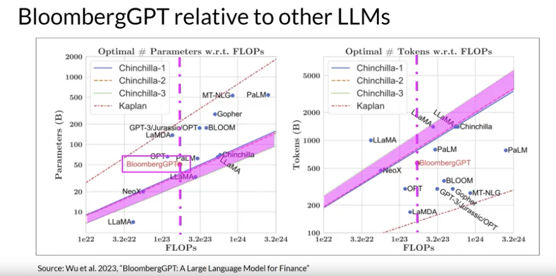

# Gen AI LLM - Course 2
## Part 5 - Pre-training for domain adaptation

###### Below are some key notes from [Generative AI with Large Language Models](https://www.coursera.org/learn/generative-ai-with-llms)

### Domain Adaptation

#### Legal and Medical domain adapation examples
There's one situation where you may find it necessary to pretrain your own model from scratch. If your target domain uses vocabulary and language structures that are not commonly used in day to day language. You may need to perform domain adaptation to achieve good model performance. 

For example, imagine you're a developer building an app to help lawyers and paralegals summarize *legal* briefs. Legal writing makes use of very specific terms like mens rea in the first example and res judicata in the second. These words are rarely used outside of the legal world, which means that they are unlikely to have appeared widely in the training text of existing LLMs. As a result, the models may have difficulty understanding these terms or using them correctly. Another issue is that legal language sometimes uses everyday words in a different context, like consideration in the third example. Which has nothing to do with being nice, but instead refers to the main element of a contract that makes the agreement enforceable. 

For similar reasons, you may face challenges if you try to use an existing LLM in a *medical* application. Medical language contains many uncommon words to describe medical conditions and procedures. And these may not appear frequently in training datasets consisting of web scrapes and book texts. Some domains also use language in a highly idiosyncratic way. This last example of medical language may just look like a string of random characters, but it's actually a shorthand used by doctors to write prescriptions. This text has a very clear meaning to a pharmacist, take one tablet by mouth four times a day, after meals and at bedtime. Because models learn their vocabulary and understanding of language through the original pretraining task. 

Pretraining your model from scratch will result in better models for highly specialized domains like law, medicine, finance or science.

#### BloombergGPT for Financial
Now let's return to BloombergGPT, first announced in 2023 in a paper by Shijie Wu, Steven Lu, and colleagues at Bloomberg. BloombergGPT is an example of a large language model that has been pretrained for a specific domain, in this case, finance. The Bloomberg researchers chose to combine both finance data and general purpose tax data to pretrain a model that achieves Bestinclass results on financial benchmarks. While also maintaining competitive performance on general purpose LLM benchmarks. As such, the researchers chose data consisting of 51% financial data and 49% public data.

In their paper, the Bloomberg researchers describe the model architecture in more detail. They also discuss how they started with a *chinchilla* scaling laws for guidance and where they had to make tradeoffs. These two graphs compare a number of LLMs, including BloombergGPT, to scaling laws that have been discussed by researchers. On the left, the diagonal lines trace the optimal model size in billions of parameters for a range of compute budgets. On the right, the lines trace the compute optimal training data set size measured in number of tokens. 

The dashed pink line on each graph indicates the compute budget that the Bloomberg team had available for training their new model. The pink shaded regions correspond to the compute optimal scaling loss determined in the Chinchilla paper. In terms of model size, you can see that BloombergGPT roughly follows the Chinchilla approach for the given compute budget of 1.3 million GPU hours, or roughly 230,000,000 petaflops. 

The model is only a little bit above the pink shaded region, suggesting the number of parameters is fairly close to optimal. However, the actual number of tokens used to pretrain BloombergGPT 569,000,000,000 is below the recommended Chinchilla value for the available compute budget. 

The smaller than optimal training data set is due to the limited availability of financial domain data. Showing that real world constraints may force you to make trade offs when pretraining your own models.

You can read more about BloombergGPT [here](https://arxiv.org/abs/2303.17564)

