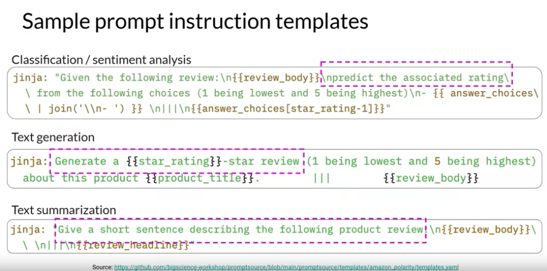

# Gen AI LLM - Course 3
## Part 1 - Instruction fine-tuning

###### Below are some key notes from [Generative AI with Large Language Models](https://www.coursera.org/learn/generative-ai-with-llms)

### Intro
When you have your base model, the thing that's initially pretrained, it's encoded a lot of really good information, usually about the world. So it knows about things, but it doesn't necessarily know how to be able to respond to our prompts, our questions. So when we instruct it to do a certain task, it doesn't necessarily know how to respond. And so instruction fine-tuning helps it to be able to change its behavior to be more helpful for us

Instruction fine-tuning is one of those major breakthroughs in the history of large language models. Because by learning off general text off the Internet and other sources, you learn to predict the next word. By predicting what's the next word on the Internet is not the same as following instructions. In other words, you can take a large language model, train it on hundreds of billions of words off the Internet. And then fine-tune it with a much smaller data set on following instructions and just learn to do that. 

One of the things you have to watch out for, is catastrophic forgetting. That's where you train the model on some extra data in this insane instruct fine-tuning. And then it forgets all of that stuff that it had before, or a big chunk of that data that it had before.

It turns out that there are two types of fine-tuning that are very worth doing. One is that *instruction fine-tuning* we just talked about. And then when a specific developer is trying to fine-tune it for their own application, for a *specialized application*. One of the problems with fine-tuning is you take a giant model and you fine-tune every single parameter in that model. You have this big thing to store around and deploy, and it's actually very compute and memory expansive. So fortunately, there are better techniques than that. This is when we talk about parameter efficient fine-tuning or *PEFT* for short, as a set of methods that can allow you to mitigate some of those concerns.

Parameter efficient fine-tuning is a great way to still achieve similar performance results on a lot of tasks that you can with full fine-tuning. But then actually take advantage of techniques that allow you to freeze those original model weights. Or add adaptive layers on top of that with a much smaller memory footprint.

We see a lot of excitemenet around LoRA because of the performance results of using those low rank matrices as opposed to full fine-tuning. So you're able to get really good performance results with minimal compute and memory requirements. Many developers will often start off with prompting, and sometimes that gives you good enough performance and that's great. And sometimes prompting hits a ceiling in performance and then this type of fine-tuning with LoRA or other PEFT technique is really critical for unlocking that extra level performance.

And then the other thing I'm seeing among a lot of developers is a discussion or debate about the cost of using a giant model, which is a lot of benefits versus for your application fine-tuning a smaller model. Full fine tuning can be cost prohibitive so the ability to actually be able to use techniques like PEFT to put fine-tuning generative AI models kind of in the hands of everyday users. That do have those cost constraints and they're cost conscious, which is pretty much everyone in the real world.

### Instruction fine-tuning
In this chapter we will focus on Fine-Tuning and Evaluating a fine-tuned LLM

Earlier in the course, you saw that some models are capable of identifying instructions contained in a prompt and correctly carrying out zero shot inference, while others, such as smaller LLMs, may fail to carry out the task, like the example shown here. You also saw that including one or more examples of what you want the model to do, known as one shot or few shot inference, can be enough to help the model identify the task and generate a good completion. 

However, this strategy has a couple of drawbacks. First, for smaller models, it doesn't always work, even when five or six examples are included. Second, any examples you include in your prompt take up valuable space in the context window, reducing the amount of room you have to include other useful information. Luckily, another solution exists, you can take advantage of a process known as fine-tuning to further train a base model. 

#### LLM fine-tuning at a high level
In contrast to pre-training, where you train the LLM using vast amounts of unstructured textual data via selfsupervised learning, fine-tuning is a *supervised learning* process where you use a data set of labeled examples to update the weights of the LLM. The labeled examples are *prompt completion pairs*, the fine-tuning process extends the training of the model to improve its ability to generate good completions for a specific task. 

One strategy, known as instruction fine tuning, is particularly good at improving a model's performance on a variety of tasks. Let's take a closer look at how this works, instruction fine-tuning trains the model using examples that demonstrate how it should respond to a specific instruction.

Here are a couple of example prompts to demonstrate this idea. The instruction in both examples is classify this review, and the desired completion is a text string that starts with sentiment followed by either positive or negative.

!prompts_fine-tuning_example_sentiment](../../images/prompts_fine-tuning_example_sentiment.png)

 The data set you use for training includes many pairs of prompt completion examples for the task you're interested in, each of which includes an instruction. For example, if you want to fine tune your model to improve its summarization ability, you'd build up a data set of examples that begin with the instruction summarize, the following text or a similar phrase. And if you are improving the model's translation skills, your examples would include instructions like translate this sentence. These prompt completion examples allow the model to learn to generate responses that follow the given instructions.

#### Prompt instruction templates

How do you actually go about instruction, fine-tuning and LLM? The first step is to prepare your training data. 

##### Training Data

There are many publicly available datasets that have been used to train earlier generations of language models, although most of them are not formatted as instructions. Luckily, developers have assembled *prompt template* libraries that can be used to take existing datasets, for example, the large data set of Amazon product reviews and turn them into instruction prompt datasets for fine-tuning. 

Prompt template libraries include many templates for different tasks and different data sets. Here are three prompts that are designed to work with the Amazon reviews dataset and that can be used to fine tune models for classification, text generation and text summarization tasks. You can see that in each case you pass the original review, here called review_body, to the template, where it gets inserted into the text that starts with an instruction like predict the associated rating, generate a star review, or give a short sentence describing the following product review. 

The result is a prompt that now contains both an instruction and the example from the data set.

##### Validation and Test Data
Once you have your instruction data set ready, as with standard supervised learning, you divide the data set into training validation and test splits. 

During fine tuning, you select prompts from your training data set and pass them to the LLM, which then generates completions. Next, you compare the LLM completion with the response specified in the training data. You can see here that the model didn't do a great job, it classified the review as neutral, which is a bit of an understatement. The review is clearly very positive. 

Remember that the output of an LLM is a probability distribution across tokens. So you can compare the distribution of the completion and that of the training label and use the standard crossentropy function to calculate loss between the two token distributions. 
And then use the calculated loss to update your model weights in standard backpropagation. You'll do this for many batches of prompt completion pairs and over several epochs, update the weights so that the model's performance on the task improves. 

As in standard supervised learning, you can define separate evaluation steps to measure your LLM performance using the holdout validation data set. This will give you the *validation accuracy*, and after you've completed your fine tuning, you can perform a final performance evaluation using the holdout test data set. This will give you the *test accuracy*.

The fine-tuning process results in a new version of the base model, often called an instruct model that is better at the tasks you are interested in. Fine-tuning with instruction prompts is the most common way to fine-tune LLMs these days. From this point on, when you hear or see the term fine-tuning, you can assume that it always means instruction fine tuning.

### Fine tuning on a single task
While LLMs have become famous for their ability to perform many different language tasks within a single model, your application may only need to perform a single task. In this case, you can fine-tune a pre-trained model to improve performance on only the task that is of interest to you. 

For example, summarization using a dataset of examples for that task. Interestingly, good results can be achieved with relatively few examples. Often just 500-1,000 examples can result in good performance in contrast to the billions of pieces of texts that the model saw during pre-training.

#### Catastrophic forgetting
However, there is a potential downside to fine-tuning on a single task. The process may lead to a phenomenon called catastrophic forgetting. *Catastrophic forgetting* happens because the full fine-tuning process modifies the weights of the original LLM. While this leads to great performance on the single fine-tuning task, it can degrade performance on other tasks. 

For example, while fine-tuning can improve the ability of a model to perform sentiment analysis on a review and result in a quality completion, the model may forget how to do other tasks. This model knew how to carry out named entity recognition before fine-tuning correctly identifying Charlie as the name of the cat in the sentence. 

But after fine-tuning, the model can no longer carry out this task, confusing both the entity it is supposed to identify and exhibiting behavior related to the new task. 

What options do you have to avoid catastrophic forgetting? First of all, it's important to decide whether catastrophic forgetting actually impacts your use case. If all you need is reliable performance on the single task you fine-tuned on, it may not be an issue that the model can't generalize to other tasks. If you do want or need the model to maintain its multitask generalized capabilities, you can perform *fine-tuning on multiple tasks at one time*. Good multitask fine-tuning may require 50-100,000 examples across many tasks, and so will require more data and compute to train. Will discuss this option in more detail shortly. 

Our second option is to perform parameter efficient fine-tuning, or *PEFT* for short instead of full fine-tuning. PEFT is a set of techniques that preserves the weights of the original LLM and trains only a small number of task-specific adapter layers and parameters. PEFT shows greater robustness to catastrophic forgetting since most of the pre-trained weights are left unchanged. 

