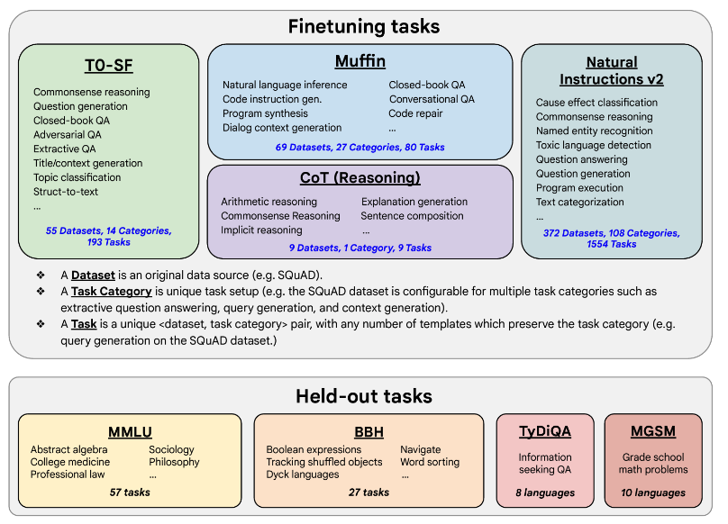

# Gen AI LLM - Course 3
## Part 2 - Multi-task instruction fine-tuning

###### Below are some key notes from [Generative AI with Large Language Models](https://www.coursera.org/learn/generative-ai-with-llms)

### Intro
*Multitask fine-tuning* is an extension of single task fine-tuning, where the training dataset is comprised of example inputs and outputs for multiple tasks. Here, the dataset contains examples that instruct the model to carry out a variety of tasks, including summarization, review rating, code translation, and entity recognition. 

You train the model on this mixed dataset so that it can improve the performance of the model on all the tasks simultaneously, thus avoiding the issue of catastrophic forgetting. Over many epochs of training, the calculated losses across examples are used to update the weights of the model, resulting in an instruction tuned model that is learned how to be good at many different tasks simultaneously. One drawback to multitask fine-tuning is that it requires a lot of data. You may need as many as 50-100,000 examples in your training set. However, it can be really worthwhile and worth the effort to assemble this data. The resulting models are often very capable and suitable for use in situations where good performance at many tasks is desirable

### FLAN Instruction Fine Tuning
FLAN, which stands for *fine-tuned language net*, is a specific set of instructions used to fine-tune different models. Because they're FLAN fine-tuning is the last step of the training process the authors of the original paper called it the metaphorical dessert to the main course of pre-training quite a fitting name. FLAN-T5, the FLAN instruct version of the T5 foundation model while FLAN-PALM is the flattening struct version of the palm foundation model. 

#### FLAN T-5
FLAN-T5 is a great general purpose instruct model. In total, it's been fine tuned on 473 datasets across 146 task categories. Those datasets are chosen from other models and papers as shown here.

One example of a prompt dataset used for summarization tasks in FLAN-T5 is *SAMSum*. It's part of the muffin collection of tasks and datasets and is used to train language models to summarize dialogue. SAMSum is a dataset with 16,000 messenger like conversations with summaries. 

Three examples are shown here with the dialogue on the left and the summaries on the right. The dialogues and summaries were crafted by linguists for the express purpose of generating a high-quality training dataset for language models. The linguists were asked to create conversations similar to those that they would write on a daily basis, reflecting their proportion of topics of their real life messenger conversations. Although language experts then created short summaries of those conversations that included important pieces of information and names of the people in the dialogue. 

Here is a prompt template designed to work with this SAMSum dialogue summary dataset. The template is actually comprised of several different instructions that all basically ask the model to do this same thing. Summarize a dialogue

##### FLAN T-5 in action with Summarization
Imagine you're a data scientist building an app to support your customer service team, process requests received through a chat bot, like the one shown here. Your customer service team needs a summary of every dialogue to identify the key actions that the customer is requesting and to determine what actions should be taken in response. 

The SAMSum dataset gives FLAN-T5 some abilities to summarize conversations. However, the examples in the dataset are mostly conversations between friends about day-to-day activities and don't overlap much with the language structure observed in customer service chats. You can perform additional fine-tuning of the FLAN-T5 model using a dialogue dataset that is much closer to the conversations that happened with your bot. 

This is the exact scenario that you'll explore in the lab this week. You'll make use of an additional domain specific summarization dataset called *dialogsum* to improve FLAN-T5's is ability to summarize support chat conversations. 

This dataset consists of over 13,000 support chat dialogues and summaries. The dialogue some dataset is not part of the FLAN-T5 training data, so the model has not seen these conversations before. Let's take a look at example from dialogsum and discuss how a further round of fine-tuning can improve the model. This is a support chat that is typical of the examples in the dialogsum dataset. The conversation is between a customer and a staff member at a hotel check-in desk. The chat has had a template applied so that the instruction to summarize the conversation is included at the start of the text.

##### Before additional Fine Tuning
Now, let's take a look at how FLAN-T5 responds to this prompt before doing any additional fine-tuning, note that the prompt is now condensed on the left to give you more room to examine the completion of the model. Here is the model's response to the instruction. 
You can see that the model does as it's able to identify that the conversation was about a reservation for Tommy. However, it does not do as well as the human-generated baseline summary, which includes important information such as Mike asking for information to facilitate check-in and the models completion has also *invented information* that was not included in the original conversation. Specifically the name of the hotel and the city it was located in.

##### After additional Fine Tuning
Now let's take a look at how the model does after fine-tuning on the dialogue some dataset, hopefully, you will agree that this is closer to the human-produced summary. There is *no fabricated information and the summary includes all of the important details*, including the names of both people participating in the conversation. 

### Scaling instruct models
This [paper](https://arxiv.org/abs/2210.11416) introduces FLAN (Fine-tuned LAnguage Net), an instruction finetuning method, and presents the results of its application. The study demonstrates that by fine-tuning the 540B PaLM model on 1836 tasks while incorporating Chain-of-Thought Reasoning data, FLAN achieves improvements in generalization, human usability, and zero-shot reasoning over the base model. The paper also provides detailed information on how each these aspects was evaluated.

