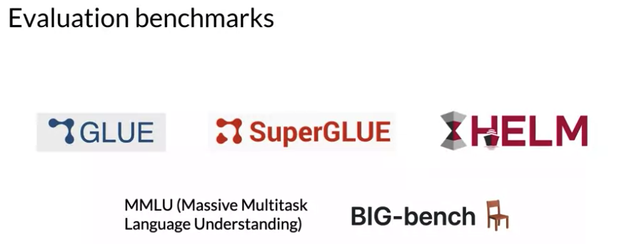
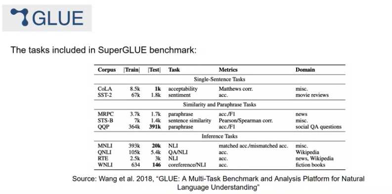
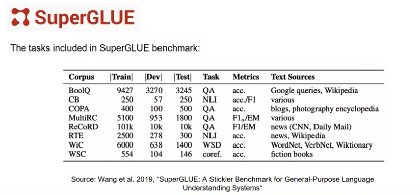
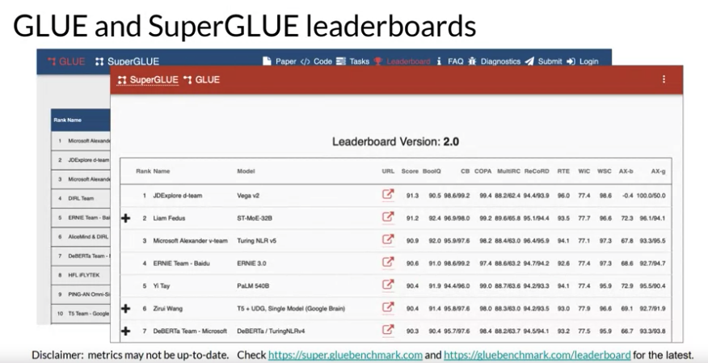
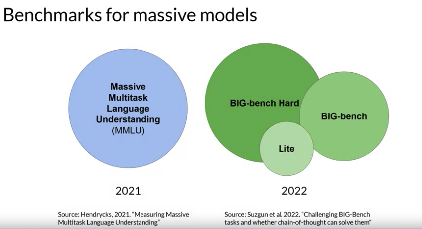
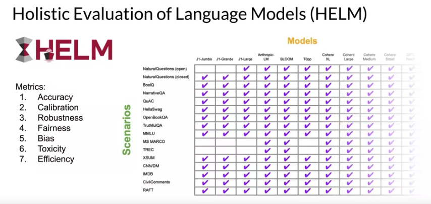

# Gen AI LLM - Course 3
## Part 3 - Model Evaluation


###### Below are some key notes from [Generative AI with Large Language Models](https://www.coursera.org/learn/generative-ai-with-llms)

### Model Evaluation metrics

In traditional machine learning, you can assess how well a model is doing by looking at its performance on training and validation data sets where the output is already known. You're able to calculate simple metrics such as accuracy, which states the fraction of all predictions that are correct because the models are deterministic. 

```
Accuracy = Correct Predictions / Total Predictions
```

But with large language models where the output is non-deterministic and language-based evaluation is much more challenging. Take, for example, the sentence, Mike really loves drinking tea. This is quite similar to Mike adores sipping tea. But how do you measure the similarity? Let's look at these other two sentences. Mike does not drink coffee, and Mike does drink coffee. There is only one word difference between these two sentences. However, the meaning is completely different.


When you train a model on millions of sentences, you need an automated, structured way to make measurements. ROUGE and BLEU, are two widely used evaluation metrics for different tasks. 
 - *ROUGE* or recall oriented under study for gesting evaluation is primarily employed to assess the quality of automatically generated summaries by comparing them to human-generated reference summaries. 
 - *BLEU* or bilingual evaluation understudy is an algorithm designed to evaluate the quality of machine-translated text, again, by comparing it to human-generated translations.


### ROUGE score
#### Terminology
Before we start calculating metrics. Let's review some terminology. In the anatomy of language, a unigram is equivalent to a single word. A bigram is two words and n-gram is a group of n-words.


#### ROUGE-1

The recall metric measures the number of words or unigrams that are matched between the reference and the generated output divided by the number of words or unigrams in the reference. In this case, that gets a perfect score of one as all the generated words match words in the reference. Precision measures the unigram matches divided by the output size. The F1 score is the harmonic mean of both of these values. These are very basic metrics that only focused on individual words, hence the one in the name, and don't consider the ordering of the words. It can be deceptive. It's easily possible to generate sentences that score well but would be subjectively poor. Stop for a moment and imagine that the sentence generated by the model was different by just one word. Not, so it is not cold outside. 


#### ROUGE-2
You can get a slightly better score by taking into account bigrams or collections of two words at a time from the reference and generated sentence. By working with pairs of words you're acknowledging in a very simple way, the ordering of the words in the sentence. By using bigrams, you're able to calculate a ROUGE-2. Now, you can calculate the recall, precision, and F1 score using bigram matches instead of individual words. You'll notice that the scores are lower than the ROUGE-1 scores. With longer sentences, they're a greater chance that bigrams don't match, and the scores may be even lower. 


#### ROUGE-L
Rather than continue on with ROUGE numbers growing bigger to n-grams of three or fours, let's take a different approach. Instead, you'll look for the longest common subsequence present in both the generated output and the reference output. In this case, the longest matching sub-sequences are, it is and cold outside, each with a length of two. You can now use the LCS value to calculate the recall precision and F1 score, where the numerator in both the recall and precision calculations is the length of the longest common subsequence, in this case, two. Collectively, these three quantities are known as the Rouge-L score


You can now use the LCS value to calculate the recall precision and F1 score, where the numerator in both the recall and precision calculations is the length of the longest common subsequence, in this case, two. Collectively, these three quantities are known as the Rouge-L score. As with all of the rouge scores, you need to take the values in context.


#### ROUGE hacking and clipping
You can only use the scores to compare the capabilities of models if the scores were determined for the same task. For example, summarization. Rouge scores for different tasks are not comparable to one another. 


As you've seen, a particular problem with simple rouge scores is that it's possible for a bad completion to result in a good score. Take, for example, this generated output, cold, cold, cold, cold. As this generated output contains one of the words from the reference sentence, it will score quite highly, even though the same word is repeated multiple times. The Rouge-1 precision score will be perfect. One way you can counter this issue is by using a clipping function to limit the number of unigram matches to the maximum count for that unigram within the reference. In this case, there is one appearance of cold and the reference and so a modified precision with a clip on the unigram matches results in a dramatically reduced score. However, you'll still be challenged if their generated words are all present, but just in a different order. For example, with this generated sentence, outside cold it is. This sentence was called perfectly even on the modified precision with the clipping function as all of the words and the generated output are present in the reference. Whilst using a different rouge score can help experimenting with a n-gram size that will calculate the most useful score will be dependent on the sentence, the sentence size, and your use case.


#### BLEU score
BLEU score stands for bilingual evaluation under study. It is useful for evaluating the quality of machine-translated text. The score itself is calculated using the average precision over multiple n-gram sizes. 

The BLEU score quantifies the quality of a translation by checking how many n-grams in the machine-generated translation match those in the reference translation. To calculate the score, you average precision across a range of different n-gram sizes. If you were to calculate this by hand, you would carry out multiple calculations and then average all of the results to find the BLEU score. 


### Benchmarks
In order to measure and compare LLMs more holistically, you can make use of pre-existing datasets, and associated benchmarks that have been established by LLM researchers specifically for this purpose. Selecting the right evaluation dataset is vital, so that you can accurately assess an LLM's performance, and understand its true capabilities. 

You'll find it useful to select datasets that isolate specific model skills, like reasoning or common sense knowledge, and those that focus on potential risks, such as disinformation or copyright infringement. An important issue that you should consider is whether the model has seen your evaluation data during training. You'll get a more accurate and useful sense of the model's capabilities by evaluating its performance on data that it hasn't seen before. 


Benchmarks, such as GLUE, SuperGLUE, or Helm, cover a wide range of tasks and scenarios. They do this by designing or collecting datasets that test specific aspects of an LLM.



#### GLUE
GLUE, or General Language Understanding Evaluation, was introduced in 2018. GLUE is a collection of natural language tasks, such as sentiment analysis and question-answering. GLUE was created to encourage the development of models that can generalize across multiple tasks, and you can use the benchmark to measure and compare the model performance.




#### SuperGLUE
As a successor to GLUE, SuperGLUE was introduced in 2019, to address limitations in its predecessor. It consists of a series of tasks, some of which are not included in GLUE, and some of which are more challenging versions of the same tasks. SuperGLUE includes tasks such as multi-sentence reasoning, and reading comprehension. 




Both the GLUE and SuperGLUE benchmarks have leaderboards that can be used to compare and contrast evaluated models. The results page is another great resource for tracking the progress of LLMs.




#### Benchmarks for massive models
As models get larger, their performance against benchmarks such as SuperGLUE start to match human ability on specific tasks. That's to say that models are able to perform as well as humans on the benchmarks tests, but subjectively we can see that they're not performing at human level at tasks in general. There is essentially an arms race between the emergent properties of LLMs, and the benchmarks that aim to measure them. 


Here are a couple of recent benchmarks that are pushing LLMs further. Massive Multitask Language Understanding, or *MMLU*, is designed specifically for modern LLMs. To perform well models must possess extensive world knowledge and problem-solving ability. Models are tested on elementary mathematics, US history, computer science, law, and more. In other words, tasks that extend way beyond basic language understanding. 


*BIG-bench* currently consists of 204 tasks, ranging through linguistics, childhood development, math, common sense reasoning, biology, physics, social bias, software development and more. BIG-bench comes in three different sizes, and part of the reason for this is to keep costs achievable, as running these large benchmarks can incur large inference costs.




A final benchmark you should know about is the Holistic Evaluation of Language Models, or *HELM*. The HELM framework aims to improve the transparency of models, and to offer guidance on which models perform well for specific tasks. HELM takes a multimetric approach, measuring seven metrics across 16 core scenarios, ensuring that trade-offs between models and metrics are clearly exposed. One important feature of HELM is that it assesses on metrics beyond basic accuracy measures, like precision of the F1 score. The benchmark also includes metrics for fairness, bias, and toxicity, which are becoming increasingly important to assess as LLMs become more capable of human-like language generation, and in turn of exhibiting potentially harmful behavior. HELM is a living benchmark that aims to continuously evolve with the addition of new scenarios, metrics, and models. 




