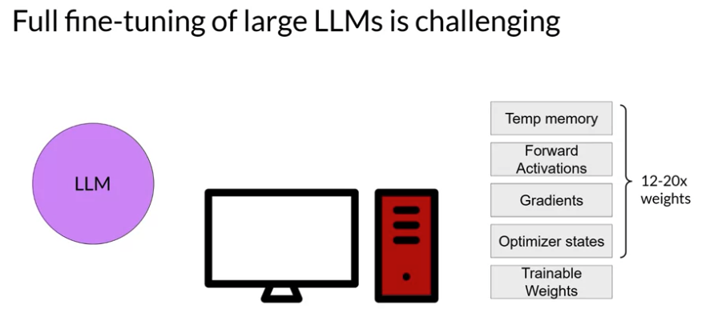
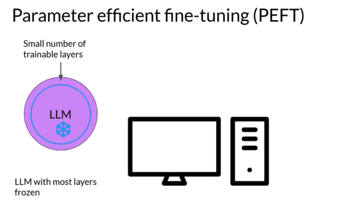
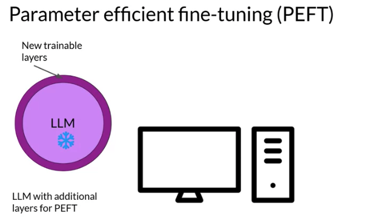
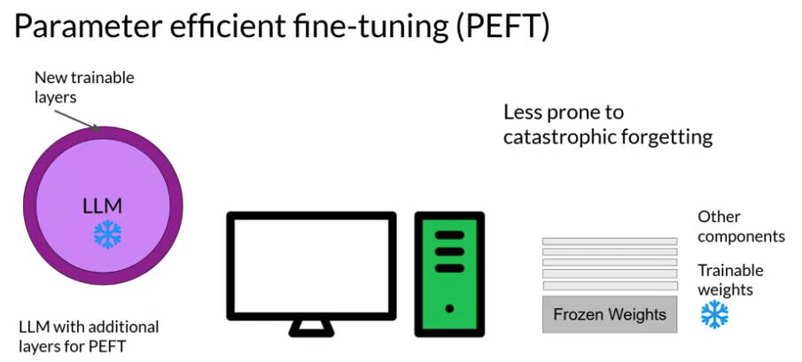
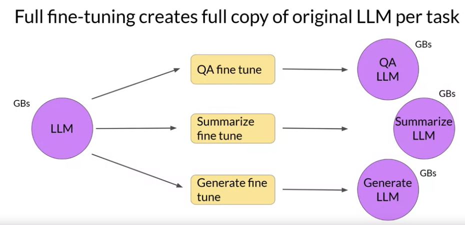
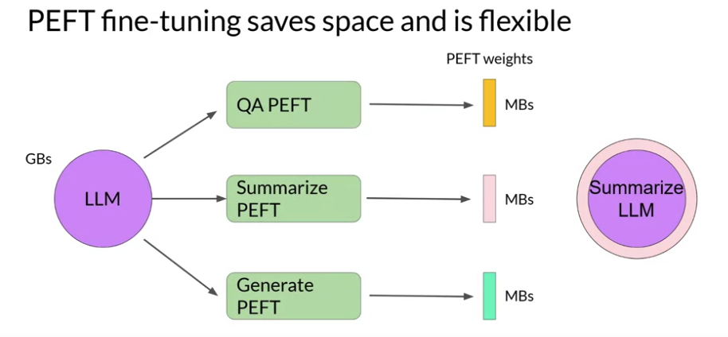
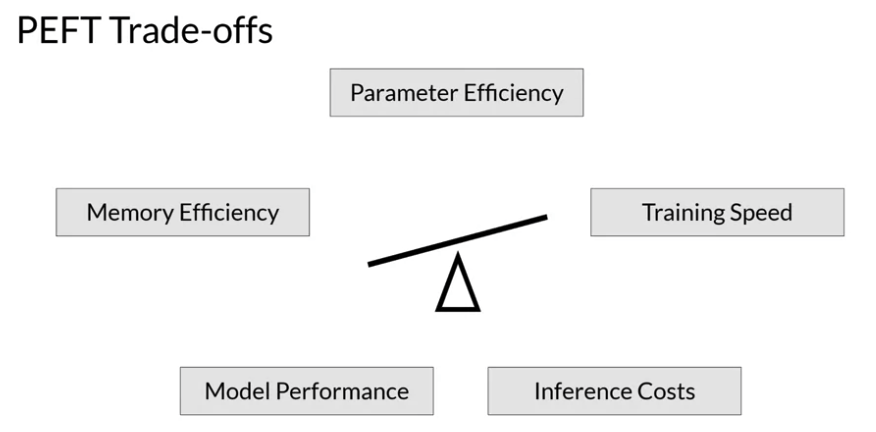
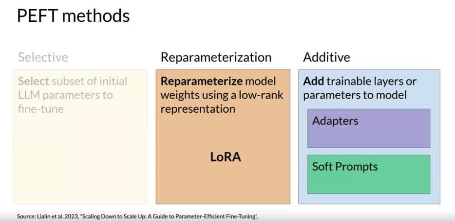

# Gen AI LLM - Course 4
## Part 1 - Parameter efficient fine-tuning (PEFT)

###### Below are some key notes from [Generative AI with Large Language Models](https://www.coursera.org/learn/generative-ai-with-llms)

### Intro

#### Challenges of Full fine-tuning
Training LLMs is computationally intensive. Full fine-tuning requires memory not just to store the model, but various other parameters that are required during the training process. Even if your computer can hold the model weights, which are now on the order of hundreds of gigabytes for the largest models, you must also be able to allocate memory for optimizer states, gradients, forward activations, and temporary memory throughout the training process. These additional components can be many times larger than the model and can quickly become too large to handle on consumer hardware. 

#### Parameter efficient fine-tuning (PEFT)
In contrast to full fine-tuning where every model weight is updated during supervised learning, parameter efficient fine tuning methods only update a small subset of parameters. Some path techniques freeze most of the model weights and focus on fine tuning a subset of existing model parameters, for example, particular layers or components. 

Other techniques don't touch the original model weights at all, and instead add a small number of new parameters or layers and fine-tune only the new components. 

#### Advantages of PEFT
With PEFT, most if not all of the LLM weights are kept frozen. As a result, the number of trained parameters is much smaller than the number of parameters in the original LLM. In some cases, just 15-20% of the original LLM weights. This makes the memory requirements for training much more manageable. In fact, PEFT can often be performed on a single GPU. And because the original LLM is only slightly modified or left unchanged, PEFT is less prone to the catastrophic forgetting problems of full fine-tuning.

*Full fine-tuning* results in a new version of the model for every task you train on. Each of these is the same size as the original model, so it can create an expensive storage problem if you're fine-tuning for multiple tasks. 

Let's see how you can use *PEFT* to improve the situation. With parameter efficient fine-tuning, you train only a small number of weights, which results in a much smaller footprint overall, as small as megabytes depending on the task. The new parameters are combined with the original LLM weights for inference. The PEFT weights are trained for each task and can be easily swapped out for inference, allowing efficient adaptation of the original model to multiple tasks. There are several methods you can use for parameter efficient fine-tuning, each with trade-offs on parameter efficiency, memory efficiency, training speed, model quality, and inference costs. 

#### PEFT Parameters Trade offs
There are several methods you can use for parameter efficient fine-tuning, each with trade-offs on parameter efficiency, memory efficiency, training speed, model quality, and inference costs.

*Selective* methods are those that fine-tune only a subset of the original LLM parameters. There are several approaches that you can take to identify which parameters you want to update. You have the option to train only certain components of the model or specific layers, or even individual parameter types. Researchers have found that the performance of these methods is mixed and there are significant trade-offs between parameter efficiency and compute efficiency. 
  
*Reparameterization* methods also work with the original LLM parameters, but reduce the number of parameters to train by creating new low rank transformations of the original network weights. A commonly used technique of this type is LoRA, which we'll explore in detail in the next video.
  
Lastly, *additive* methods carry out fine-tuning by keeping all of the original LLM weights frozen and introducing new trainable components. Here there are two main approaches. Adapter methods add new trainable layers to the architecture of the model, typically inside the encoder or decoder components after the attention or feed-forward layers. Soft prompt methods, on the other hand, keep the model architecture fixed and frozen, and focus on manipulating the input to achieve better performance. This can be done by adding trainable parameters to the prompt embeddings or keeping the input fixed and retraining the embedding weights.

