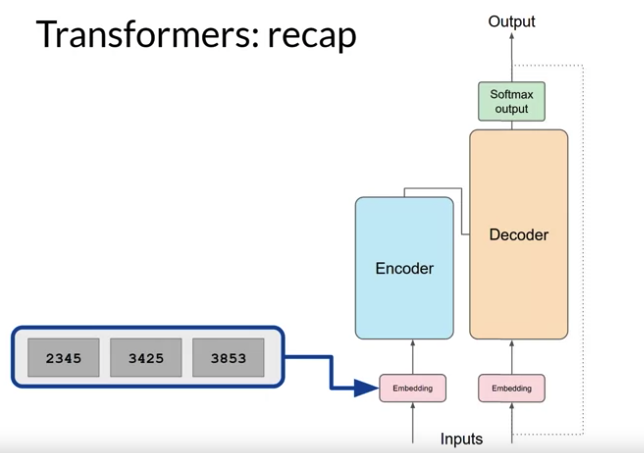

# Gen AI LLM - Course 4
## Part 2 - PEFT techniques 1: LoRA

###### Below are some key notes from [Generative AI with Large Language Models](https://www.coursera.org/learn/generative-ai-with-llms)

Low-rank Adaptation, or LoRA for short, is a parameter-efficient fine-tuning technique that falls into the re-parameterization category. 

### Transformers recap
As a quick reminder, here's the diagram of the transformer architecture that you saw earlier in the course. The input prompt is turned into tokens, which are then converted to embedding vectors and passed into the encoder and/or decoder parts of the transformer

In both of these components, there are two kinds of neural networks; *self-attention* and *feedforward* networks. The weights of these networks are learned during pre-training. After the embedding vectors are created, they're fed into the self-attention layers where a series of weights are applied to calculate the attention scores.During full fine-tuning, every parameter in these layers is updated.

### LoRA
LoRA is a strategy that *reduces the number of parameters to be trained during fine-tuning by freezing* all of the original model parameters and then injecting a pair of rank decomposition matrices alongside the original weights.

The dimensions of the smaller matrices are set so that their product is a matrix with the same dimensions as the weights they're modifying. You then keep the original weights of the LLM frozen and train the smaller matrices using the same supervised learning process you saw earlier this week.

For inference, the two low-rank matrices are multiplied together to create a matrix with the same dimensions as the frozen weights. You then add this to the original weights and replace them in the model with these updated values. You now have a LoRA fine-tuned model that can carry out your specific task. Because this model has the same number of parameters as the original, there is little to no impact on inference latency. Researchers have found that applying LoRA to just the self-attention layers of the model is often enough to fine-tune for a task and achieve performance gains. 

#### Concrete Example of LoRA
Let's look at a practical example using the transformer architecture described in the Attention is All You Need paper. The paper specifies that the transformer weights have dimensions of 512 by 64. This means that each weights matrix has 32,768 trainable parameters. If you use LoRA as a fine-tuning method with the rank equal to eight, you will instead train two small rank decomposition matrices whose small dimension is eight. This means that Matrix A will have dimensions of 8 by 64, resulting in 512 total parameters. Matrix B will have dimensions of 512 by 8, or 4,096 trainable parameters. By updating the weights of these new low-rank matrices instead of the original weights, you'll be training 4,608 parameters instead of 32,768 and 86% reduction.

Because LoRA allows you to significantly reduce the number of trainable parameters, you can often perform this method of parameter efficient fine tuning with a single GPU and avoid the need for a distributed cluster of GPUs

#### LoRA for different tasks
Since the rank-decomposition matrices are small, you can fine-tune a different set for each task and then switch them out at inference time by updating the weights. Suppose you train a pair of LoRA matrices for a specific task; let's call it Task A. To carry out inference on this task, you would multiply these matrices together and then add the resulting matrix to the original frozen weights. You then take this new summed weights matrix and replace the original weights where they appear in your model. You can then use this model to carry out inference on Task A. If instead, you want to carry out a different task, say Task B, you simply take the LoRA matrices you trained for this task, calculate their product, and then add this matrix to the original weights and update the model again. The memory required to store these LoRA matrices is very small. So in principle, you can use LoRA to train for many tasks. Switch out the weights when you need to use them, and avoid having to store multiple full-size versions of the LLM. 

### LoRA performances
How good are these models? Let's use the ROUGE metric you learned about earlier this week to compare the performance of a LoRA fine-tune model to both an original base model and a full fine-tuned version. Let's focus on fine-tuning the FLAN-T5 for dialogue summarization, which you explored earlier in the week. Just to remind you, the FLAN-T5-base model has had an initial set of full fine-tuning carried out using a large instruction data set. First, let's set a baseline score for the FLAN-T5 base model and the summarization data set we discussed earlier. Here are the ROUGE scores for the base model where a higher number indicates better performance. You should focus on the ROUGE 1 score for this discussion, but you could use any of these scores for comparison. As you can see, the scores are fairly low. 

Next, look at the scores for a model that has had additional full fine-tuning on dialogue summarization. Remember, although FLAN-T5 is a capable model, it can still benefit from additional fine-tuning on specific tasks. With full fine-tuning, you update every way in the model during supervised learning. You can see that this results in a much higher ROUGE 1 score increasing over the base FLAN-T5 model by 0.19. The additional round of fine-tuning has greatly improved the performance of the model on the summarization task. 

Now let's take a look at the scores for the LoRA fine-tune model. You can see that this process also resulted in a big boost in performance. The ROUGE 1 score has increased from the baseline by 0.17. This is a little lower than full fine-tuning, but not much. However, using LoRA for fine-tuning trained a much smaller number of parameters than full fine-tuning using significantly less compute, so this small trade-off in performance may well be worth it. 

### Chosing the LoRA rank

You might be wondering how to choose the rank of the LoRA matrices. This is a good question and still an active area of research. In principle, the smaller the rank, the smaller the number of trainable parameters, and the bigger the savings on compute. However, there are some issues related to model performance to consider. In the paper that first proposed LoRA, researchers at Microsoft explored how different choices of rank impacted the model performance on language generation tasks. You can see the summary of the results in the table here. 

The table shows the rank of the LoRA matrices in the first column, the final loss value of the model, and the scores for different metrics, including BLEU and ROUGE. The bold values indicate the best scores that were achieved for each metric. The authors found a plateau in the loss value for ranks greater than 16. In other words, using larger LoRA matrices didn't improve performance. The takeaway here is that ranks in the range of 4-32 can provide you with a good trade-off between reducing trainable parameters and preserving performance. Optimizing the choice of rank is an ongoing area of research and best practices may evolve as more practitioners like you make use of LoRA. LoRA is a powerful fine-tuning method that achieves great performance. The principles behind the method are useful not just for training LLMs, but for models in other domains. 

