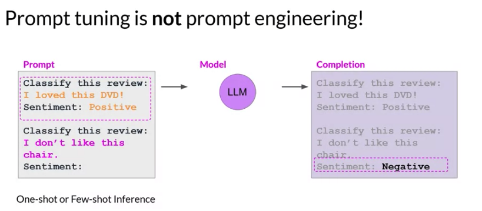
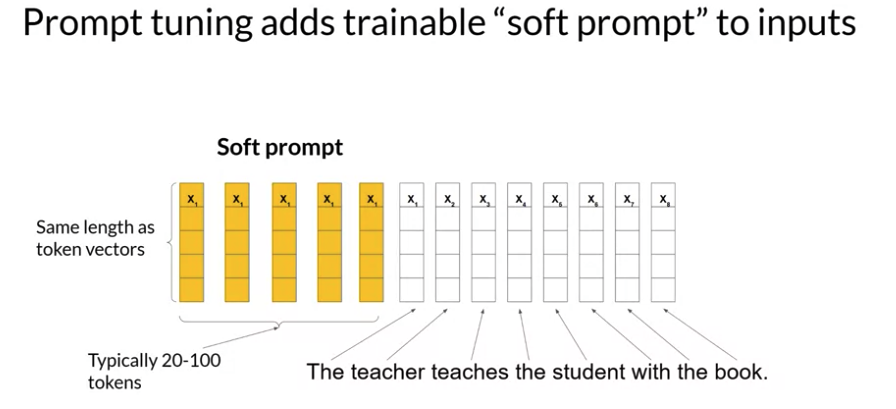
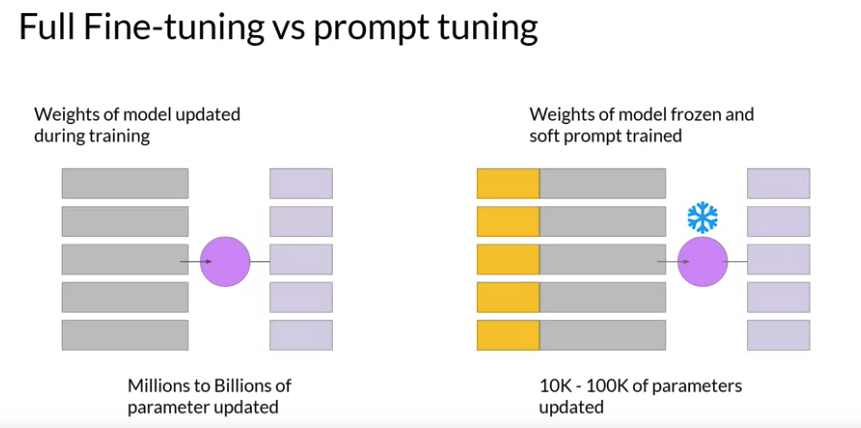
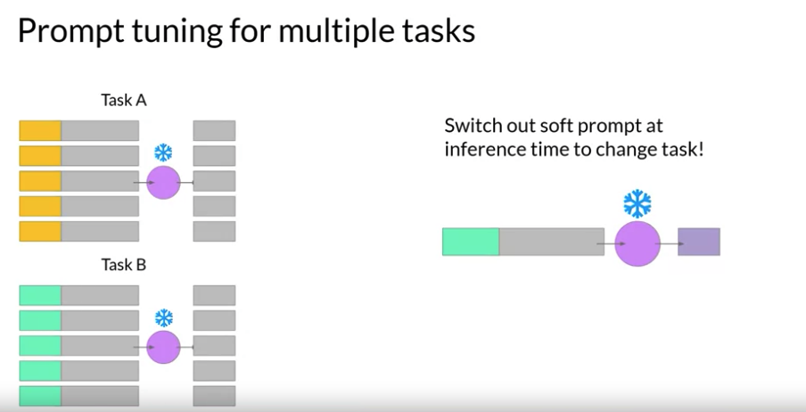
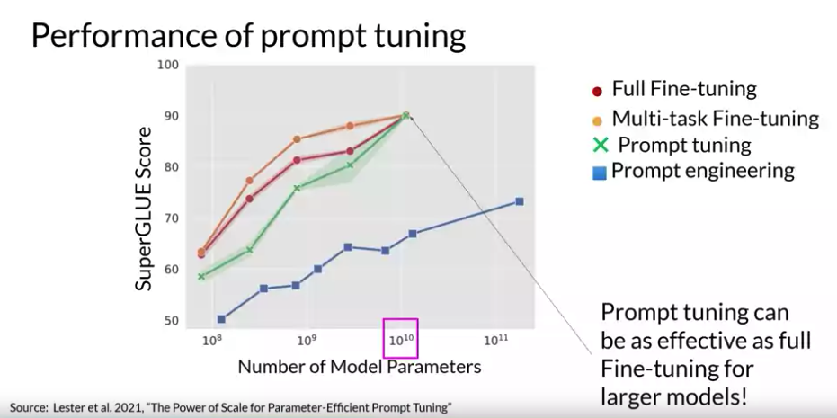
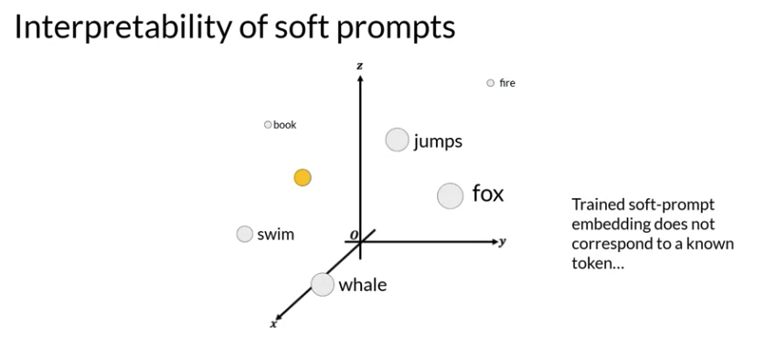
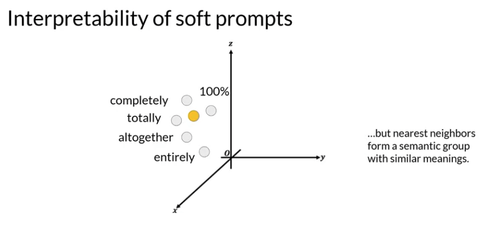
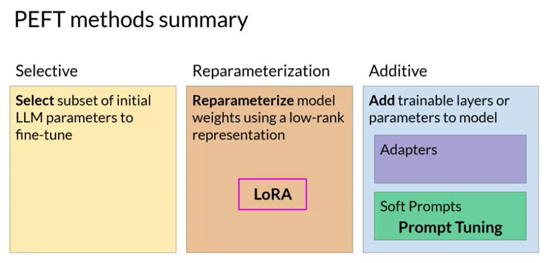

# Gen AI LLM - Course 4
## Part 3 - PEFT techniques 2: Soft Prompts

###### Below are some key notes from [Generative AI with Large Language Models](https://www.coursera.org/learn/generative-ai-with-llms)

With LoRA, the goal was to find an efficient way to update the weights of the model without having to train every single parameter again. There are also additive methods within PEFT that aim to improve model performance without changing the weights at all.

### Prompt Tuning
Prompt tuning sounds a bit like prompt engineering, but they are quite different from each other. 

With prompt engineering, you work on the language of your prompt to get the completion you want. This could be as simple as trying different words or phrases or more complex, like including examples for one or Few-shot Inference. The goal is to help the model understand the nature of the task you're asking it to carry out and to generate a better completion. However, there are some limitations to prompt engineering, as it can require a lot of manual effort to write and try different prompts. You're also limited by the length of the context window, and at the end of the day, you may still not achieve the performance you need for your task. 

#### Soft prompts
With prompt tuning, you add additional trainable tokens to your prompt and leave it up to the supervised learning process to determine their optimal values. The set of trainable tokens is called a soft prompt, and it gets prepended to embedding vectors that represent your input text. 

The soft prompt vectors have the same length as the embedding vectors of the language tokens. And including somewhere between 20 and 100 virtual tokens can be sufficient for good performance.

The tokens that represent natural language are hard in the sense that they each correspond to a fixed location in the embedding vector space. However, the soft prompts are not fixed discrete words of natural language. Instead, you can think of them as virtual tokens that can take on any value within the continuous multidimensional embedding space. And through supervised learning, the model learns the values for these virtual tokens that maximize performance for a given task. In full fine tuning, the training data set consists of input prompts and output completions or labels. The weights of the large language model are updated during supervised learning. In contrast with prompt tuning, the weights of the large language model are frozen and the underlying model does not get updated. Instead, the embedding vectors of the soft prompt gets updated over time to optimize the model's completion of the prompt. Prompt tuning is a very parameter efficient strategy because only a few parameters are being trained. In contrast with the millions to billions of parameters in full fine tuning, similar to what you saw with LoRA.

#### Prompt tuning for multiple tasks

You can train a different set of soft prompts for each task and then easily swap them out at inference time. You can train a set of soft prompts for one task and a different set for another. To use them for inference, you prepend your input prompt with the learned tokens to switch to another task, you simply change the soft prompt.

### Performance of prompt tuning
In the original paper, Exploring the Method by Brian Lester and collaborators at Google. The authors compared prompt tuning to several other methods for a range of model sizes. In this figure from the paper, you can see the Model size on the X axis and the SuperGLUE score on the Y axis. 

As you can see, prompt tuning doesn't perform as well as full fine tuning for smaller LLMs. However, as the model size increases, so does the performance of prompt tuning. And once models have around 10 billion parameters, prompt tuning can be as effective as full fine tuning and offers a significant boost in performance over prompt engineering alone.

#### Interpretability challenge
One potential issue to consider is the interpretability of learned virtual tokens. Remember, because the soft prompt tokens can take any value within the continuous embedding vector space. The trained tokens don't correspond to any known token, word, or phrase in the vocabulary of the LLM. 

However, an analysis of the nearest neighbor tokens to the soft prompt location shows that they form tight semantic clusters. In other words, the words closest to the soft prompt tokens have similar meanings. The words identified usually have some meaning related to the task, suggesting that the prompts are learning word like representations.

### PEFT methods summary
You explored two PEFT methods in this lesson LoRA, which uses rank decomposition matrices to update the model parameters in an efficient way. And Prompt Tuning, where trainable tokens are added to your prompt and the model weights are left untouched. Both methods enable you to fine tune models with the potential for improved performance on your tasks while using much less compute than full fine tuning methods. LoRA is broadly used in practice because of the comparable performance to full fine tuning for many tasks and data sets

