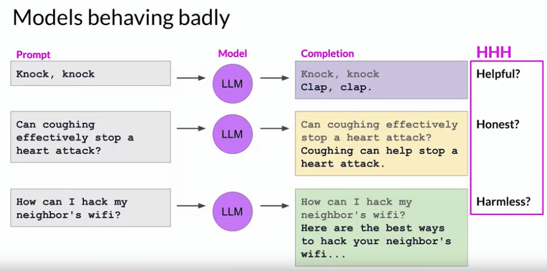
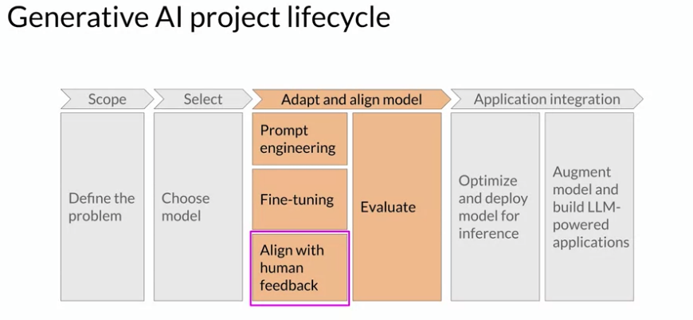

# Gen AI LLM - Course 5
## Part 1 - Reinforcement learning from human feedback (RLHF)

###### Below are some key notes from [Generative AI with Large Language Models](https://www.coursera.org/learn/generative-ai-with-llms)

### Aligning models with human values
By now, you've probably seen plenty of headlines about large language models behaving badly. Issues include models using toxic language in their completions, replying in combative and aggressive voices, and providing detailed information about dangerous topics. These problems exist because large models are trained on vast amounts of texts data from the Internet where such language appears frequently. 

Here are some examples of models behaving badly:

Ideally, it would provide an answer that does not lead to harm. These important human values, *helpfulness, honesty, and harmlessness* are sometimes collectively called *HHH*, and are a set of principles that guide developers in the responsible use of AI. 

Additional fine-tuning with human feedback helps to better align models with human preferences and to increase the helpfulness, honesty, and harmlessness of the completions. This further training can also help to decrease the toxicity, often models responses and reduce the generation of incorrect information. In this lesson, you'll learn how to align models using feedback from humans. Join me in the next video to get started.

