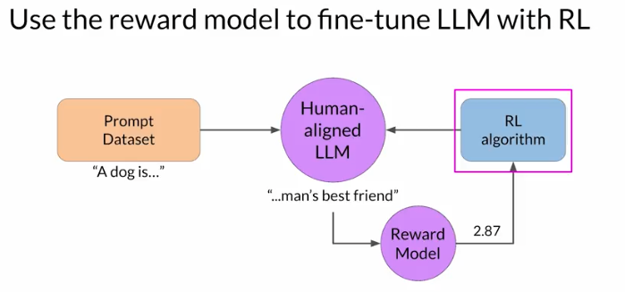

# Gen AI LLM - Course 5
## Part 2 - RLHF: Obtaining feedback from humans

###### Below are some key notes from [Generative AI with Large Language Models](https://www.coursera.org/learn/generative-ai-with-llms)

### Obtaining feedback from humans

#### Prepare dataset
The first step in fine-tuning an LLM with RLHF is to select a model to work with and use it to prepare a data set for human feedback. The model you choose should have some capability to carry out the task you are interested in, whether this is text summarization, question answering or something else. In general, you may find it easier to start with an instruct model that has already been fine tuned across many tasks and has some general capabilities. You'll then use this LLM along with a prompt data set to generate a number of different responses for each prompt. The prompt dataset is comprised of multiple prompts, each of which gets processed by the LLM to produce a set of completions.

#### Collect feedback
The next step is to collect feedback from human labelers on the completions generated by the LLM. This is the human feedback portion of reinforcement learning with human feedback. First, you must decide what criterion you want the humans to assess the completions on. This could be any of the issues discussed so far like helpfulness or toxicity. Once you've decided, you will then ask the labelers to assess each completion in the data set based on that criterion. 

##### Example
Let's take a look at an example. In this case, the prompt is, my house is too hot. You pass this prompt to the LLM, which then generates three different completions. The task for your labelers is to rank the three completions in order of helpfulness from the most helpful to least helpful. So here the labeler will probably decide that completion two is the most helpful. It tells the user something that can actually cool their house and ranks as completion first. Neither completion one or three are very helpful, but maybe the labeler will decide that three is the worst of the two because the model actively disagrees with the input from the user. So the labeler ranks the top completion second and the last completion third. This process then gets repeated for many prompt completion sets, building up a data set that can be used to train the reward model that will ultimately carry out this work instead of the humans. The same prompt completion sets are usually assigned to multiple human labelers to establish consensus and minimize the impact of poor labelers in the group. Like the third labeler here, whose responses disagree with the others and may indicate that they misunderstood the instructions, this is actually a very important point. The clarity of your instructions can make a big difference on the quality of the human feedback you obtain. Labelers are often drawn from samples of the population that represent diverse and global thinking.

#### Clear instructions are important
Here you can see an example set of instructions written for human labelers. This would be presented to the labeler to read before beginning the task and made available to refer back to as they work through the dataset. The instructions start with the overall task the labeler should carry out. In this case, to choose the best completion for the prompt. The instructions continue with additional details to guide the labeler on how to complete the task. In general, the more detailed you make these instructions, the higher the likelihood that the labelers will understand the task they have to carry out and complete it exactly as you wish. 

#### Prepare labeled data for training
Once your human labelers have completed their assessments off the Prom completion sets, you have all the data you need to train the reward model. Which you will use instead of humans to classify model completions during the reinforcement learning finetuning process. Before you start to train the reward model, however, you need to convert the ranking data into a pairwise comparison of completions. In other words, all possible pairs of completions from the available choices to a prompt should be classified as 0 or 1 score. 

### Reward model
While it has taken a fair amount of human effort to get to this point, by the time you're done training the reward model, you won't need to include any more humans in the loop. Instead, the reward model will effectively take place off the human labeler and automatically choose the preferred completion during the oral HF process. This reward model is usually also a language model.

For example, a BERT that is trained using supervised learning methods on the pairwise comparison data that you prepared from the human labelers assessment off the prompts. For a given prompt X, the reward model learns to favor the human-preferred completion y_ j, while minimizing the lock sigmoid off the reward difference, r_j-r_k.

As you saw on the last slide, the human-preferred option is always the first one labeled y_j. Once the model has been trained on the human rank prompt-completion pairs, you can use the reward model as a binary classifier to provide a set of logics across the positive and negative classes. Logics are the unnormalized model outputs before applying any activation function. Let's say you want to detoxify your LLM, and the reward model needs to identify if the completion contains hate speech. In this case, the two classes would be notate, the positive class that you ultimately want to optimize for and hate the negative class you want to avoid. The largest value of the positive class is what you use as the reward value in LLHF. Just to remind you, if you apply a Softmax function to the logits, you will get the probabilities. The example here shows a good reward for non-toxic completion and the second example shows a bad reward being given for toxic completion.

### RLHF: Fine-tuning with reinforcement learning

Remember, you want to start with a model that already has good performance on your task of interests. You'll work to align an instruction finds you and LLM. First, you'll pass a prompt from your prompt dataset. In this case, a dog is, to the instruct LLM, which then generates a completion, in this case a furry animal. Next, you sent this completion, and the original prompt to the reward model as the prompt completion pair. The reward model evaluates the pair based on the human feedback it was trained on, and returns a reward value. A higher value such as 0.24 as shown here represents a more aligned response. A less aligned response would receive a lower value, such as negative 0.53. 

You'll then pass this reward value for the prom completion pair to the reinforcement learning algorithm to update the weights of the LLM, and move it towards generating more aligned, higher reward responses. Let's call this intermediate version of the model the RL updated LLM.

These series of steps together forms a single iteration of the RLHF process. These iterations continue for a given number of epics, similar to other types of fine tuning.

Here you can see that the completion generated by the RL updated LLM receives a higher reward score, indicating that the updates to weights have resulted in a more aligned completion. If the process is working well, you'll see the reward improving after each iteration as the model produces text that is increasingly aligned with human preferences. You will continue this iterative process until your model is aligned based on some evaluation criteria.

For example, reaching a threshold value for the helpfulness you defined. You can also define a maximum number of steps, for example, 20,000 as the stopping criteria. At this point, let's refer to the fine-tuned model as the human-aligned LLM. 

#### updating LLM model weghts via reqard model
One detail we haven't discussed yet is the exact nature of the reinforcement learning algorithm. This is the algorithm that takes the output of the reward model and uses it to update the LLM model weights so that the reward score increases over time. There are several different algorithms that you can use for this part of the RLHF process.

A popular choice is proximal policy optimization or PPO for short. PPO is a pretty complicated algorithm, and you don't have to be familiar with all of the details to be able to make use of it. However, it can be a tricky algorithm to implement and understanding its inner workings in more detail can help you troubleshoot if you're having problems getting it to work.

