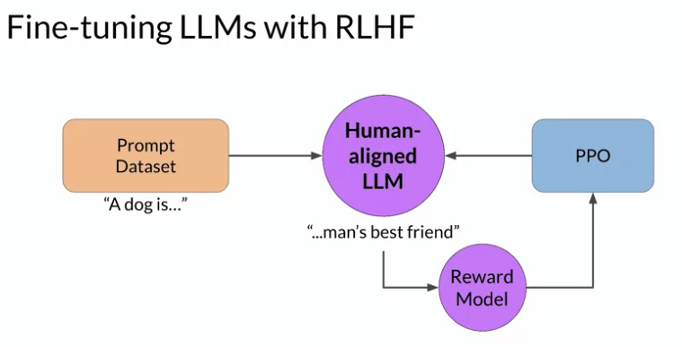
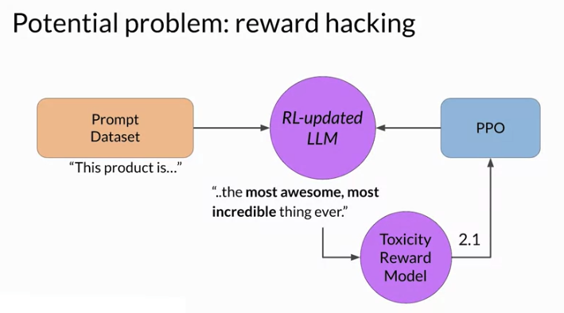
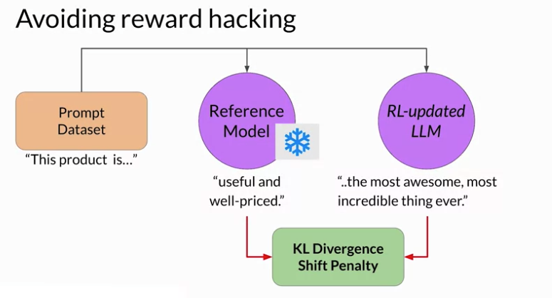
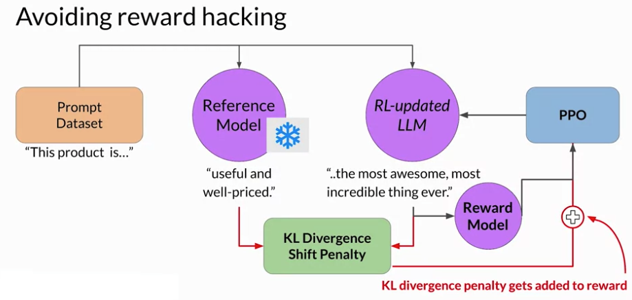
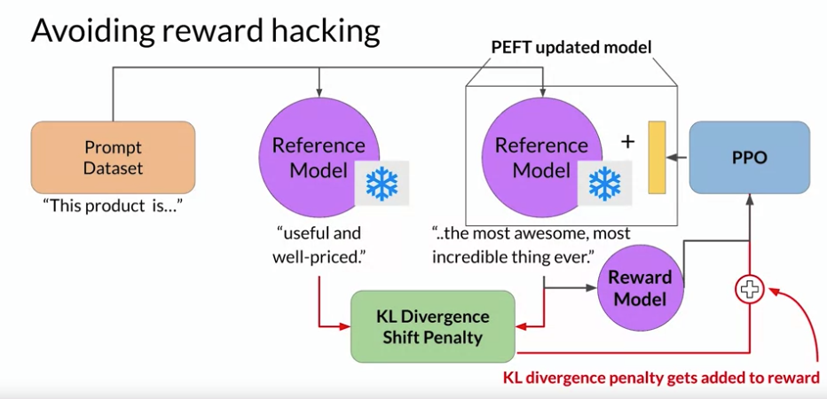
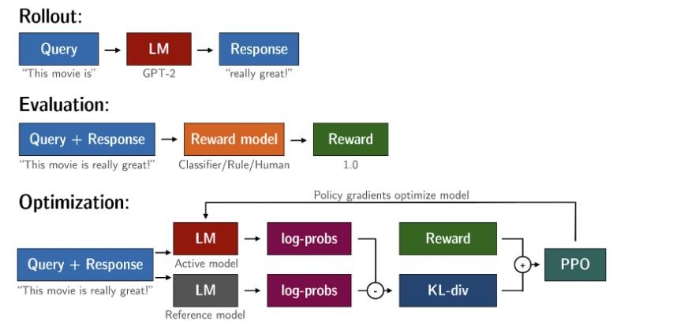
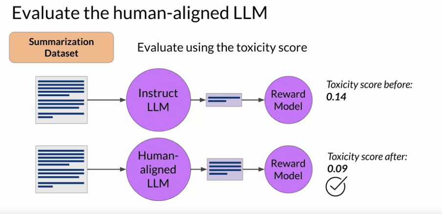

# Gen AI LLM - Course 5
## Part 3 - RLHF: Reward hacking

###### Below are some key notes from [Generative AI with Large Language Models](https://www.coursera.org/learn/generative-ai-with-llms)

RLHF is a fine-tuning process that aligns LLMs with human preferences. In this process, you make use of a reward model to assess and LLMs completions of a prompt data set against some human preference metric, like helpful or not helpful. Next, you use a reinforcement learning algorithm, in this case, PPO, to update the weights off the LLM based on the reward is signed to the completions generated by the current version off the LLM. You'll carry out this cycle of a multiple iterations using many different prompts and updates off the model weights until you obtain your desired degree of alignment. Your end result is a human aligned LLM that you can use in your application.

### Reward hacking
An interesting problem that can emerge in reinforcement learning is known as reward hacking, where the agent learns to cheat the system by favoring actions that maximize the reward received even if those actions don't align well with the original objective. In the context of LLMs, reward hacking can manifest as the addition of words or phrases to completions that result in high scores for the metric being aligned. But that reduce the overall quality of the language.

For example, suppose you are using RHF to detoxify and instruct model. You have already trained a reward model that can carry out sentiment analysis and classify model completions as toxic or non-toxic. You select a prompt from the training data this product is, and pass it to the instruct an LLM which generates a completion. This one, complete garbage is not very nice and you can expect it to get a high toxic rating. The completion is processed by the toxicity of reward model, which generates a score and this is fed to the PPO algorithm, which uses it to update the model weights. As you iterate RHF will update the LLM to create a less toxic responses. However, as the policy tries to optimize the reward, it can diverge too much from the initial language model.

In this example, the model has started generating completions that it has learned will lead to very low toxicity scores by including phrases like most awesome, most incredible. This language sounds very exaggerated. The model could also start generating nonsensical, grammatically incorrect text that just happens to maximize the rewards in a similar way, outputs like this are definitely not very useful. 

### Avoiding Reward hacking
To prevent our board hacking from happening, you can use the initial instruct LLM as performance reference. Let's call it the reference model. The weights of the reference model are frozen and are not updated during iterations of RHF. This way, you always maintain a single reference model to compare to. During training, each prompt is passed to both models, generating a completion by the reference LLM and the intermediate LLM updated model. 

At this point, you can compare the two completions and calculate a value called the Kullback-Leibler divergence, or *KL divergence* for short. KL divergence is a statistical measure of how different two probability distributions are. You can use it to compare the completions off the two models and determine how much the updated model has diverged from the reference. 

#### KL Divergence
 The KL divergence algorithm is included in many standard machine learning libraries and you can use it without knowing all the math behind it.
KL divergence is calculated for each generate a token across the whole vocabulary off the LLM. This can easily be tens or hundreds of thousands of tokens. However, using a softmax function, you've reduced the number of probabilities to much less than the full vocabulary size. Keep in mind that this is still a relatively compute expensive process. You will almost always benefit from using GPUs. Once you've calculated the KL divergence between the two models, you added acid term to the reward calculation. This will penalize the RL updated model if it shifts too far from the reference LLM and generates completions that are two different. Note that you now need to full copies of the LLM to calculate the KL divergence, the frozen reference LLM, and the oral updated PPO LLM.

By the way, you can benefit from combining our relationship with PEFT. In this case, you only update the weights of a path adapter, not the full weights of the LLM. This means that you can reuse the same underlying LLM for both the reference model and the PPO model, which you update with a trained path parameters. This reduces the memory footprint during training by approximately half. 

### More info about KL divergence 
KL-Divergence, or Kullback-Leibler Divergence, is a concept often encountered in the field of reinforcement learning, particularly when using the Proximal Policy Optimization (PPO) algorithm. It is a mathematical measure of the difference between two probability distributions, which helps us understand how one distribution differs from another. In the context of PPO, KL-Divergence plays a crucial role in guiding the optimization process to ensure that the updated policy does not deviate too much from the original policy.

In PPO, the goal is to find an improved policy for an agent by iteratively updating its parameters based on the rewards received from interacting with the environment. However, updating the policy too aggressively can lead to unstable learning or drastic policy changes. To address this, PPO introduces a constraint that limits the extent of policy updates. This constraint is enforced by using KL-Divergence.

To understand how KL-Divergence works, imagine we have two probability distributions: the distribution of the original LLM, and a new proposed distribution of an RL-updated LLM. KL-Divergence measures the average amount of information gained when we use the original policy to encode samples from the new proposed policy. By minimizing the KL-Divergence between the two distributions, PPO ensures that the updated policy stays close to the original policy, preventing drastic changes that may negatively impact the learning process.

A library that you can use to train transformer language models with reinforcement learning, using techniques such as PPO, is TRL (Transformer Reinforcement Learning). In this [link](https://huggingface.co/blog/trl-peft), you can read more about this library, and its integration with PEFT (Parameter-Efficient Fine-Tuning) methods, such as LoRA (Low-Rank Adaption). The image shows an overview of the PPO training setup in TRL.

### Evaluate the humal-aligned LLM
Once you have completed your RHF alignment of the model, you will want to assess the model's performance. You can use the summarization data set to quantify the reduction in toxicity, for example, the dialogue, some data set that you saw earlier in the course. The number you'll use here is the toxicity score, this is the probability of the negative class, in this case, a toxic or hateful response averaged across the completions. If RHF has successfully reduce the toxicity of your LLM, this score should go down. First, you'll create a baseline toxicity score for the original instruct LLM by evaluating its completions off the summarization data set with a reward model that can assess toxic language. Then you'll evaluate your newly human aligned model on the same data set and compare the scores. In this example, the toxicity score has indeed decreased after Arlo HF, indicating a less toxic, better aligned model.

