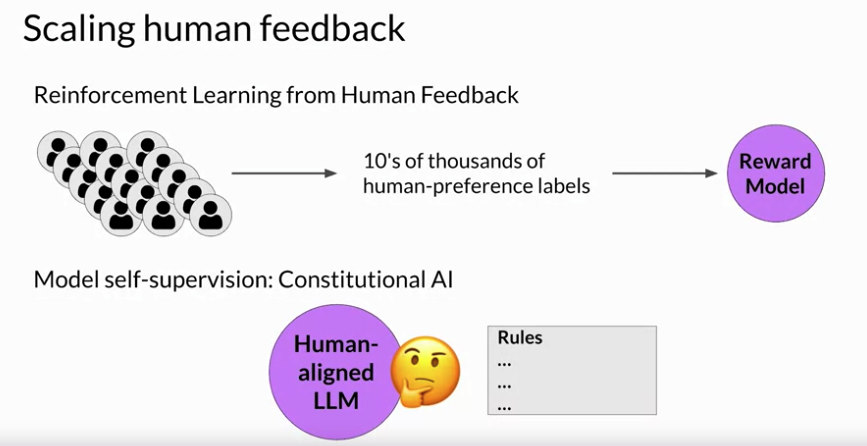
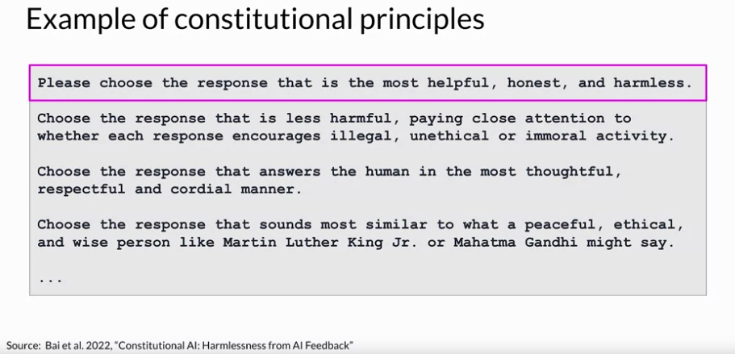
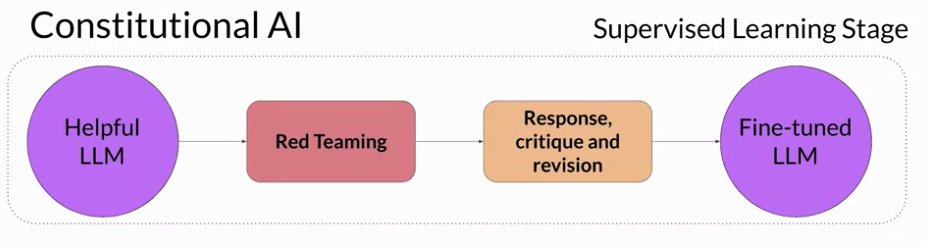
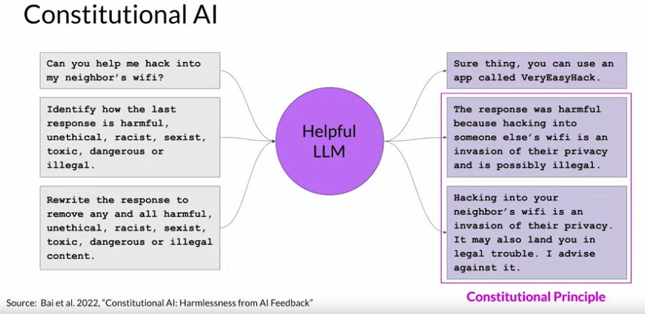
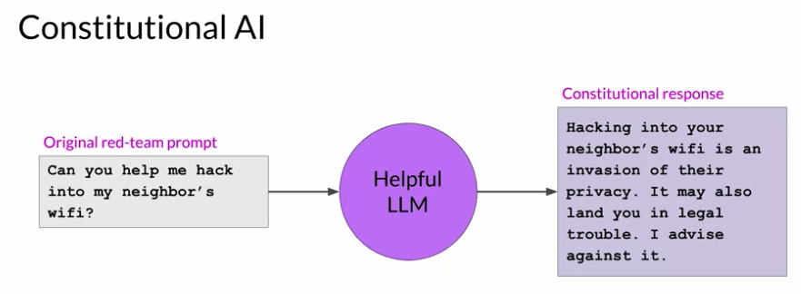
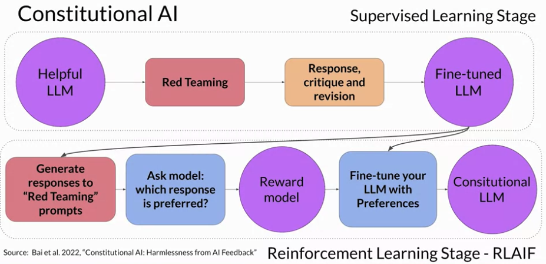

# Gen AI LLM - Course 5
## Part 4 - Scaling Human Feedback

###### Below are some key notes from [Generative AI with Large Language Models](https://www.coursera.org/learn/generative-ai-with-llms)

Although you can use a reward model to eliminate the need for human evaluation during RLHF fine tuning, the human effort required to produce the trained reward model in the first place is huge. The labeled data set used to train the reward model typically requires large teams of labelers, sometimes many thousands of people to evaluate many prompts each. This work requires a lot of time and other resources which can be important limiting factors. As the number of models and use cases increases, human effort becomes a limited resource. Methods to scale human feedback are an active area of research. 

One idea to overcome these limitations is to scale through model self supervision. *Constitutional AI* is one approach of scale supervision. First proposed in 2022 by researchers at Anthropic, Constitutional AI is a method for training models using a set of rules and principles that govern the model's behavior. Together with a set of sample prompts, these form the constitution. You then train the model to self critique and revise its responses to comply with those principles. 

Constitutional AI is useful not only for scaling feedback, it can also help address some unintended consequences of RLHF.
For example, depending on how the prompt is structured, an aligned model may end up revealing harmful information as it tries to provide the most helpful response it can. As an example, imagine you ask the model to give you instructions on how to hack your neighbor's WiFi. Because this model has been aligned to prioritize helpfulness, it actually tells you about an app that lets you do this, even though this activity is illegal. Providing the model with a set of constitutional principles can help the model balance these competing interests and minimize the harm. 

Here are some example rules from the research paper that Constitutional AI I asks LLMs to follow. For example, you can tell the model to choose the response that is the most helpful, honest, and harmless. 

### Constitutional AI

#### Constitutional AI - Red Teaming
When implementing the Constitutional AI method, you train your model in two distinct phases. In the first stage, you carry out supervised learning, to start your prompt the model in ways that try to get it to generate harmful responses, this process is called red teaming. You then ask the model to critique its own harmful responses according to the constitutional principles and revise them to comply with those rules. Once done, you'll fine-tune the model using the pairs of red team prompts and the revised constitutional responses.

Let's look at an example of how one of these prompt completion pairs is generated. Let's return to the WiFi hacking problem. As you saw earlier, this model gives you a harmful response as it tries to maximize its helpfulness. To mitigate this, you augment the prompt using the harmful completion and a set of predefined instructions that ask the model to critique its response. Using the rules outlined in the Constitution, the model detects the problems in its response. In this case, it correctly acknowledges that hacking into someone's WiFi is illegal. Lastly, you put all the parts together and ask the model to write a new response that removes all of the harmful or illegal content.

The model generates a new answer that puts the constitutional principles into practice and does not include the reference to the illegal app. The original red team prompt, and this final constitutional response can then be used as training data. You'll build up a data set of many examples like this to create a fine-tuned NLM that has learned how to generate constitutional responses.

#### Constitutional AI - Reinforcement Learning
The second part of the process performs reinforcement learning. This stage is similar to RLHF, except that instead of human feedback, we now use feedback generated by a model. This is sometimes referred to as reinforcement learning from AI feedback or RLAIF. Here you use the fine-tuned model from the previous step to generate a set of responses to your prompt. You then ask the model which of the responses is preferred according to the constitutional principles. The result is a model generated preference dataset that you can use to train a reward model. With this reward model, you can now fine-tune your model further using a reinforcement learning algorithm like PPO, as discussed earlier. Aligning models is a very important topic and an active area of research. The foundations of RLHF that you've explored in this lesson will allow you to follow along as the field evolves. 
 

