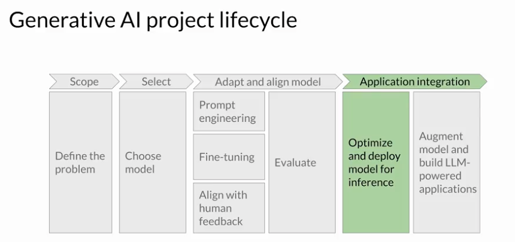
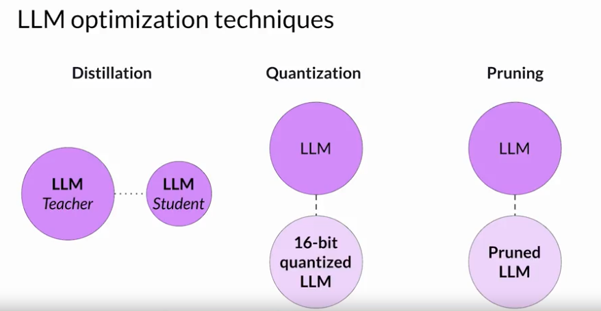
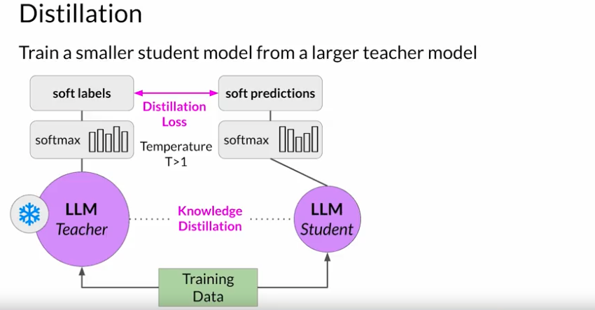
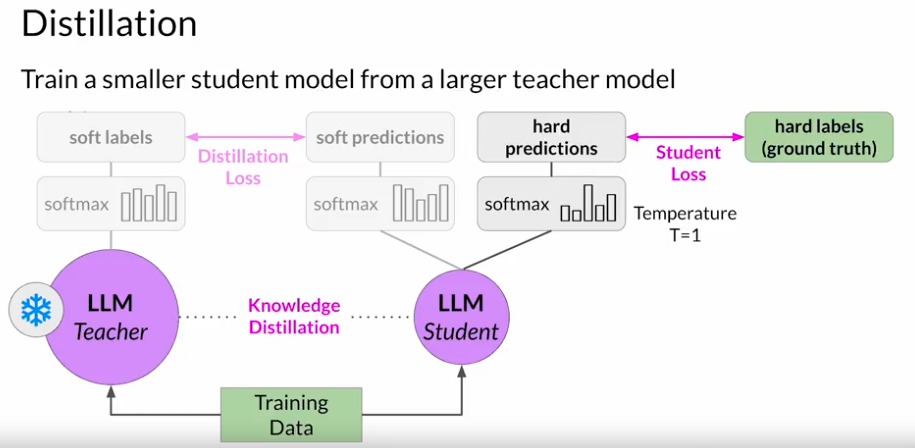
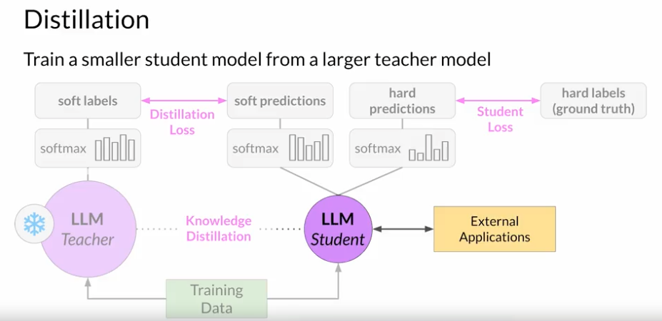
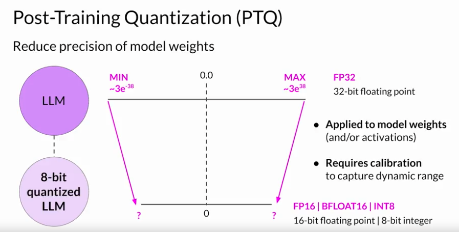
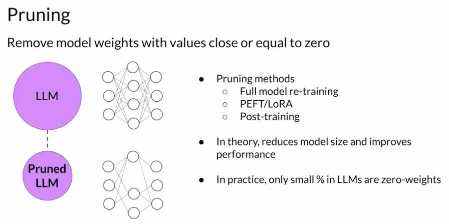

# Gen AI LLM - Course 6
## Part 1 - Model optimizations for deployment

###### Below are some key notes from [Generative AI with Large Language Models](https://www.coursera.org/learn/generative-ai-with-llms)

### Intro
Let's consider how to integrate your model into applications. 

There are a number of important questions to ask at this stage. The first set is related to how your LLM will function in deployment. So how fast do you need your model to generate completions? What compute budget do you have available? And are you willing to trade off model performance for improved inference speed or lower storage? The second set of questions is tied to additional resources that your model may need. Do you intend for your model to interact with external data or other applications? And if so, how will you connect to those resources? Lastly, there's the question of how your model will be consumed. What will the intended application or API interface that your model will be consumed through look like? 

### LLM optimization techniques

Large language models present inference challenges in terms of computing and storage requirements, as well as ensuring low latency for consuming applications. These challenges persist whether you're deploying on premises or to the cloud, and become even more of an issue when deploying to edge devices. One of the primary ways to improve application performance is to reduce the size of the LLM. This can allow for quicker loading of the model, which reduces inference latency. However, the challenge is to reduce the size of the model while still maintaining model performance. Some techniques work better than others for generative models, and there are tradeoffs between accuracy and performance. 

You'll learn about three techniques in this section:
 - *Distillation* uses a larger model, the teacher model, to train a smaller model, the student model. You then use the smaller model for inference to lower your storage and compute budget. 
 - Similar to quantization aware training, post training *quantization* transforms a model's weights to a lower precision representation, such as a 16- bit floating point or eight bit integer. This reduces the memory footprint of your model. 
 - The third technique, *Model Pruning*, removes redundant model parameters that contribute little to the model's performance.

#### Distillation

Model Distillation is a technique that focuses on having a larger teacher model train a smaller student model. The student model learns to statistically mimic the behavior of the teacher model, either just in the final prediction layer or in the model's hidden layers as well.

You start with your fine tune LLM as your teacher model and create a smaller LLM for your student model. You freeze the teacher model's weights and use it to generate completions for your training data. At the same time, you generate completions for the training data using your student model. The knowledge distillation between teacher and student model is achieved by minimizing a loss function called the distillation loss. To calculate this loss, distillation uses the probability distribution over tokens that is produced by the teacher model's softmax layer. Now, the teacher model is already fine tuned on the training data. So the probability distribution likely closely matches the ground truth data and won't have much variation in tokens. That's why Distillation applies a little trick adding a temperature parameter to the softmax function. As you learned in lesson one, a higher temperature increases the creativity of the language the model generates. With a temperature parameter greater than one, the probability distribution becomes broader and less strongly peaked. This softer distribution provides you with a set of tokens that are similar to the ground truth tokens. In the context of Distillation, the teacher model's output is often referred to as soft labels and the student model's predictions as soft predictions. 

 In parallel, you train the student model to generate the correct predictions based on your ground truth training data. Here, you don't vary the temperature setting and instead use the standard softmax function. Distillation refers to the student model outputs as the hard predictions and hard labels. The loss between these two is the student loss. The combined distillation and student losses are used to update the weights of the student model via back propagation. 

The key benefit of distillation methods is that the smaller student model can be used for inference in deployment instead of the teacher model. In practice, distillation is not as effective for generative decoder models. It's typically more effective for encoder only models, such as Burt that have a lot of representation redundancy. Note that with Distillation, you're training a second, smaller model to use during inference. You aren't reducing the model size of the initial LLM in any way. 

#### Quantization
Quantization is another model optimization technique that actually reduces the size of your LLM.
After a model is trained, you can perform post training quantization, or PTQ for short to optimize it for deployment. PTQ transforms a model's weights to a lower precision representation, such as 16-bit floating point or 8-bit integer. To reduce the model size and memory footprint, as well as the compute resources needed for model serving, quantization can be applied to just the model weights or to both weights and activation layers. In general, quantization approaches that include the activations can have a higher impact on model performance. Quantization also requires an extra calibration step to statistically capture the dynamic range of the original parameter values. As with other methods, there are tradeoffs because sometimes quantization results in a small percentage reduction in model evaluation metrics. However, that reduction can often be worth the cost savings and performance gains. 

#### Pruning
Another  model optimization technique is Pruning.  At a high level, the goal is to reduce model size for inference by eliminating weights that are not contributing much to overall model performance. These are the weights with values very close to or equal to zero. 

Note that some pruning methods require full retraining of the model, while others fall into the category of parameter efficient fine tuning, such as LoRA. There are also methods that focus on post-training Pruning. In theory, this reduces the size of the model and improves performance. In practice, however, there may not be much impact on the size and performance if only a small percentage of the model weights are close to zero.

#### Summary of Model optimization
Quantization, Distillation and Pruning all aim to reduce model size to improve model performance during inference without impacting accuracy. Optimizing your model for deployment will help ensure that your application functions well and provides your users with the best possible experience sense.

