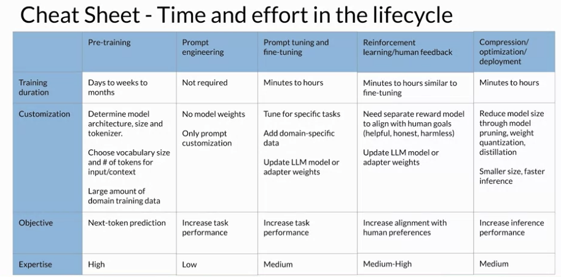

# Gen AI LLM - Course 6
## Part 2 - Generative AI Project Lifecycle Cheat Sheet

###### Below are some key notes from [Generative AI with Large Language Models](https://www.coursera.org/learn/generative-ai-with-llms)

To help you plan out these stages of the generative AI project life cycle, this cheat sheet provide some indication of the time and effort required for each phase of work

### 1 - Pre-training
Pre-training a large language model can be a *huge effort*. This stage is the most complex you'll face because of the model architecture decisions, the large amount of training data required, and the expertise needed. 

Remember though, that in general, you will start your development work with an *existing foundation model*. You'll probably be able to skip this stage. 

### 2 - Prompt Engineering
If you're working with a foundation model, you'll likely start to assess the model's performance through prompt engineering, which requires less technical expertise, and no additional training of the model. 

### 3 - Prompt tuning and fine-tuning
If your model isn't performing as you need, you'll next think about prompt tuning and fine tuning. Depending on your use case, performance goals, and compute budget, the methods you'll try could range from full fine-tuning to parameter efficient fine tuning techniques like laura or prompt tuning. Some level of technical expertise is required for this work. But since fine-tuning can be very successful with a relatively small training dataset, this phase could potentially be completed in a single day. 

### 4 - Reinforcement learning/human feedback
Aligning your model using reinforcement learning from human feedback can be done quickly, once you have your train reward model. You'll likely see if you can use an existing reward model for this work, as you saw in this week's lab. However, if you have to train a reward model from scratch, it could take a long time because of the effort involved to gather human feedback. 

### 5 - Compression, Optimization and Deployment
Finally, optimization techniques typically fall in the middle in terms of complexity and effort, but can proceed quite quickly assuming the changes to the model don't impact performance too much. After working through all of these steps, you have hopefully trained in tuned a gray LLM that is working well for your specific use case, and is optimized for deployment. 

