# Gen AI LLM - Course 6
## Part 3 - Using the LLM in applications

###### Below are some key notes from [Generative AI with Large Language Models](https://www.coursera.org/learn/generative-ai-with-llms)
i

### Challenges of LLM that training can't solve alone
There are some broader challenges with large language models that can't be solved by training alone. Let's take a look at a few examples.

One issue is that the internal *knowledge held by a model cuts off at the moment of pretraining*. For example, if you ask a model that was trained in early 2022 who the British Prime Minister is, it will probably tell you Boris Johnson. This knowledge is out of date. The model does not know that Johnson left office in late 2022 because that event happened after its training. 

Models can also struggle with *complex math*. If you prompt a model to behave like a calculator, it may get the answer wrong, depending on the difficulty of the problem. Here, you ask the model to carry out a division problem. The model returns a number close to the correct answer, but it's incorrect. Note the LLMs do not carry out mathematical operations. They are still just trying to predict the next best token based on their training, and as a result, can easily get the answer wrong.

Lastly, one of the best known problems of LLMs is their tendency to generate text even when they don't know the answer to a problem. This is often called *hallucination*, and here you can see the model clearly making up a description of a nonexistent plant, the Martian Dunetree. Although there is still no definitive evidence of life on Mars, the model will happily tell you otherwise.

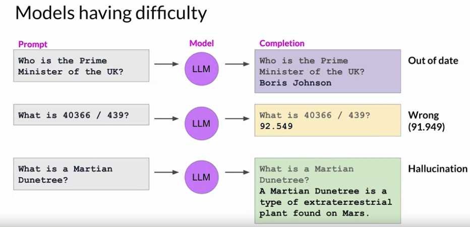

In this section, you'll learn about some techniques that you can use to help your LLM overcome these issues by connecting to external data sources and applications. You'll have a bit more work to do to be able to connect your LLM to these external components and fully integrate everything for deployment within your application. 

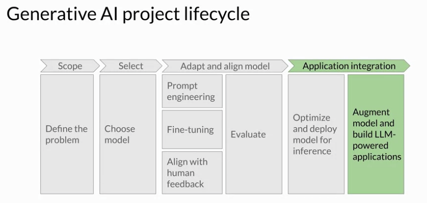

Your application must manage the passing of user input to the large language model and the return of completions. This is often done through some type of orchestration library. This layer can enable some powerful technologies that augment and enhance the performance of the LLM at runtime. By providing access to external data sources or connecting to existing APIs of other applications. One implementation example is Langchain

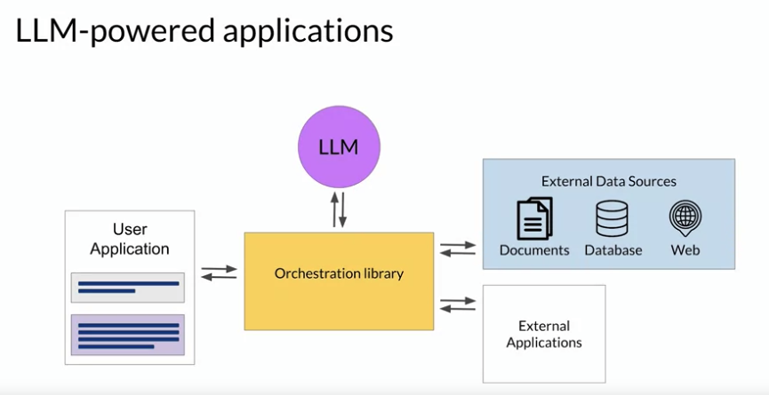

#### RAG (External Data Sources)
Retrieval Augmented Generation, or *RAG* for short, is a framework for building LLM powered systems that make use of external data sources. And applications to overcome some of the limitations of these models. 

RAG is a great way to overcome the knowledge cutoff issue and help the model update its understanding of the world. While you could retrain the model on new data, this would quickly become very expensive. And require repeated retraining to regularly update the model with new knowledge. A more flexible and less expensive way to overcome knowledge cutoffs is to give your model access to additional external data at inference time.

RAG is useful in any case where you want the language model to have access to data that it may not have seen. This could be new information documents not included in the original training data, or proprietary knowledge stored in your organization's private databases.
Providing your model with external information, can improve both the relevance and accuracy of its completions.

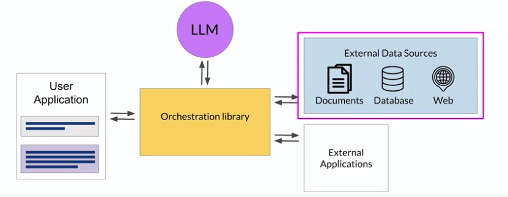

Retrieval augmented generation isn't a specific set of technologies, but rather a framework for providing LLMs access to data they did not see during training. A number of different implementations exist, and the one you choose will depend on the details of your task and the format of the data you have to work with. Here you'll walk through the implementation discussed in one of the earliest papers on RAG by researchers at Facebook, originally published in 2020. 

At the heart of this implementation is a model component called the Retriever, which consists of a query encoder and an external data source. The encoder takes the user's input prompt and encodes it into a form that can be used to query the data source. 
In the Facebook paper, the external data is a vector store, which we'll discuss in more detail shortly. But it could instead be a SQL database, CSV files, or other data storage format. These two components are trained together to find documents within the external data that are most relevant to the input query. The Retriever returns the best single or group of documents from the data source and combines the new information with the original user query. The new expanded prompt is then passed to the language model, which generates a completion that makes use of the data.

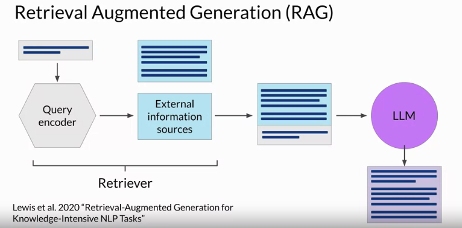

#### RAG Example - searching legal documents
Let's take a look at a more specific example. Imagine you are a lawyer using a large language model to help you in the discovery phase of a case. A Rag architecture can help you ask questions of a corpus of documents, for example, previous court filings. Here you ask the model about the plaintiff named in a specific case number.

The prompt is passed to the query encoder, which encodes the data in the same format as the external documents. And then searches for a relevant entry in the corpus of documents. Having found a piece of text that contains the requested information, the Retriever then combines the new text with the original prompt. 

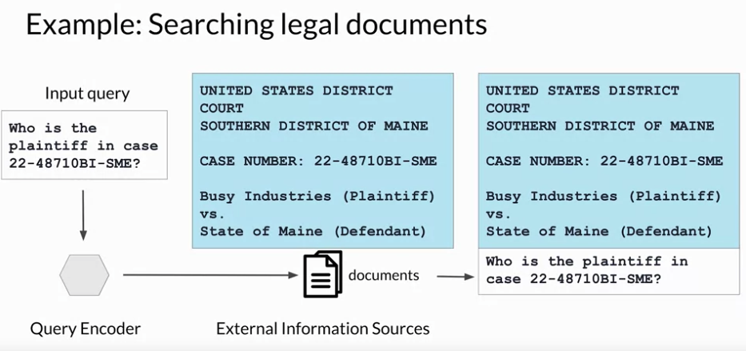

The expanded prompt that now contains information about the specific case of interest is then passed to the LLM. The model uses the information in the context of the prompt to generate a completion that contains the correct answer. The use case you have seen here is quite simple and only returns a single piece of information that could be found by other means. 

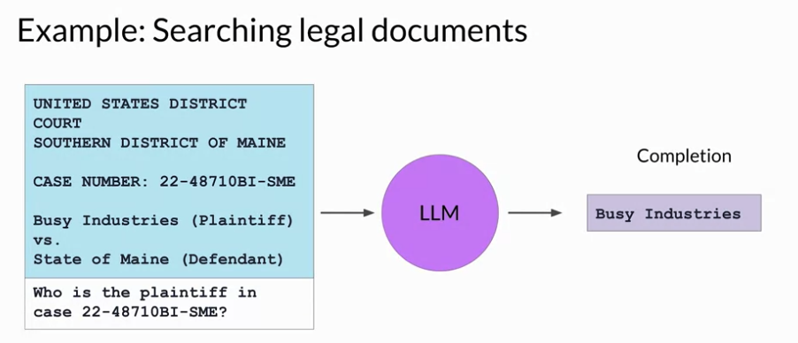

But imagine the power of Rag to be able to generate summaries of filings or identify specific people, places and organizations within the full corpus of the legal documents. Allowing the model to access information contained in this external data set greatly increases its utility for this specific use case.

#### RAG example - avoiding hallucination
In addition to overcoming knowledge cutoffs, rag also helps you avoid the problem of the model hallucinating when it doesn't know the answer. RAG architectures can be used to integrate multiple types of external information sources. You can augment large language models with access to local documents, including private wikis and expert systems. Rag can also enable access to the Internet to extract information posted on web pages, for example, Wikipedia. By encoding the user input prompt as a SQL query, RAG can also interact with databases. Another important data storage strategy is a Vector Store, which contains vector representations of text. This is a particularly useful data format for language models, since internally they work with vector representations of language to generate text. Vector stores enable a fast and efficient kind of relevant search based on similarity. 

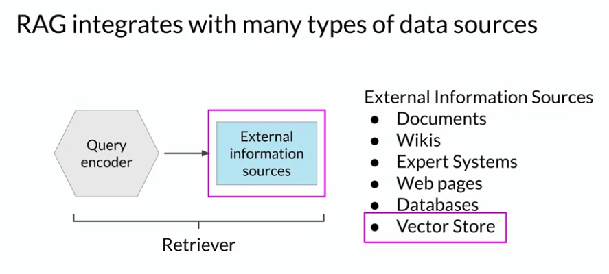

Note that implementing RAG is a little more complicated than simply adding text into the large language model. There are a couple of key considerations to be aware of, starting with the size of the context window. Most text sources are too long to fit into the limited context window of the model, which is still at most just a few thousand tokens. Instead, the external data sources are chopped up into many chunks, each of which will fit in the context window. Packages like Langchain can handle this work for you.

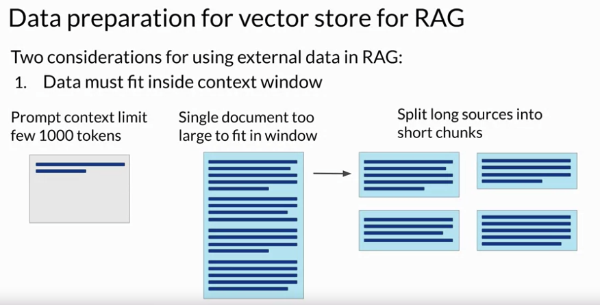

Second, the data must be available in a format that allows for easy retrieval of the most relevant text. Recall that large language models don't work directly with text, but instead create vector representations of each token in an embedding space. These embedding vectors allow the LLM to identify semantically related words through measures such as cosine similarity, which you learned about earlier. 

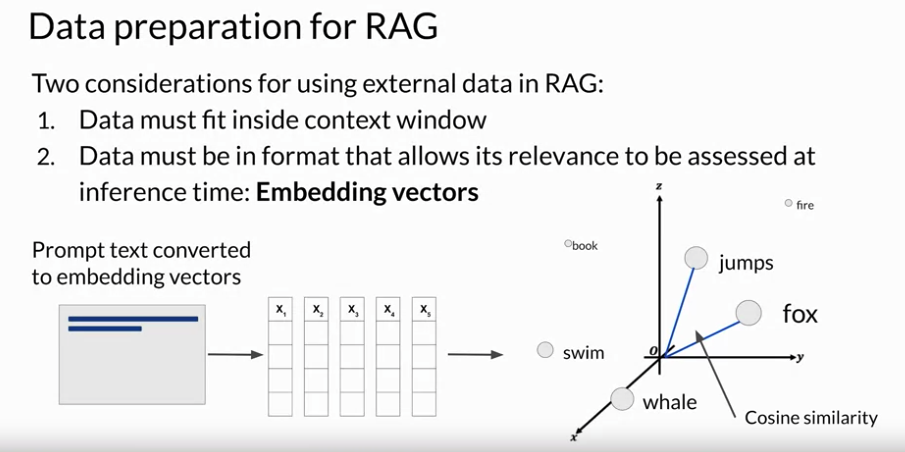

Rag methods take the small chunks of external data and process them through the large language model, to create embedding vectors for each. These new representations of the data can be stored in structures called vector stores, which allow for fast searching of datasets and efficient identification of semantically related text. 

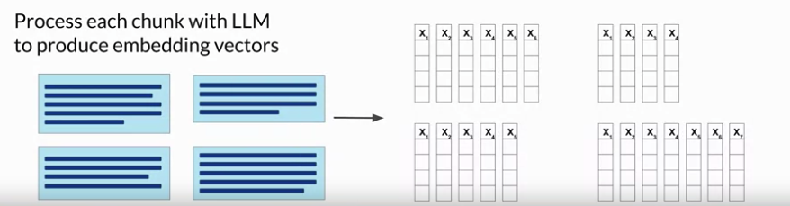

#### Vector DB search
Vector databases are a particular implementation of a vector store where each vector is also identified by a key. This can allow, for instance, the text generated by RAG to also include a citation for the document from which it was received. So you've seen how access to external data sources can help a model overcome limits to its internal knowledge. By providing up to date relevant information and avoiding hallucinations, you can greatly improve the experience of using your application for your users. 

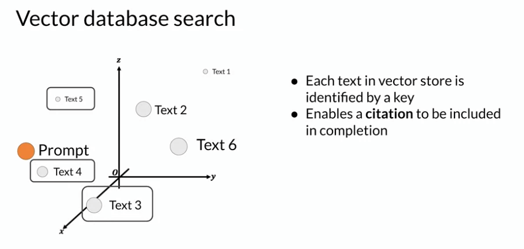

