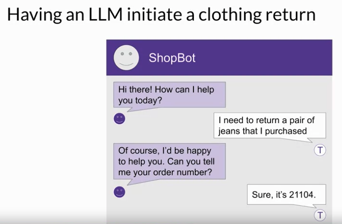
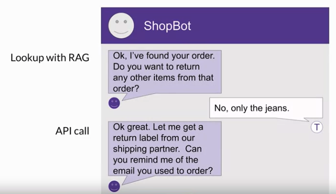
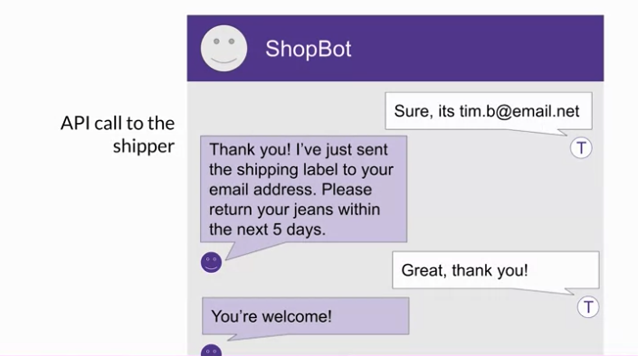
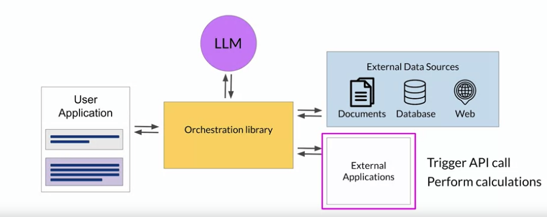
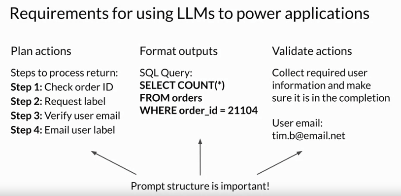
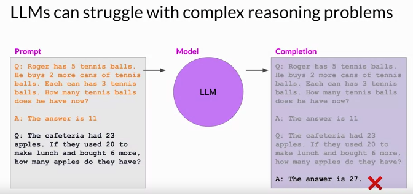
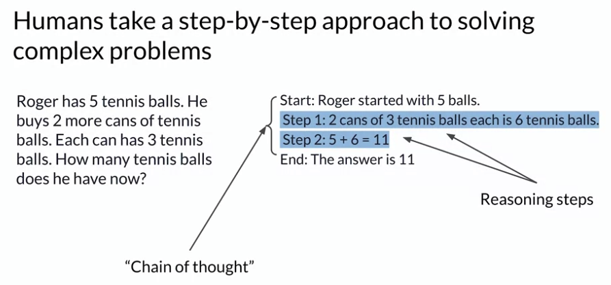
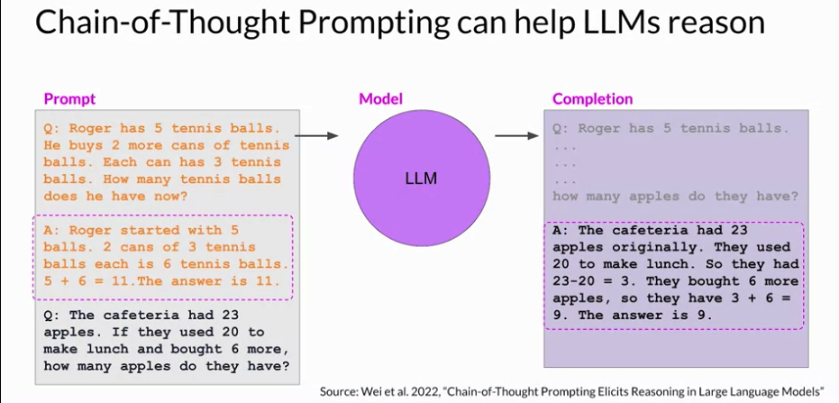
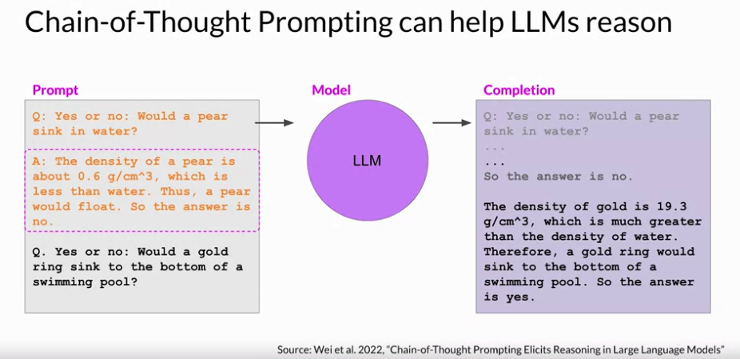

# Gen AI LLM - Course 6
## Part 4 - Interacting with external applications and helping LLM reason with Chain-of-Thought

###### Below are some key notes from [Generative AI with Large Language Models](https://www.coursera.org/learn/generative-ai-with-llms)

To motivate the types of problems and use cases that require the use of external apps, let's take the chatbot example.
In this conversation, the customer has expressed that they want to return some genes that they purchased. ShopBot responds by asking for the order number, which the customer then provides. ShopBot then looks up the order number in the transaction database.

One way it could do this is by using a rag implementation of the kind you saw earlier in the previous video. In this case here, you would likely be retrieving data through a SQL query to a back-end order database rather than retrieving data from a corpus of documents. Once ShopBot has retrieved the customers order, the next step is to confirm the items that will be returned. The bot ask the customer if they'd like to return anything other than the genes. After the user states their answer, the bot initiates a request to the company's shipping partner for a return label. 

The body uses the shippers Python API to request the label ShopBot is going to email the shipping label to the customer. It also asks them to confirm their email address. The customer responds with their email address and the bot includes this information in the API call to the shipper. Once the API request is completed, the Bartlett's the customer know that the label has been sent by email, and the conversation comes to an end.

This short example illustrates just one possible set of interactions that you might need an LLM to be capable of to power and application.

### LLM-powered applications
 In general, connecting LLMs to external applications allows the model to interact with the broader world, extending their utility beyond language tasks. As the shop bought example showed, LLMs can be used to trigger actions when given the ability to interact with APIs. LLMs can also connect to other programming resources. For example, a Python interpreter that can enable models to incorporate accurate calculations into their outputs.

It's important to note that prompts and completions are at the very heart of these workflows. The actions that the app will take in response to user requests will be determined by the LLM, which serves as the application's reasoning engine.

#### how to trigger actions
In order to trigger actions, the completions generated by the LLM must contain certain important information. 
 - First, the model needs to be able to generate a set of instructions so that the application knows what actions to take. These instructions need to be understandable and correspond to allowed actions. In the ShopBot example for instance, the important steps were; checking the order ID, requesting a shipping label, verifying the user email, and emailing the user the label. 

 - Second, the completion needs to be formatted in a way that the broader application can understand. This could be as simple as a specific sentence structure or as complex as writing a script in Python or generating a SQL command. For example, here is a SQL query that would determine whether an order is present in the database of all orders.

 - Lastly, the model may need to collect information that allows it to validate an action. For example, in the ShopBot conversation, the application needed to verify the email address the customer used to make the original order. Any information that is required for validation needs to be obtained from the user and contained in the completion so it can be passed through to the application. Structuring the prompts in the correct way is important for all of these tasks and can make a huge difference in the quality of a plan generated or the adherence to a desired output format specification

### Helping LLMs reason and plan with chain-of-thought
As we just saw, it is important that LLMs can reason through the steps that an application must take, to satisfy a user request. Unfortunately, complex reasoning can be challenging for LLMs, especially for problems that involve multiple steps or mathematics. These problems exist even in large models that show good performance at many other tasks.

Here's one example where an LLM has difficulty completing the task. You're asking the model to solve a simple multi-step math problem, to determine how many apples a cafeteria has after using some to make lunch, and then buying some more. Your prompt includes a similar example problem, complete with the solution, to help the model understand the task through one-shot inference

After processing the prompt, the model generates the completion shown here, stating that the answer is 27. This answer is incorrect, as you found out if you solve the problem. The cafeteria actually only has nine apples remaining. 

#### Chain-of-thought prompting (Thinking more like a human)
 Researchers have been exploring ways to improve the performance of large language models on reasoning tasks, like the one you just saw. One strategy that has demonstrated some success is prompting the model to think more like a human, by breaking the problem down into steps.

The task here is to calculate how many tennis balls Roger has after buying some new ones. One way that a human might tackle this problem is as follows. Begin by determining the number of tennis balls Roger has at the start. Then note that Roger buys two cans of tennis balls. Each can contains three balls, so he has a total of six new tennis balls. Next, add these 6 new balls to the original 5, for a total of 11 balls. Then finish by stating the answer. These intermediate calculations form the reasoning steps that a human might take, and the full sequence of steps illustrates the chain of thought that went into solving the problem. 

Asking the model to mimic this behavior is known as *chain of thought prompting*. It works by including a series of intermediate reasoning steps into any examples that you use for one or few-shot inference. 

By structuring the examples in this way, you're essentially teaching the model how to reason through the task to reach a solution. Here's the same apples problem you saw a couple of slides ago, now reworked as a chain of thought prompt. 
Thinking through the problem has helped the model come to the correct answer. 

You can use chain of thought prompting to help LLMs improve their reasoning of other types of problems too, in addition to arithmetic. 

Here's an example of a simple physics problem, where the model is being asked to determine if a gold ring would sink to the bottom of a swimming pool. The chain of thought prompt included as the one-shot example here, shows the model how to work through this problem, by reasoning that a pair would flow because it's less dense than water. When you pass this prompt to the LLM, it generates a similarly structured completion. The model correctly identifies the density of gold, which it learned from its training data, and then reasons that the ring would sink because gold is much more dense than water. 

### Summary
Chain of thought prompting is a powerful technique that improves the ability of your model to reason through problems. While this can greatly improve the performance of your model, the limited math skills of LLMs can still cause problems if your task requires accurate calculations, like totaling sales on an e-commerce site, calculating tax, or applying a discount.

