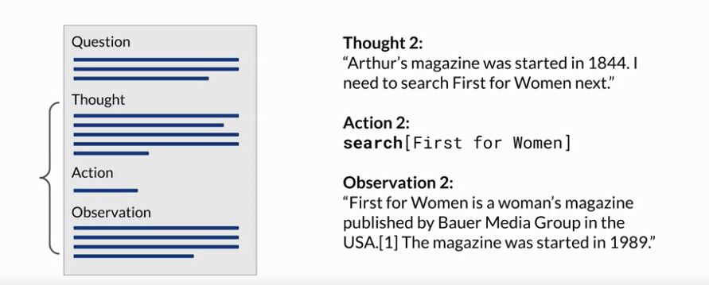

# Gen AI LLM - Course 6
## Part 5 - Program-aided language models (PAL)

###### Below are some key notes from [Generative AI with Large Language Models](https://www.coursera.org/learn/generative-ai-with-llms)

### Intro
As we saw earlier, the ability of LLMs to carry out arithmetic and other mathematical operations is limited. While you can try using chain of thought prompting to overcome this, it will only get you so far. Even if the model correctly reasons through a problem, it may still get the individual math operations wrong, especially with larger numbers or complex operations. 

Here's the example you saw earlier where the LLM tries to act like a calculator but gets the answer wrong. Remember, the model isn't actually doing any real math here. It is simply trying to predict the most probable tokens that complete the prompt. The model getting math wrong can have many negative consequences depending on your use case, like charging customers the wrong total or getting the measurements for a recipe incorrect.

You can overcome this limitation by allowing your model to interact with external applications that are good at math, like a Python interpreter. One interesting framework for augmenting LLMs in this way is called program-aided language models, or *PAL* for short. 

### Program-aided language model (PAL)
This work first presented by Luyu Gao and collaborators at Carnegie Mellon University in 2022, pairs an LLM with an external code interpreter to carry out calculations. The method makes use of chain of thought prompting to generate executable Python scripts. The scripts that the model generates are passed to an interpreter to execute. The image on the right here is taken from the paper and show some example prompts and completions. 

The strategy behind PAL is to have the *LLM generate completions where reasoning steps are accompanied by computer code*. This code is then passed to an interpreter to carry out the calculations necessary to solve the problem. You specify the output format for the model by including examples for one or few short inference in the prompt.his code is then passed to an interpreter to carry out the calculations necessary to solve the problem. You specify the output format for the model by including examples for one or few short inference in the prompt.

Let's take a closer look at how these example prompts are structured. You'll continue to work with the story of Roger buying tennis balls as the one-shot example. The setup here should now look familiar. This is a chain of thought example. You can see the reasoning steps written out in words on the lines highlighted in blue. What differs from the prompts you saw before is the inclusion of lines of Python code shown in pink.

These lines translate any reasoning steps that involve calculations into code. Variables are declared based on the text in each reasoning step. Their values are assigned either directly, as in the first line of code here, or as calculations using numbers present in the reasoning text as you see in the second Python line. The model can also work with variables it creates in other steps, as you see in the third line. Note that the text of each reasoning step begins with a pound sign, so that the line can be skipped as a comment by the Python interpreter. The prompt here ends with the new problem to be solved. In this case, the objective is to determine how many loaves of bread a bakery has left after a day of sales and after some loaves are returned from a grocery store partner.

On the right, you can see the completion generated by the LLM. Again, the chain of thought reasoning steps are shown in blue and the Python code is shown in pink. As you can see, the model creates a number of variables to track the loaves baked, the loaves sold in each part of the day, and the loaves returned by the grocery store. The answer is then calculated by carrying out arithmetic operations on these variables. The model correctly identifies whether terms should be added or subtracted to reach the correct total. 

### PAL and external interpreter
let's go over how the PAL framework enables an LLM to interact with an external interpreter. To prepare for inference with PAL, you'll format your prompt to contain one or more examples. Each example should contain a question followed by reasoning steps in lines of Python code that solve the problem. Next, you will append the new question that you'd like to answer to the prompt template. Your resulting PAL formatted prompt now contains both the example and the problem to solve.

Next, you'll pass this combined prompt to your LLM, which then generates a completion that is in the form of a Python script having learned how to format the output based on the example in the prompt. You can now hand off the script to a Python interpreter, which you'll use to run the code and generate an answer. 

You'll now append the text containing the answer, which you know is accurate because the calculation was carried out in Python to the PAL formatted prompt you started with. By this point you have a prompt that includes the correct answer in context. 

Now when you pass the updated prompt to the LLM, it generates a completion that contains the correct answer. 

Given the relatively simple math in the bakery bread problem, it's likely that the model may have gotten the answer correct just with chain of thought prompting. But for more complex math, including arithmetic with large numbers, trigonometry or calculus, PAL is a powerful technique that allows you to ensure that any calculations done by your application are accurate and reliable.

### PAL and Orchestrator
You might be wondering how to automate this process so that you don't have to pass information back and forth between the LLM, and the interpreter by hand. This is where the orchestrator that you saw earlier comes in. The orchestrator shown here as the yellow box is a technical component that can manage the flow of information and the initiation of calls to external data sources or applications. It can also decide what actions to take based on the information contained in the output of the LLM. 

Remember, the LLM is your application's reasoning engine. Ultimately, it creates the plan that the orchestrator will interpret and execute. In PAL there's only one action to be carried out, the execution of Python code. The LLM doesn't really have to decide to run the code, it just has to write the script which the orchestrator then passes to the external interpreter to run. However, most real-world applications are likely to be more complicated than the simple PAL architecture. Your use case may require interactions with several external data sources. As you saw in the shop bought example, you may need to manage multiple decision points, validation actions, and calls to external applications. 

How can you use the LLM to power a more complex application? Let's explore one strategy in the next course. 

### ReAct: Reasoning and Action
In the previous chapter, you saw how structured prompts can be used to help an LLM write Python scripts to solve complex math problems. An application making use of PAL can link the LLM to a Python interpreter to run the code and return the answer to the LLM. Most applications will require the LLM to manage more complex workflows, perhaps in including interactions with multiple external data sources and applications.

In this chapter, you'll explore a framework called *ReAct* that can help LLMs plan out and execute these workflows. ReAct is a prompting strategy that *combines chain of thought reasoning with action planning*.

The framework was proposed by researchers at Princeton and Google in 2022. The paper develops a series of complex prompting examples based on problems from Hot Pot QA, a multi-step question answering benchmark. That requires reasoning over two or more Wikipedia passages and fever, a benchmark that uses Wikipedia passages to verify facts. The figure on the right shows some example prompts from the paper

ReAct uses structured examples to show a large language model how to reason through a problem and decide on actions to take that move it closer to a solution. The example prompts start with a *question* that will require multiple steps to answer. In this example, the goal is to determine which of two magazines was created first. The example then includes a related thought action observation trio of strings. 

The *thought* is a reasoning step that demonstrates to the model how to tackle the problem and identify an action to take. In the newspaper publishing example, the prompt specifies that the model will search for both magazines and determine which one was published first.

In order for the model to interact with an external application or data source, it has to identify an *action* to take from a pre-determined list. In the case of the ReAct framework, the authors created a small Python API to interact with Wikipedia. The three allowed actions are search, which looks for a Wikipedia entry about a particular topic lookup, which searches for a string on a Wikipedia page. 

And finish, which the model carries out when it decides it has determined the answer. As you saw on the previous slide, the thought in the prompt identified two searches to carry out one for each magazine. In this example, the first search will be for Arthur's magazine. The action is formatted using the specific square bracket notation you see here, so that the model will format its completions in the same way. The Python interpreter searches for this code to trigger specific API actions.

The last part of the prompt template is the *observation*, this is where the new information provided by the external search is brought into the context of the prompt. For the model to interpret the prompt then repeats the cycle as many times as is necessary to obtain the final answer. 

In the second thought, the prompt states the start year of Arthur's magazine and identifies the next step needed to solve the problem. The second action is to search for first for women, and the second observation includes text that states the start date of the publication, in this case 1989. At this point, all the information required to answer the question is known. 

The third thought states the start year of first for women and then gives the explicit logic used to determine which magazine was published first. The final action is to finish the cycle and pass the answer back to the user. 

#### Action space
It's important to note that in the ReAct framework, the LLM can only choose from a limited number of actions that are defined by a set of instructions that is pre-pended to the example prompt text. 
The full text of the instructions is shown here. First, the task is defined, telling the model to answer a question using the prompt structure you just explored in detail. Next, the instructions give more detail about what is meant by thought and then specifies that the action step can only be one of three types. The first is the search action, which looks for Wikipedia entries related to the specified entity. The second is the lookup action, which retrieves the next sentence that contains the specified keyword. The last action is finish, which returns the answer and brings the task to an end. It is critical to define a set of allowed actions when using LLMs to plan tasks that will power applications.

LLMs are very creative, and they may propose taking steps that don't actually correspond to something that the application can do. The final sentence in the instructions lets the LLM know that some examples will come next in the prompt text. 

### Putting it altogether for inference
let's put all the pieces together, for inference. You'll start with the ReAct example prompt. Note that depending on the LLM you're working with, you may find that you need to include more than one example and carry out future inference. Next, you'll pre-pend the instructions at the beginning of the example and then insert the question you want to answer at the end. The full prompt now includes all of these individual pieces, and it can be passed to the LLM for inference. 

### Langchain
The ReAct framework shows one way to use LLMs to power an application through reasoning and action planning. This strategy can be extended for your specific use case by creating examples that work through the decisions and actions that will take place in your application. Thankfully, frameworks for developing applications powered by language models are in active development. One solution that is being widely adopted is called LangChain, the LangChain framework provides you with modular pieces that contain the components necessary to work with LLMs. 

These components include prompt templates for many different use cases that you can use to format both input examples and model completions. And memory that you can use to store interactions with an LLM. The framework also includes pre-built tools that enable you to carry out a wide variety of tasks, including calls to external datasets and various APIs. Connecting a selection of these individual components together results in a chain. The creators of LangChain have developed a set of predefined chains that have been optimized for different use cases, and you can use these off the shelf to quickly get your app up and running.

!llm_LangChain](../../images/llm_LangChain.png)

Sometimes your application workflow could take multiple paths depending on the information the user provides. In this case, you can't use a pre-determined chain, but instead we'll need the flexibility to decide which actions to take as the user moves through the workflow. LangChain defines another construct, known as an *agent*, that you can use to interpret the input from the user and determine which tool or tools to use to complete the task.

LangChain currently includes agents for both PAL and ReAct, among others. Agents can be incorporated into chains to take an action or plan and execute a series of actions. 

### Resources (ReAct - Reasoning and Action)
This [paper](https://arxiv.org/abs/2210.03629) introduces ReAct, a novel approach that integrates verbal reasoning and interactive decision making in large language models (LLMs). While LLMs have excelled in language understanding and decision making, the combination of reasoning and acting has been neglected. ReAct enables LLMs to generate reasoning traces and task-specific actions, leveraging the synergy between them. The approach demonstrates superior performance over baselines in various tasks, overcoming issues like hallucination and error propagation. ReAct outperforms imitation and reinforcement learning methods in interactive decision making, even with minimal context examples. It not only enhances performance but also improves interpretability, trustworthiness, and diagnosability by allowing humans to distinguish between internal knowledge and external information.

In summary, ReAct bridges the gap between reasoning and acting in LLMs, yielding remarkable results across language reasoning and decision making tasks. By interleaving reasoning traces and actions, ReAct overcomes limitations and outperforms baselines, not only enhancing model performance but also providing interpretability and trustworthiness, empowering users to understand the model's decision-making process.

*Image*: The figure provides a comprehensive visual comparison of different prompting methods in two distinct domains. The first part of the figure (1a) presents a comparison of four prompting methods: Standard, Chain-of-thought (CoT, Reason Only), Act-only, and ReAct (Reason+Act) for solving a HotpotQA question. Each method's approach is demonstrated through task-solving trajectories generated by the model (Act, Thought) and the environment (Obs). The second part of the figure (1b) focuses on a comparison between Act-only and ReAct prompting methods to solve an AlfWorld game. In both domains, in-context examples are omitted from the prompt, highlighting the generated trajectories as a result of the model's actions and thoughts and the observations made in the environment. This visual representation enables a clear understanding of the differences and advantages offered by the ReAct paradigm compared to other prompting methods in diverse task-solving scenarios.

