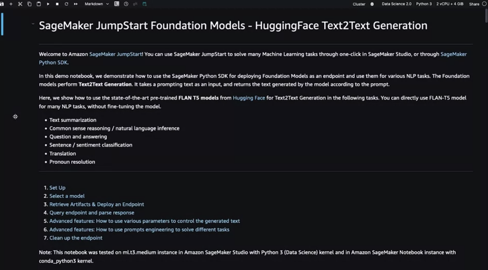

# Gen AI LLM - Course 6
## Part 6 - LLM Application Architectures

###### Below are some key notes from [Generative AI with Large Language Models](https://www.coursera.org/learn/generative-ai-with-llms)

### Building blocks for Generative Applications

You'll require several key components to create end-to-end solutions for your applications, starting with the *infrastructure* layer. This layer provides the compute, storage, and network to serve up your LLMs, as well as to host your application components. You can make use of your on-premises infrastructure for this or have it provided for you via on-demand and pay-as-you-go Cloud services. 

Next, you'll include the *large language models* you want to use in your application. These could include foundation models, as well as the models you have adapted to your specific task. The models are deployed on the appropriate infrastructure for your inference needs. Taking into account whether you need real-time or near-real-time interaction with the model. You may also have the need to retrieve information from external sources, such as those discussed in the retrieval augmented generation section. Your application will return the completions from your large language model to the user or consuming application. 

For example, you could build the capacity to store user completions during a session to augment the fixed contexts window size of your LLM. You can also gather feedback from users that may be useful for additional fine-tuning, alignment, or evaluation as your application matures. 

Next, you may need to use additional *tools and frameworks for large language models* that help you easily implement some of the techniques discussed in this course. As an example, you can use len chains built-in libraries to implement techniques like pow react or chain of thought prompting. You may also utilize model hubs which allow you to centrally manage and share models for use in applications. 

In the final layer, you typically have some type of user interface that the application will be consumed through, such as a website or a rest API. This layer is where you'll also include the security components required for interacting with your application. 

At a high level, this architecture stack represents the various components to consider as part of your generative AI applications. Your users, whether they are human end-users or other systems that access your application through its APIs, will interact with this entire stack. As you can see, the model is typically only one part of the story in building end-to-end generative AI applications. 

### Amazon Sagemaker Jumpstart

Sagemaker JumpStart is a model hub, and it allows you to quickly deploy foundation models that are available within the service, and integrate them into your own applications. The JumpStart service also provides an easy way to fine-tune and deploy models. 

JumpStart covers many parts of this diagram, including the infrastructure, the LLM itself, the tools and frameworks, and even an API to invoke the model. In contrast to the models that you worked with in the labs, JumpStart models require GPUs to fine tune and deploy. And keep in mind, these GPUs are subject to on-demand pricing and you should refer to the Sagemaker pricing page before selecting the compute you want to use. Also, please be sure to delete the Sagemaker model endpoints when not in use and follow cost monitoring best practices to optimize cost.

Sagemaker JumpStart is accessible from the AWS console, or through Sagemaker studio. 
i

After I click on "JumpStart", you'll see different categories that include end-to-end solutions across different use cases, as well as a number of foundation models for different modalities that you can easily deploy, as well as fine-tune, where yes is indicated under the fine-tuning option. 

Let's look at an example you're all familiar with after working through the course, which is the Flan-T5 model.
If I select Flan-T5 Base, you'll see I have a few options. First, I can choose to deploy the model by identifying a few key parameters like the instance type and size. And this is the instance type and size that should be used to host the model. And as a reminder, this deploys to a real-time persistent endpoint, and the price depends on the hosting instance that you select here. And some of these can be quite large, so always remember to delete any endpoints that are not in use to avoid incurring any unnecessary cost. You'll also notice you can specify a number of security settings allowing you to implement the controls that are acquired for your own security requirements. 

You can then choose to hit "Deploy", and this will automatically deploy that Flan-T5 Base model to the endpoint using the infrastructure that you specify. 

In the second tab, you'll notice the option to train. Because this model supports fine-tuning, you can also set up your fine-tuning jobs by specifying the location of your training and validation data sets, then selecting the size of the compute that you want to use for training. And it's just an easy adjustment to the size that compute through this drop-down, you can easily choose what type of compute you'd want to use for your training job. And keep in mind again, you're charged for the underlying compute for the time it takes to train the model. So we recommend choosing the smallest instance that's required for your specific task. Another feature is the ability to quickly identify and modify the tunable hyperparameters for this specific model through these drop-downs. 

If we go ahead and scroll down to the bottom, you'll see a parameter type called PEFT, parameter-efficient fine-tuning which you learned about in Lesson 6. Here you can select Laura, which you learned about in Lesson 4 through just a simple dropdown, making it easier to implement these various techniques that you learned. You can then go ahead and hit "Train". And that'll kick off a training job to fine-tune this pre-trained Flan-T5 model using the input provided for your specific task. 

Finally, here is another option which is to have JumpStart automatically generate a notebook for you. Let's say you don't like using the drop-down, and preferred to programmatically work with these models. This notebook basically provides you all the code behind what is happening in the options that we previously covered. This is an option if you prefer to work with JumpStart at the lowest level programmatically.

